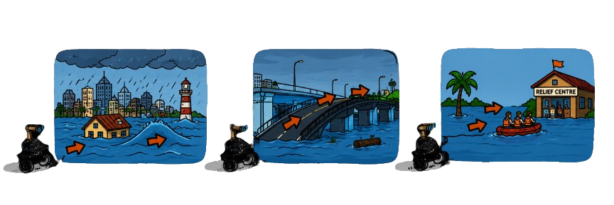

<h1 align="center">Intrepid Explorer 2026</h1>
<h3 align="center">Edition 4</h3>

Welcome to **Intrepid Explorer 2026**, the fourth edition of the **e-Yantra School Robotics Competition (eYSRC)**! This is IIT Bombay's flagship global robotics competition designed specifically for school students to dive into hands-on coding, simulation, and engineering workflows.

---

## Who is an Intrepid Explorer?

An **Intrepid Explorer** is a student who steps into the unknown with curiosity, courage, and a hunger to learn. 

You do not need to be a programming expert or have prior robotics experience. You just need the drive to explore, experiment, and push through design challenges.

Unlike traditional high-pressure contests, eYSRC runs on a **no-elimination learning model**. Every single registered team gets full access to the training modules, discussion forums, and interactive doubt-clearing sessions with e-Yantra mentors. You will learn entirely by doing , debugging your code, refining your robot's logic, and completing milestones at your own pace.

That is what being an Intrepid Explorer is all about.

---

## Theme

### Disaster Management and Autonomous Rescue

This edition is set in the aftermath of a series of natural and man-made disasters that have crippled a city. Roads are flooded, buildings have collapsed, survivors are stranded, and emergency supply chains are broken.

Your autonomous **e-puck** robot simulation serves as a vital component of the first-responder rescue team. Each task in this competition represents a unique, critical phase of the broader emergency response operation.

Starting from a basic **colour-detection calibration** at the military supply depot, you will progress through **line-following** on flooded pipelines, **shape-detection** for medical triage, **ArUco marker navigation** through gridlocked streets, and finally a full **multi-behaviour rescue** inside a collapsed underground terminal.

---

## What You Will Learn

Throughout this competition, you will gain hands-on experience with:

- Python Programming
- Webots Robot Simulation (Kinematics & Differential Drive systems)
- e-puck Proximity and IR Sensor Integration
- OpenCV Image Processing (HSV color spaces, Contours, and Shape Tracking)
- ArUco Marker Detection and Decoding
- Finite State Machines (FSM) for complex multi-behavior autonomy
- Line Following via Proportional (P) Control
- Experiential STEM Problem-Solving

---

## Learning Journey

The documentation is organised into four sections:

- **Getting Started** - Install the required software, configure Python, and verify your Webots environment setup.
- **Learn** - Master fundamental robotics and coding concepts through comprehensive tutorials, resources, and live streams.
- **Tasks** - Apply your knowledge directly by building out solutions for progressively challenging robotic missions.
- **Resources** - Access useful software references, official code assets, downloads, and community support channels.

---

## Before You Begin

Before attempting the tasks, ensure you:

- Read the **Competition Guidelines** carefully to understand evaluation protocols.
- Complete all initialization procedures in the **Getting Started** section.
- Review the specific learning material provided for each milestone and attend the weekly live sessions.
- Verify that Webots and Python are communicating correctly on your local system.

### Happy Learning! 🚀

