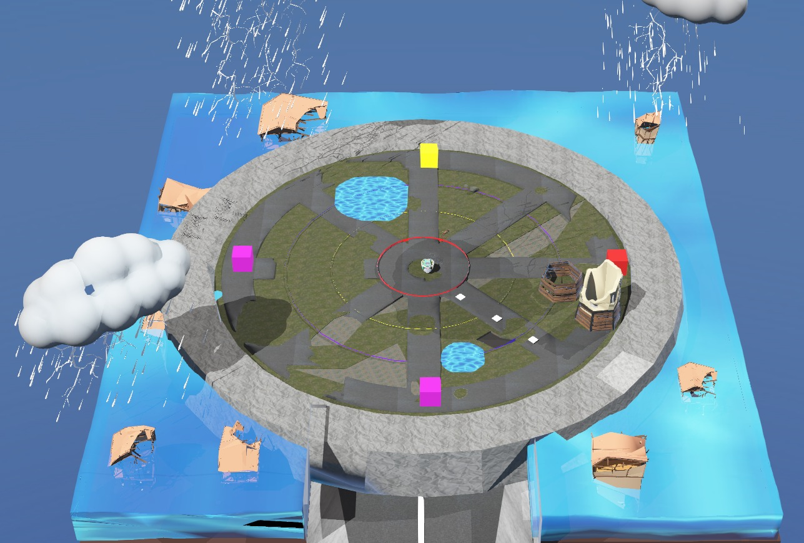
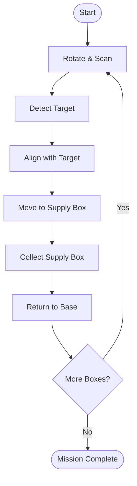
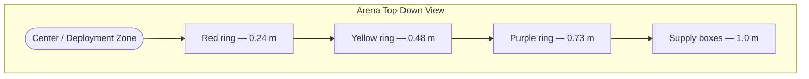

<hr>
<h1 align="center">Task 1: Problem Statement</h1>
<hr>

## Mission Scenario

A powerful hurricane has disrupted the city's emergency supply network. A temporary **Military Supply Drop Zone** has been established to organize relief materials before they are distributed to affected regions.

Before joining the rescue mission, the autonomous e-puck robot must successfully complete its calibration procedure by identifying and collecting emergency supply boxes placed around the deployment area.

Your task is to design an autonomous controller capable of completing this mission.

---

## Objective

Develop a controller that enables the robot to:

- Rotate and scan the surroundings.
- Detect the assigned coloured target.
- Navigate towards the corresponding supply box.
- Collect the supply box.
- Return to the deployment zone.
- Continue until the mission is completed or the allotted time expires.

---

## Arena

The arena consists of:

- A central deployment zone.
- Multiple coloured supply stations.
- Emergency supply boxes.
- An autonomous e-puck robot.

<p align="center">

</p>

---

## Mission Requirements

Your controller must perform the following sequence autonomously.



No manual intervention is allowed once the simulation begins.

---

## Arena Specifications

The supply boxes are positioned on a circular path around the deployment zone.

### Supply Box Radius

All supply boxes are placed at a radial distance of:

| Parameter | Value |
|-----------|------:|
| Supply Box Radius | **1.0 m** |

---

### Coloured Waypoint Radii

Each coloured waypoint is positioned at a predefined distance from the centre of the arena on the colored rings.

| Colour | Radius (m) |
|--------|-----------:|
| 🔴 Red | **0.24** |
| 🟡 Yellow | **0.48** |
| 🟣 Purple | **0.73** |

---

### Possible Target Angles

Supply boxes may appear at any of the following angular positions relative to the deployment zone:

| **Angle (°)** | 0 | 45 | 90 | 135 | 180 | 225 | 270 | 315 |
|:-------------:|:-:|:--:|:--:|:---:|:---:|:---:|:---:|:---:|

---

### Arena Layout Diagram

The diagram below shows the top-down view of the arena, including the concentric coloured rings and the eight possible angular positions for supply boxes.

```
                      90°
                       |
              135°     |     45°
                  \    |    /
                   \   |   /
  180° ----------- [CENTER] ----------- 0°
                   /   |   \
                  /    |    \
              225°     |     315°
                       |
                      270°

  Rings (distance from centre):
  ● Red    ring  = 0.24 m
  ● Yellow ring  = 0.48 m
  ● Purple ring  = 0.73 m
  ○ Supply boxes = 1.0 m  (on outer ring, at one of 8 angles)
```



> **NOTE!** <span style="color:red">The radius values provided above indicate the approximate locations of the coloured waypoints and supply boxes in the arena. Your controller should use these values as reference distances while navigating.</span>

---

## Getting Started

To begin Task 1:

1. Download and extract the project package.
2. Open `task_1.wbt` inside the **worlds** folder.
3. Open the provided controller template.
4. Implement your solution.
5. Test your controller thoroughly.
6. Update the Team ID in `teaminfo.json` before submission.

---

## Scoring

The final score consists of two components.

### Supply Box Score

Each successfully collected supply box awards **5 points**.

```text
Box Score = Number of Boxes Collected × 5
```

### Time Bonus

The remaining mission time contributes to the final score.

```text
Time Score = 60 × (Time Remaining / Maximum Time)
```

### Final Score

```text
Total Score = Box Score + Time Score
```

> **Maximum Score:** **100 Points**

To maximize your score:

- Collect every supply box.
- Complete the mission as quickly as possible.

---

## Expected Output

A successful controller should:

- Detect the assigned coloured target.
- Collect the correct supply box.
- Return safely to the deployment zone.
- Continue until the mission is completed.

The supervisor will display:

- Remaining mission time
- Supply boxes collected
- Mission status
- Final score

### Please refer to the expected output video shown below.

<center><iframe width="640" height="350" src="https://www.youtube.com/embed/3IINuNNjP0w?si=vcA08pHFsPfZCG2l" title="YouTube video player" frameborder="0" allow="accelerometer; autoplay; clipboard-write; encrypted-media; gyroscope; picture-in-picture; web-share" referrerpolicy="strict-origin-when-cross-origin" allowfullscreen></iframe></center> 

---

## Before You Submit

Before generating your submission package, verify that:

- The controller executes without errors.
- All required supply boxes are collected.
- The robot returns to the deployment zone.
- `teaminfo.json` contains the correct Team ID.
- The submission package is generated successfully.