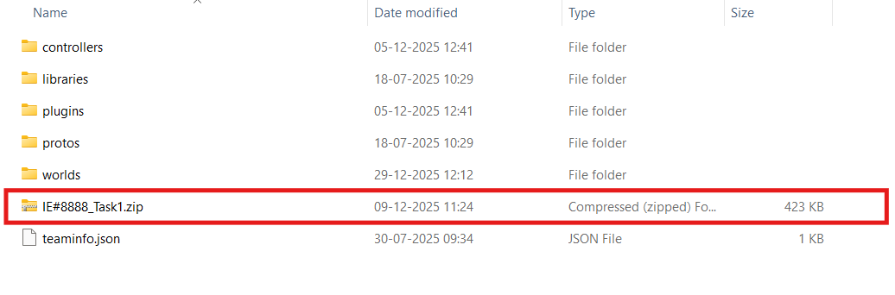
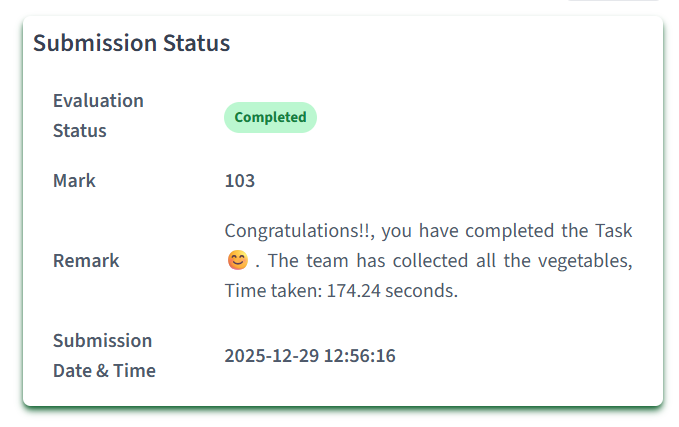

<hr>
<h1 align="center">Submission Instructions</h1>
<hr>

For this task, you are required to submit:

- A **ZIP file** generated after completing the task.
- An **Unlisted YouTube video** demonstrating your solution.

> [!IMPORTANT]
> **Both the ZIP file and the YouTube video must be submitted before the submission deadline.**

> [!NOTE]
> Please read the complete instructions before generating your final submission.

---

## Update Your Controller Information

Before submitting, update the following details in your controller file.

```python
# Team ID:
# Author List:
# Filename:
# Functions:
# Global Variables:
```

Ensure that the Team ID and Author List are correct before generating the submission package.

---

## Part 1: Uploading the ZIP File

After the simulation finishes successfully, a ZIP file will automatically be generated inside the **Task_1** directory.

<p align="center">

</p>

> *Note: The image above shows Task 1 as an example. Your portal will show the correct task.*

Upload this ZIP file to the submission portal.

### Steps

1. Login to the submission portal.
2. Navigate to **Task 1**.
3. Select **ZIP Submission**.
4. Click **Upload Submission**.
5. Select the generated ZIP file.
6. Click **Submit**.

After successful submission, the portal will display your submission status.

<p align="center">

</p>

---

## Part 2: Recording the Demonstration

Record a screen capture showing the complete execution of your controller.

The video should include:

- Your Name
- Team ID
- Opening the Webots project
- Starting the simulation
- Complete execution of the controller
- Successful completion of the mission

> **Recommended Duration:** **2-3 minutes**

The recording should clearly show the Webots simulation window throughout the execution.

---

## Reference Video

The following video demonstrates the recommended recording format.

<center>

<iframe width="700" height="390"
src="https://www.youtube.com/embed/tp-5Pcg1Kv4?si=EJHlDEjBl2F2FcNQ"
title="Submission Guide"
frameborder="0"
allowfullscreen>
</iframe>

</center>

---

## Part 3: Uploading the Video

Upload your demonstration video to **YouTube**.

### Video Settings

- Visibility: **Unlisted**
- Video quality: **720p or higher**

### Naming Convention

```
Task1_TeamID
```

Example:

```
Task1_1234
```

---

### Upload Steps

1. Open the submission portal.
2. Navigate to **Task 1**.
3. Select **Video Submission**.
4. Paste the YouTube video link.
5. Click **Submit**.

After submission, verify that the uploaded link opens the correct demonstration video.

---

# Submission Checklist

Before submitting, make sure that:

- Team ID is updated.
- Controller runs without errors.
- ZIP file is generated successfully.
- Demonstration video is uploaded as **Unlisted**.
- Correct YouTube link is submitted.
- Both ZIP file and video have been uploaded before the deadline.

---

## Need Help?

If you encounter any issues while generating or submitting your files, please refer to the **Guidelines**, **FAQ**, or contact the mentors through the official communication channels.