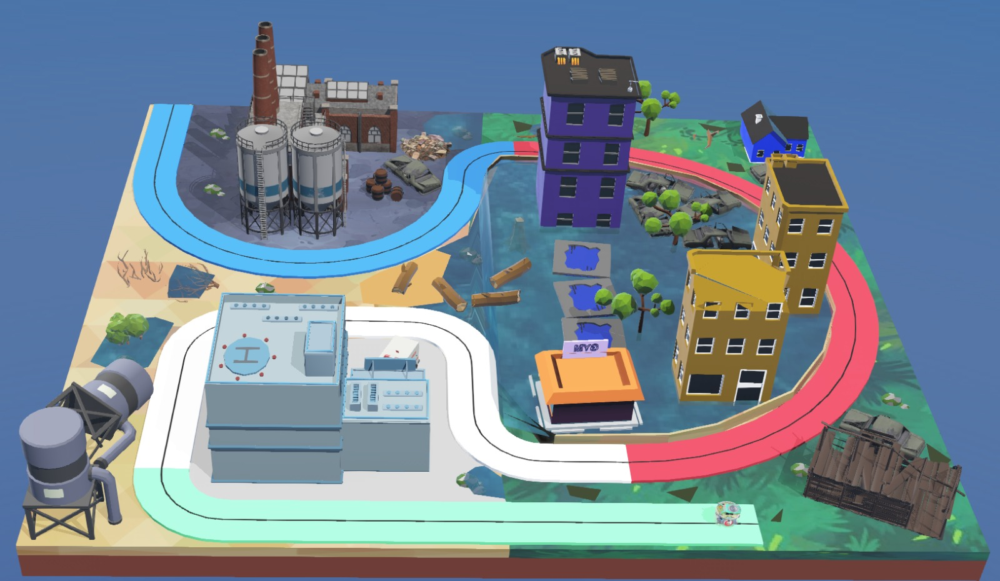

<hr>
<h1 align="center">Task 2: Problem Statement</h1>
<hr>

## Objective

Following the devastating hurricane, the city's roads have been submerged. The only safe route through the **Flooded Industrial District** is a network of elevated pipelines represented by a black navigation line.

Your objective is to program the **e-puck** robot to autonomously follow this route while identifying important rescue locations marked by coloured checkpoints.

The robot should:

- Follow the black navigation line.
- Ignore the first coloured marker at the starting position.
- Detect and remember the next **three coloured markers** in the order they appear.
- Complete the mission within the allotted time.

---

## Learning Outcomes

After completing this task, you will be able to:

- Read ground sensor values.
- Implement a line-following controller.
- Detect coloured floor markers.
- Store information sequentially.
- Build a complete autonomous navigation algorithm.

---

## Mission Requirements

Your controller should perform the following sequence:

1. Start from the deployment zone.
2. Follow the black navigation line.
3. Ignore the first coloured marker.
4. Detect and store the next three coloured markers.
5. Reach every waypoint.
6. Complete the route before time expires.

---

## The Arena

The arena consists of:

- A continuous black navigation line.
- Multiple coloured floor markers.
- Waypoints placed along the route.

The coloured markers represent important rescue locations:

- Hospital
- Residential Area
- Factory

The robot must detect these locations in the correct order while maintaining stable line following.

<p align="center">

</p>

---

## Getting Started

To begin Task 2:

1. Download the Task 2 package.
2. Open `task_2.wbt` in Webots.
3. Open the provided controller.
4. Implement line following.
5. Detect coloured markers.
6. Ignore the first marker.
7. Store the next three colours.
8. Test your controller.
9. Generate the submission package.

---

## Scoring

The final score consists of three components.

### Waypoint Score

Points are awarded based on the number of waypoints reached.

```text
Waypoint Score = (Waypoints Reached / Total Waypoints) × 30
```

---

### Time Bonus

Finishing the mission quickly earns additional points.

```text
Time Score = 30 × (Remaining Time / Maximum Time)
```

---

### Colour Sequence Score

The robot receives **40 points** for correctly detecting and storing the complete sequence of the three coloured markers.

---

### Final Score

```text
Total Score = Waypoint Score + Time Score + Sequence Score
```

> **Maximum Score: 100 Points**

To achieve the highest score:

- Reach every waypoint.
- Record the correct colour sequence.
- Finish the mission as quickly as possible.

---

## Expected Output

A successful controller should:

- Follow the navigation line smoothly.
- Ignore the starting marker.
- Detect the next three coloured markers.
- Store the correct colour sequence.
- Reach every waypoint.
- Complete the mission before time expires.

During execution, the supervisor displays:

- Remaining mission time
- Waypoints reached
- Recorded colour sequence
- Mission status
- Final score

### Please refer to the expected output video shown below.

<center><iframe width="640" height="350" src="https://www.youtube.com/embed/SK_10nEG24Q?si=w7PtFwhKRrTOYZhp" title="YouTube video player" frameborder="0" allow="accelerometer; autoplay; clipboard-write; encrypted-media; gyroscope; picture-in-picture; web-share" referrerpolicy="strict-origin-when-cross-origin" allowfullscreen></iframe></center> 

---

## Before You Submit

Before generating your submission, verify that:

- Line following is stable.
- The first marker is ignored.
- The colour sequence is recorded correctly.
- All waypoints are reached.
- `teaminfo.json` contains the correct Team ID.
- The submission package is generated successfully.