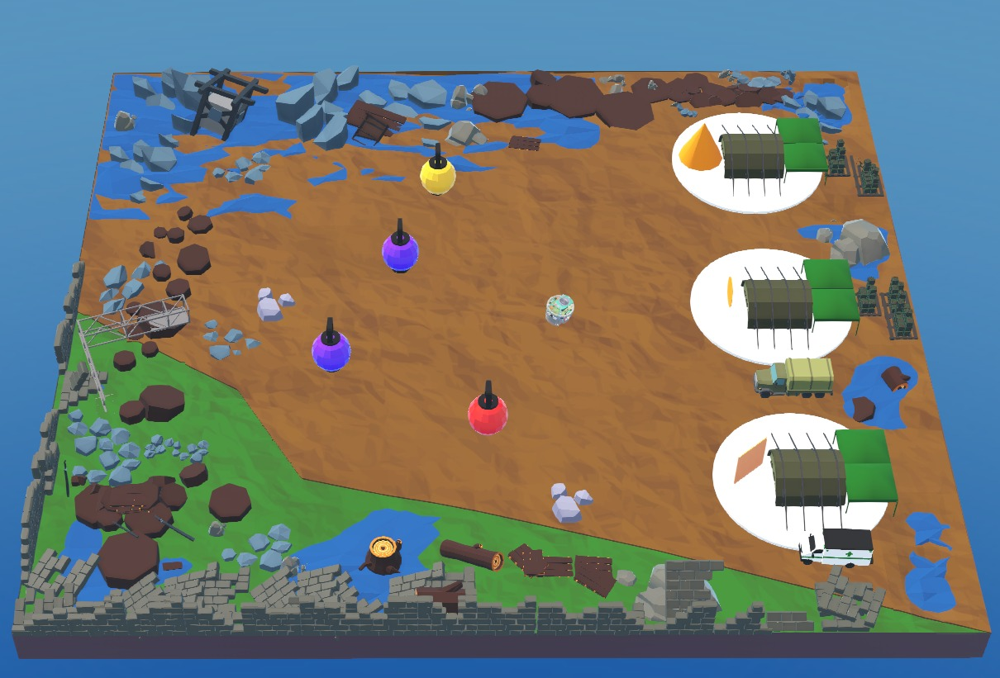

<hr>
<h1 align="center">Task 3: Problem Statement</h1>
<hr>

## Objective

A massive landslide has isolated several survivors across a mountainous region. Emergency beacons indicate each survivor's condition, which may deteriorate if rescue is delayed.

Your objective is to program the **e-puck** robot to autonomously rescue survivors by identifying their priority, transporting them safely, and adapting its rescue strategy throughout the mission.

---

## Learning Outcomes

After completing this task, you will be able to:

- Design a Finite State Machine (FSM).
- Implement dynamic decision-making.
- Detect colours using OpenCV.
- Identify geometric shapes.
- Prioritize tasks based on changing conditions.
- Build adaptive autonomous behaviours.

---

## Mission Requirements

Your controller should perform the following sequence:

1. Search for survivor beacons.
2. Detect each survivor's current priority.
3. Select the highest-priority survivor.
4. Navigate to the survivor.
5. Rescue the survivor.
6. Identify the correct medical camp using shape detection.
7. Deliver the survivor safely.
8. Repeat until the mission ends.

---

## The Arena

The arena represents a mountainous rescue zone containing multiple survivors and medical camps.

Each survivor broadcasts one of the following priority levels:

| Colour | Priority |
|---------|----------|
| 🟣 Purple | Stable |
| 🟡 Yellow | Severe |
| 🔴 Red | Critical |
| ⚫ Black | Deceased |

Medical camps are identified using different geometric shapes. The robot must correctly match every rescued survivor with the appropriate camp.

<p align="center">

</p>

---

## Getting Started

To begin Task 3:

1. Download the Task 3 package.
2. Open `task_3.wbt` in Webots.
3. Implement colour detection.
4. Design a finite state machine.
5. Prioritize survivors dynamically.
6. Detect medical camp shapes.
7. Deliver rescued survivors.
8. Test your controller.
9. Generate the submission package.

---

## Scoring

The final score consists of three components.

### Rescue Score

Points are awarded for successfully delivering survivors.

```text
Rescue Score = (Survivors Delivered / Total Survivors) × 70
```

---

### Time Bonus

Completing the mission quickly earns additional points.

```text
Time Score = (Remaining Time / Maximum Time) × 20
```

---

### Penalties

Penalty points are deducted for delayed rescue operations.

```text
Penalty = (Deceased Survivors × 3)
         + (Priority Changes × 1)
```

---

### Final Score

```text
Total Score = Rescue Score + Time Score − Penalty
```

> **Maximum Score: 100 Points**

To maximize your score:

- Rescue survivors before their condition deteriorates.
- Deliver every survivor to the correct medical camp.
- Complete the mission as quickly as possible.

---

## Expected Output

A successful controller should:

- Continuously monitor survivor priorities.
- Rescue the highest-priority survivor first.
- Detect the correct medical camp.
- Deliver every rescued survivor safely.
- Adapt its rescue strategy as priorities change.
- Complete the mission before time expires.

During execution, the supervisor displays:

- Remaining mission time
- Survivors rescued
- Deceased survivors
- Priority changes
- Mission status
- Final score

### Please refer to the expected output video shown below.

<center><iframe width="640" height="350" src="https://www.youtube.com/embed/JRUqcfl3r7I?si=frFwYZG0a370R7CY" title="YouTube video player" frameborder="0" allow="accelerometer; autoplay; clipboard-write; encrypted-media; gyroscope; picture-in-picture; web-share" referrerpolicy="strict-origin-when-cross-origin" allowfullscreen></iframe></center> 

---

## Before You Submit

Before generating your submission, verify that:

- Survivor priorities are monitored correctly.
- The highest-priority survivor is always selected.
- Medical camps are identified accurately.
- Survivors are delivered successfully.
- `teaminfo.json` contains the correct Team ID.
- The submission package is generated successfully.