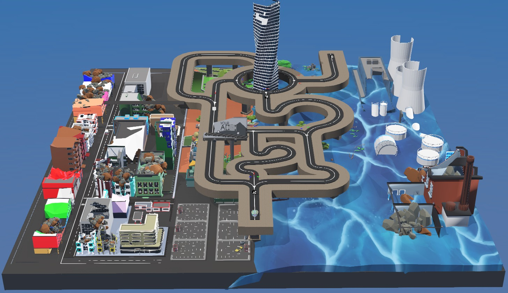

<hr>
<h1 align="center">Task 4: Urban Gridlock</h1>
<hr>

## Theme

The city's transportation network has been severely damaged following the disaster.
Traffic lights and navigation systems are no longer functional, forcing rescue robots to rely on **ArUco markers** placed at road intersections to determine the correct route.

The **e-puck** robot must decode these markers, interpret the navigation instructions, and choose the correct coloured directional arrow to safely traverse the city.

<p align="center">

</p>

---

## What You Will Learn

- ArUco marker detection
- Marker ID decoding
- Decision making at intersections
- Colour-based path selection
- Autonomous navigation

---

## Learning Flow

```text
Learn → Build → Test → Submit
```

---

## Why This Task Matters

Many autonomous robots rely on visual markers such as QR codes, AprilTags, or ArUco markers for localisation and navigation.
This task introduces one of the most widely used techniques for robot navigation in structured environments.

---

**Next Step:** Go through the **Learning Resources** before heading to the **Problem Statement**.

**Happy Learning! 🚀**