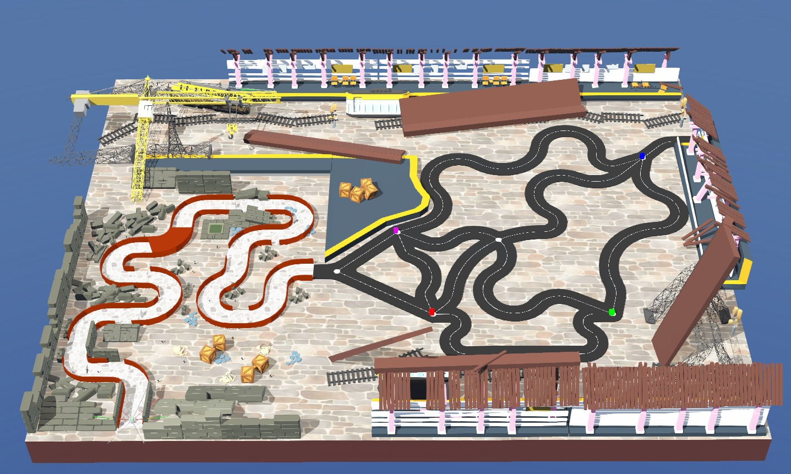

<hr>
<h1 align="center">Task 5: Problem Statement</h1>
<hr>

## Objective

A powerful earthquake has severely damaged the city's underground railway terminal, leaving several train cars stranded with evacuees.

Emergency rescue information is stored inside **ArUco markers** placed throughout a collapsed maintenance tunnel. Before beginning the evacuation, the robot must retrieve this information, determine the rescue order, and then navigate the railway network to rescue every train car.

Your objective is to develop a fully autonomous controller capable of completing the entire rescue mission.

---

## Learning Outcomes

After completing this task, you will be able to:

- Implement wall-following algorithms.
- Detect and decode multiple ArUco markers.
- Store and manage sequential information.
- Switch between autonomous behaviours.
- Navigate complex railway intersections.
- Integrate multiple robotics concepts into a complete system.

---

## Mission Requirements

Your controller should perform the following sequence:

### Phase 1 – Maintenance Tunnel

- Follow the tunnel walls.
- Detect every ArUco marker.
- Decode the rescue information.
- Store the rescue priority sequence.

### Phase 2 – Railway Terminal

- Switch to line following.
- Navigate through multiple intersections.
- Rescue train cars in the stored priority order.
- Complete the mission before time expires.

---

## The Arena

The arena is divided into two independent environments.

### Phase 1 – Maintenance Tunnel

The robot begins inside a narrow maintenance tunnel.

The objectives are:

- Follow the wall.
- Detect ArUco markers.
- Build the rescue priority list.

---

### Phase 2 – Terminal Evacuation

After exiting the tunnel, the robot enters the railway network.

The terminal contains:

- Railway tracks
- Multiple intersections
- Rescue boxes (train cars)
- Navigation waypoints

Using the rescue sequence obtained in Phase 1, the robot must rescue every train car in the correct order.

<p align="center">

</p>

---

## Getting Started

To begin Task 5:

1. Download the Task 5 package.
2. Open `task_5.wbt` in Webots.
3. Implement wall following.
4. Detect and decode ArUco markers.
5. Store the rescue priority sequence.
6. Switch to line following.
7. Navigate the railway network.
8. Rescue train cars in the correct order.
9. Test your controller thoroughly.
10. Generate the submission package.

---

## Scoring

The final score consists of three components.

### Waypoint Score

Points are awarded for successfully traversing waypoints.

```text
Waypoint Score = (Waypoints Reached / Total Waypoints) × 30
```

---

### Rescue Score

Points are awarded for rescuing train cars.

```text
Rescue Score = (Rescued Train Cars / Total Train Cars) × 40
```

---

### Time Bonus

Completing the mission quickly earns additional points.

```text
Time Score = (Remaining Time / Maximum Time) × 30
```

---

### Final Score

```text
Total Score = Waypoint Score + Rescue Score + Time Score
```

> **Maximum Score: 100 Points**

To achieve the highest score:

- Traverse every waypoint.
- Rescue every train car.
- Follow the correct rescue priority.
- Complete the mission with maximum remaining time.

---

## Expected Output

A successful controller should:

- Perform stable wall following.
- Decode every ArUco marker.
- Store the rescue priority correctly.
- Transition smoothly to line following.
- Navigate every intersection.
- Rescue every train car in the correct order.
- Complete the mission before time expires.

During execution, the supervisor displays:

- Remaining mission time
- Waypoints reached
- Train cars rescued
- Current mission status
- Final score

### Please refer to the expected output video shown below.

<center>

*The Task 5 demo video will be added here once available.*

<!-- <iframe width="640" height="350" src="TASK_5_VIDEO_URL" title="YouTube video player" frameborder="0" allow="accelerometer; autoplay; clipboard-write; encrypted-media; gyroscope; picture-in-picture; web-share" referrerpolicy="strict-origin-when-cross-origin" allowfullscreen></iframe> -->

</center>

---

## Before You Submit

Before generating your submission, verify that:

- Wall following is stable.
- Every ArUco marker is detected.
- The rescue sequence is stored correctly.
- Behaviour switching works correctly.
- Train cars are rescued in the correct order.
- All required waypoints are reached.
- `teaminfo.json` contains the correct Team ID.
- The submission package is generated successfully.