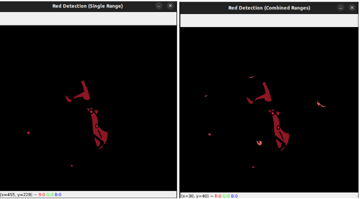

# Color Detection

---

## Detecting a Red Object

In OpenCV, we detect colors using **ranges** — because lighting conditions in real-world environments are inconsistent. A red object may appear:

- Bright red in strong light  
- Slightly orange in dim light  
- Dark red in shadow  

Instead of detecting a single exact red value, we define a **range of acceptable red shades** using lower and upper bounds.

---

### Example: Single Red Hue Range

```python
import numpy as np
import cv2

# Load image
image = cv2.imread("your_image.jpg")

# Convert image to HSV
hsv = cv2.cvtColor(image, cv2.COLOR_BGR2HSV)

# Define upper red hue range
lower_red_single = np.array([160, 100, 100])
upper_red_single = np.array([180, 255, 255])

# Create mask
mask_single = cv2.inRange(hsv, lower_red_single, upper_red_single)

# Apply mask
result_single = cv2.bitwise_and(image, image, mask=mask_single)

# Show result
cv2.imshow("Original Image", image)
cv2.imshow("Red Detection (Single Range)", result_single)
cv2.waitKey(0)
cv2.destroyAllWindows()
 ```
 ---
## What is Mask in Opencv

A **mask** is a **black and white image** (a binary image) that shows:
- **White (255)** where the color we want is present.
- **Black (0)** where it’s not <br>

```
mask_single = cv2.inRange(hsv, lower_red_single, upper_red_single)
```
This creates a mask where all red pixels are white (255), and everything else is black (0).<br>

We use the mask to **focus only on the areas** of the image that match the color we want (in this case, red). This helps us extract or highlight only the red parts and ignore the rest.

---

## What is cv2.bitwise_and()?

```
result_single = cv2.bitwise_and(image, image, mask=mask_single)
```
This keeps **only the pixels from the original image where the mask is white (255).** Everything else becomes black. So, bitwise_and is like applying a stencil: it cuts out the red areas from the original image.

---

## What is cv2.bitwise_or()?
```
result = bitwise_or(img1, img2)
```
Combines pixels from both images — wherever one is white. For combining two masks or effects.

---
### Example: Using Two Red Ranges (because red wraps around hue)
```python
# Lower red hue range (0-10)
lower_red1 = np.array([0, 100, 100])
upper_red1 = np.array([10, 255, 255])

# Upper red hue range (160-180)
lower_red2 = np.array([160, 100, 100])
upper_red2 = np.array([180, 255, 255])

mask1 = cv2.inRange(hsv, lower_red1, upper_red1)
mask2 = cv2.inRange(hsv, lower_red2, upper_red2)

# Combine both masks using bitwise OR
full_red_mask = cv2.bitwise_or(mask1, mask2)
result_combined = cv2.bitwise_and(image, image, mask=full_red_mask)

cv2.imshow("Red Detection (Combines Ranges)", result_combined)
cv2.waitKey(0)
cv2.destroyAllWindows()

```

**Now we cover the entire red range in HSV by combining two masks.**

<p align="center">
  
</p>

<p align="center">
  
</p>

