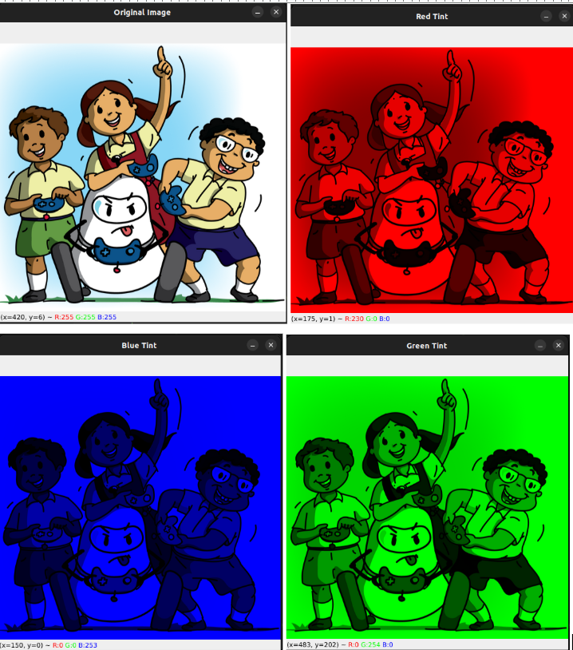
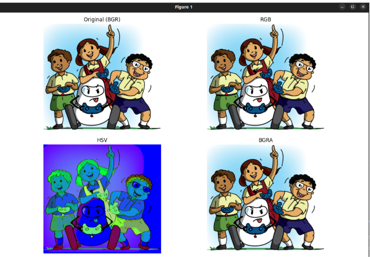

# Color Spaces in Image Processing

---

## Color Representation in OpenCV

In OpenCV, color is represented using channels — each pixel in a color image is stored as a combination of three values, which represent how much blue, green, and red that pixel contains.

> **Note:** OpenCV uses **BGR** format by default — not RGB.

This means:
```
img[0, 0] = [255, 0, 0]  # Blue
img[0, 0] = [0, 255, 0]  # Green
img[0, 0] = [0, 0, 255]  # Red
```
This is the reverse of the usual RGB format used in most image editors and display tools like matplotlib.

<p align="center">
  
</p>

---

## Color Image Structure

When you load an image:
```python
import cv2
img = cv2.imread("image.jpg")
print(img.shape)
```
You might see output like:
```
(411, 612, 3)
```
This means:
- 411 pixels height
- 612 pixels width
- 3 color channels (BGR)

---

## Common Color Spaces

| Color Space | Meaning                | Used For                |
|------------|------------------------|-------------------------|
| BGR        | Blue-Green-Red         | OpenCV default          |
| RGB        | Red-Green-Blue         | Display, matplotlib     |
| HSV        | Hue-Saturation-Value   | Color detection, filtering |
| BGRA       | BGR + Alpha (transparency) | Used in Webots, graphics |

---

## Converting Between Color Spaces

```python
# Convert BGR to RGB
rgb = cv2.cvtColor(image, cv2.COLOR_BGR2RGB)

# Convert BGR to HSV
hsv = cv2.cvtColor(image, cv2.COLOR_BGR2HSV)

# Convert BGR to BGRA
bgra = cv2.cvtColor(image, cv2.COLOR_BGR2BGRA)
```

---

**HSV** is especially useful for color detection, because:
- **Hue** = Type of color
- **Saturation** = Intensity
- **Value** = Brightness

<p align="center">
  
</p>

> HSV won’t look like natural colors — it’s meant for color processing, not human viewing.
