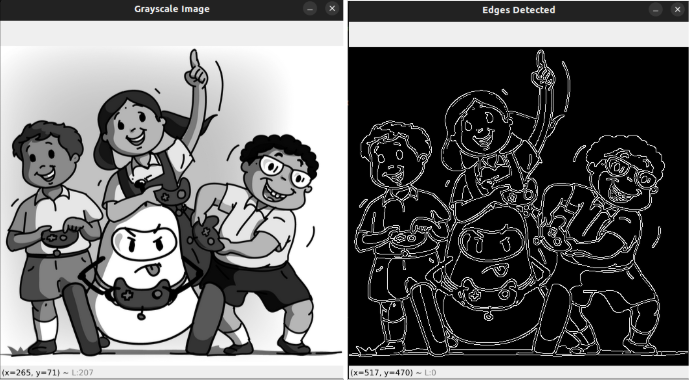
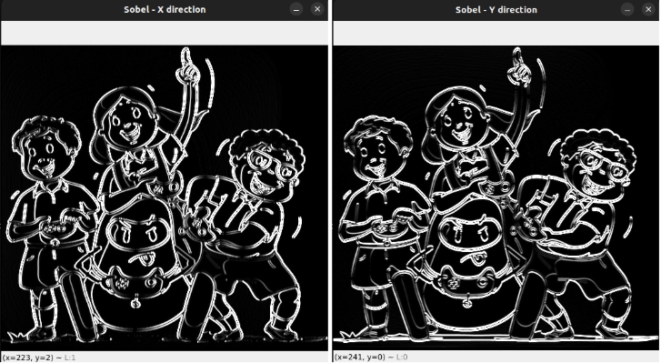

# Edge Detection

---
Edge detection means finding **boundaries or outlines** of objects in an image.

When you look at a picture, you can tell where one object ends and another begins — usually because of **sudden changes in color or brightness**. That’s exactly what edge detection tries to find!

---

### It helps a computer:

- Understand shapes  
- Identify objects  
- Track movement  
- Prepare for tasks like contour detection, segmentation, etc.  

---

### What is an “Edge” in an Image?

An edge is a place where the **pixel values change sharply** — like where a dark object touches a bright background.

In grayscale, this looks like:<br>
[  10,  10,  12,  90, 200, 205 ] → Sudden jump → Edge!

---

### How Do We Detect Edges?
We use mathematical tools called filters (or kernels) to look at pixel differences. OpenCV provides powerful tools like:
- **Sobel**
- **Laplacian**
- **Canny** (most commonly used)

**Example:**<br>
```python
import cv2

# Step 1: Load an image in grayscale
img = cv2.imread('image.jpg', 0)

# Step 2: Apply Canny Edge Detection
edges = cv2.Canny(img, 100, 200)

# Step 3: Show the result
cv2.imshow('Original', img)
cv2.imshow('Edges', edges)
cv2.waitKey(0)
cv2.destroyAllWindows()
```
---

### What do 100 and 200 mean here?

These are thresholds: <br>
- **Lower threshold (100):** anything below this is ignored (too weak)
- **Upper threshold (200):** anything above this is considered an edge
- Anything **in between** is accepted only if it’s connected to a strong edge

This helps remove **noise** (small, unwanted details).

<p align="center">
  
</p>

---
### Other Edge Detectors - 
- **Sobel Filter** – Detects vertical/horizontal edges
```python
sobel_x = cv2.Sobel(img, cv2.CV_64F, 1, 0)
sobel_y = cv2.Sobel(img, cv2.CV_64F, 0, 1)
```
---

<p align="center">
  
</p>

<p align="center">
  
</p>

- **Laplacian Filter** – Detects edges in all directions.

```python
laplacian = cv2.Laplacian(img, cv2.CV_64F)
```
<p align="center">
  
</p>

>But **Canny** is usually preferred because it's accurate and clean.
