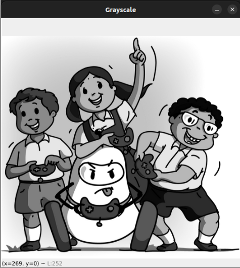

# Gray Scaling in Image Processing

---

## What is Grayscale?

A grayscale image contains only shades of gray, ranging from black (0) to white (255), instead of colors. Instead of having 3 color channels (Blue, Green, Red in OpenCV), a grayscale image has just one channel.

---

## How to Convert to Grayscale in OpenCV

```python
import cv2

# Load a color image
img = cv2.imread("your_image.jpg")

# Convert to grayscale
gray = cv2.cvtColor(img, cv2.COLOR_BGR2GRAY)

# Display the grayscale image
cv2.imshow("Grayscale", gray)
cv2.waitKey(0)
cv2.destroyAllWindows()
```
<p align="center">
  
</p>

---

## How Grayscale Conversion Works Internally

Grayscale is not just taking one channel (like just Blue or just Red). Instead, OpenCV uses a weighted average of all three channels:

**Gray = (0.299 × R) + (0.587 × G) + (0.114 × B)**

These weights reflect how sensitive the human eye is to each color — we see green better than red or blue.

If a pixel is `[B=50, G=100, R=200]`, then the grayscale value is:

`(0.299 × 200) + (0.587 × 100) + (0.114 × 50) = 59.8 + 58.7 + 5.7 ≈ 124`

So, in grayscale, that pixel becomes just **124**.
