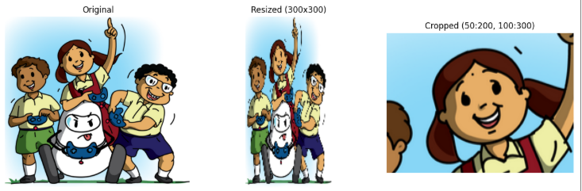
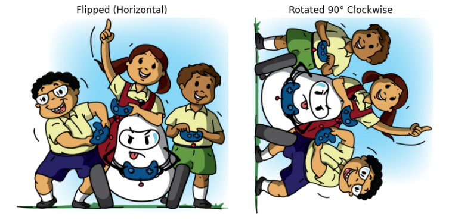

# Basic Image Operations

---

## Resize, Crop, Flip, and Rotate

```python
# Resize
small = cv2.resize(image, (300, 300))

# Crop
cropped = image[50:200, 100:300]

# Flip
flipped = cv2.flip(image, 1)  # 1 for horizontal, 0 for vertical

# Rotate 90 degrees
rotated = cv2.rotate(image, cv2.ROTATE_90_CLOCKWISE)
```
<p align="center">
  
</p>

<p align="center">
  
</p>

---

### What These Do:

- **Resize:** Changes the image size to 300x300 pixels.
- **Crop:** Extracts a region from row 50 to 200 and column 100 to 300.
- **Flip:** Flips the image horizontally (`1`) or vertically (`0`).
- **Rotate:** Rotates the image 90 degrees clockwise.
