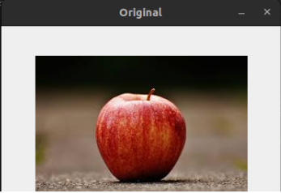
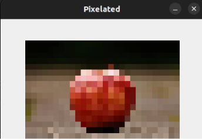

# OpenCV 

---

## What is OpenCV?

OpenCV (Open Source Computer Vision Library) is an open-source library of programming functions mainly aimed at real-time computer vision. It allows us to process images and videos to detect objects, faces, colors, shapes, etc.

It helps computers "see" and understand images and videos, just like humans do — but using code. It’s like giving eyes and basic vision intelligence to a program or robot.

---

### Install it:

```bash
pip install opencv-python
```

---

### Think of it Like This:


When you look at a picture of an apple, you immediately know:
- It’s an apple 🍎 <br>
<p align="center">
  
</p>
- It’s red
- It’s round
- It’s on a table

But for a computer, an image is just thousands of numbers (pixel values). <br>

**Computer Vision** helps the computer understand those numbers as shapes, objects, colors, and actions. <br>

<p align="center">
  
</p>
