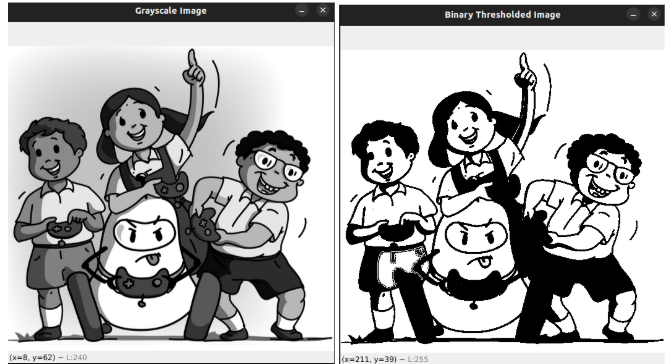

# Thresholding

---


Thresholding is a technique in image processing that converts a **grayscale image** into a **binary image** (only black and white).

---

### This is useful for:

- Simplifying an image  
- Highlighting shapes  

---

### How it works:

It compares each pixel’s intensity value to a given threshold:

- If the pixel value is greater than the threshold → it becomes white (255)  
- If it's less than the threshold → it becomes black (0)  

---

### OpenCV Syntax:

```python
retval, thresholded_image = cv2.threshold(src, thresh, maxval, type)
```

**src** → Grayscale input image<br>
**thresh** → Threshold value (e.g., 127)<br>
**maxval** → Value to use if condition is met (usually 255)<br>
**type** → Type of thresholding (e.g., cv2.THRESH_BINARY) <br>

---
```python
gray = cv2.cvtColor(image, cv2.COLOR_BGR2GRAY)
_, binary = cv2.threshold(gray, 127, 255, cv2.THRESH_BINARY)
```
---

<p align="center">
  
</p>


<p align="center">
  
</p>

