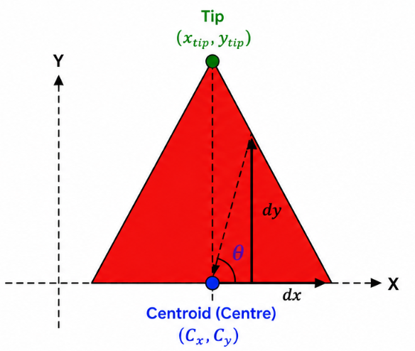

---

# Understanding Arrow Direction Detection

At every intersection, the robot must determine the direction indicated by the coloured arrow before deciding its next movement.

The overall detection pipeline is shown below.


### Step 1 — Detect the Arrow

- Capture an image using the robot camera.
- Convert the image to the HSV colour space.
- Apply colour thresholding to isolate the coloured arrow.
- Find the largest contour corresponding to the arrow.

---

### Step 2 — Find the Arrow Centre

The centre (centroid) of the detected arrow is calculated using image moments.

```text
Cx = M10 / M00
Cy = M01 / M00
```

where:

- `Cx` → x-coordinate of the centre
- `Cy` → y-coordinate of the centre

---

### Step 3 — Find the Arrow Tip

The arrow tip is the contour point that is **farthest from the centre**.

```text
Distance = √((x - Cx)² + (y - Cy)²)
```

The point with the maximum distance is selected as the arrow tip.

<p align="center">

</p>

---

### Step 4 — Calculate the Direction

Create a vector from the centre to the arrow tip.

```text
dx = TipX - Cx
dy = Cy - TipY
```

The arrow angle is calculated using:

```python
angle = np.degrees(np.arctan2(dy, dx))
```

---

### Step 5 — Classify the Direction

| Angle | Direction |
|-------:|-----------|
| 315° – 45° | Right |
| 45° – 135° | Straight |
| 135° – 225° | Left |
| 225° – 315° | U-Turn |

The robot follows the detected direction to navigate through the intersection.