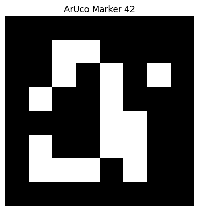
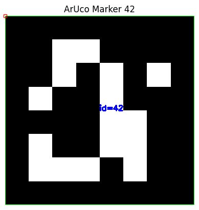

# ArUCo Marker Detection

---

## Overview

ArUCo markers are square binary fiducial markers that can be uniquely identified by a computer vision system. They are widely used in robotics, augmented reality, localization, and autonomous navigation.

Each marker contains:

- A thick black border
- A unique binary pattern
- A unique ID

The black border makes the marker easy to detect, while the binary pattern allows OpenCV to identify its ID.

---

## Learning Outcomes

After completing this tutorial, you will be able to:

- Understand how ArUCo markers work.
- Generate ArUCo markers.
- Detect markers using OpenCV.
- Extract the marker ID.
- Draw detected markers on an image.

---

## What is an ArUCo Marker?

An ArUCo marker is a square image containing a unique binary pattern.

<p align="center">

</p>

Each marker belongs to a predefined **dictionary**, such as:

- DICT_4X4_50
- DICT_5X5_100
- DICT_6X6_250
- DICT_7X7_1000

The dictionary determines:

- Number of markers
- Pattern size
- Error correction capability

---

## Why Use ArUCo Markers?

ArUCo markers are popular because they provide:

- Fast detection
- Unique identification
- Robust performance under different lighting conditions
- Reliable pose estimation
- Simple implementation

Applications include:

- Robot navigation
- Warehouse automation
- Camera calibration
- Augmented Reality (AR)
- Drone localization

---

## Step 1 — Import Libraries

```python
import cv2
import numpy as np
```

---

## Step 2 — Select an ArUCo Dictionary

OpenCV provides several predefined dictionaries.

```python
aruco_dict = cv2.aruco.getPredefinedDictionary(
    cv2.aruco.DICT_6X6_250
)
```

This dictionary contains **250 unique markers**, each with a **6×6 binary pattern**.

---

## Step 3 — Load the Image

```python
image = cv2.imread("aruco_marker.png")
```

---

## Step 4 — Convert to Grayscale

```python
gray = cv2.cvtColor(image, cv2.COLOR_BGR2GRAY)
```

Marker detection works more efficiently on grayscale images.

---

## Step 5 — Create the Detector

```python
parameters = cv2.aruco.DetectorParameters()

detector = cv2.aruco.ArucoDetector(
    aruco_dict,
    parameters
)
```

The detector contains all the parameters required for marker detection.

---

## Step 6 — Detect the Marker

```python
corners, ids, rejected = detector.detectMarkers(gray)
```

The detector returns:

| Variable | Description |
|-----------|-------------|
| corners | Corner coordinates of detected markers |
| ids | Marker IDs |
| rejected | Rejected marker candidates |

---

## Step 7 — Draw the Detection

```python
cv2.aruco.drawDetectedMarkers(
    image,
    corners,
    ids
)
```

The detected markers are highlighted with green boundaries and their corresponding IDs.

---

## Example Detection

<p align="center">

</p>

---

## Marker Anatomy

```
+-----------------------+
|                       |
|  Black Border         |
|  +----------------+   |
|  | Binary Pattern |   |
|  | Encodes Marker |   |
|  |      ID        |   |
|  +----------------+   |
|                       |
+-----------------------+
```

The binary pattern uniquely identifies each marker.

---

## Complete Detection Program

```python
import cv2

image = cv2.imread("aruco_marker.png")

gray = cv2.cvtColor(image, cv2.COLOR_BGR2GRAY)

aruco_dict = cv2.aruco.getPredefinedDictionary(
    cv2.aruco.DICT_6X6_250
)

parameters = cv2.aruco.DetectorParameters()

detector = cv2.aruco.ArucoDetector(
    aruco_dict,
    parameters
)

corners, ids, rejected = detector.detectMarkers(gray)

if ids is not None:
    cv2.aruco.drawDetectedMarkers(image, corners, ids)

cv2.imshow("Detected Marker", image)

cv2.waitKey(0)
cv2.destroyAllWindows()
```

---

## Key OpenCV Functions

| Function | Purpose |
|-----------|---------|
| `cv2.imread()` | Read image |
| `cv2.cvtColor()` | Convert to grayscale |
| `cv2.aruco.getPredefinedDictionary()` | Load marker dictionary |
| `cv2.aruco.DetectorParameters()` | Configure detector |
| `cv2.aruco.ArucoDetector()` | Create detector |
| `detectMarkers()` | Detect markers |
| `drawDetectedMarkers()` | Draw detected markers |

---

## Summary

In this tutorial, you learned how to:

- Understand ArUCo markers.
- Load a predefined dictionary.
- Detect markers using OpenCV.
- Retrieve marker IDs.
- Visualize detected markers.

ArUCo markers are widely used in robotics for navigation, localization, pose estimation, and autonomous decision-making.