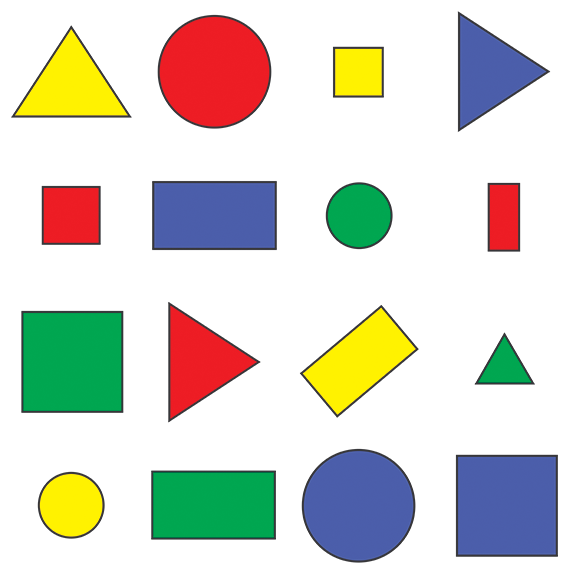
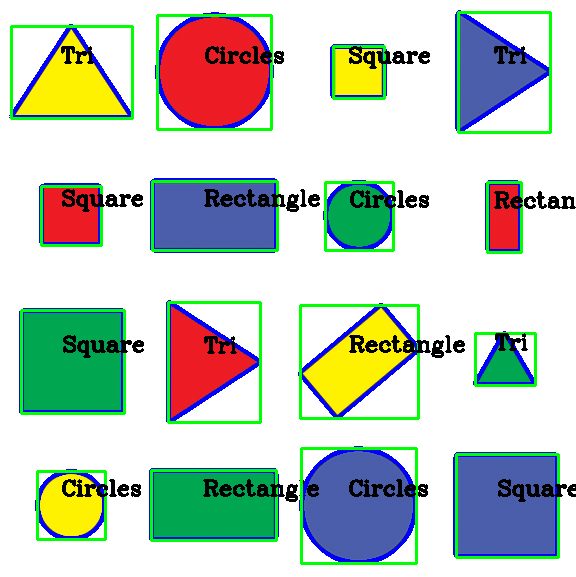

# Shape Detection using OpenCV

---

## Overview

Shape detection is one of the most fundamental computer vision techniques used in robotics. By detecting geometric shapes, a robot can recognize landmarks, identify objects, and make navigation decisions.

In this tutorial, we will learn how to detect common shapes such as:

- Triangle
- Square
- Rectangle
- Circle

using **OpenCV** contour detection.

---

## Learning Outcomes

After completing this tutorial, you will be able to:

- Detect object boundaries using contours.
- Approximate contours into polygons.
- Classify geometric shapes.
- Draw bounding boxes around detected objects.
- Label detected shapes.

---

## Input Image

The following image contains multiple geometric shapes.

<p align="center">

</p>

---

## Step 1 — Read the Image

Load the input image using OpenCV.

```python
img = cv2.imread("resources/shapes.png")
```

---

## Step 2 — Convert to Grayscale

Convert the colour image into grayscale.

```python
imgGray = cv2.cvtColor(img, cv2.COLOR_BGR2GRAY)
```

Why?

Working with a single channel reduces computation and simplifies edge detection.

---

## Step 3 — Remove Noise

Apply Gaussian Blur to smooth the image.

```python
imgBlur = cv2.GaussianBlur(imgGray, (7,7), 1)
```

This removes small image noise before edge detection.

---

## Step 4 — Detect Edges

Use the Canny Edge Detector.

```python
imgCanny = cv2.Canny(imgBlur,50,50)
```

The output contains only object boundaries.

---

## Step 5 — Find Contours

Extract contours from the edge image.

```python
contours, hierarchy = cv2.findContours(
    imgCanny,
    cv2.RETR_EXTERNAL,
    cv2.CHAIN_APPROX_NONE
)
```

- `RETR_EXTERNAL` retrieves only outer contours.
- `CHAIN_APPROX_NONE` stores every contour point.

---

## Step 6 — Approximate the Shape

For every contour,

```python
peri = cv2.arcLength(cnt, True)

approx = cv2.approxPolyDP(
    cnt,
    0.02 * peri,
    True
)
```

`approxPolyDP()` simplifies the contour into a polygon.

The number of polygon vertices helps identify the shape.

---

## Step 7 — Classify the Shape

The shape can be classified based on the number of vertices.

| Vertices | Shape |
|----------:|--------|
| 3 | Triangle |
| 4 | Square / Rectangle |
| More than 4 | Circle |

For quadrilaterals,

```python
aspectRatio = w / float(h)
```

If

```text
0.98 ≤ Aspect Ratio ≤ 1.03
```

the object is considered a **Square**.

Otherwise,

it is classified as a **Rectangle**.

---

## Step 8 — Draw Results

Draw the contour, bounding box, and detected shape.

```python
cv2.drawContours(...)
cv2.rectangle(...)
cv2.putText(...)
```

The final output displays each detected object with its corresponding label.

---

## Complete Output

The detected image should look similar to the figure below.

<p align="center">

</p>

---

## Complete Program

You can now combine all the above steps into a complete shape detection program.

> Try experimenting with different images and observe how changing the Canny thresholds or contour approximation affects the detected shapes.

---

## Key Functions Used

| Function | Purpose |
|-----------|---------|
| `cv2.imread()` | Read image |
| `cv2.cvtColor()` | Convert image to grayscale |
| `cv2.GaussianBlur()` | Remove noise |
| `cv2.Canny()` | Detect edges |
| `cv2.findContours()` | Find object boundaries |
| `cv2.arcLength()` | Calculate contour perimeter |
| `cv2.approxPolyDP()` | Approximate polygon |
| `cv2.boundingRect()` | Bounding box |
| `cv2.drawContours()` | Draw contours |
| `cv2.putText()` | Display detected shape |

---

## Summary

In this tutorial, you learned how to:

- Convert an image to grayscale.
- Detect edges using Canny.
- Extract contours.
- Approximate contours into polygons.
- Classify shapes based on the number of vertices.
- Draw and label detected objects.

Shape detection is widely used in robotics for object recognition, navigation, warehouse automation, and industrial inspection.