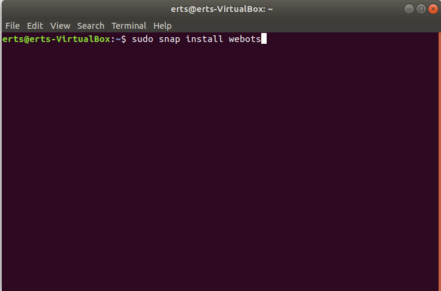
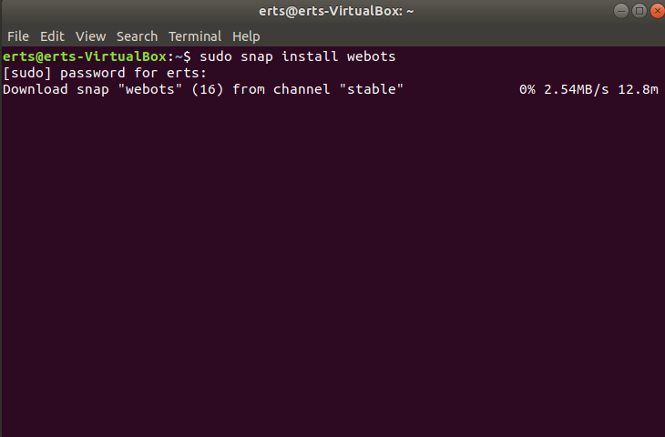
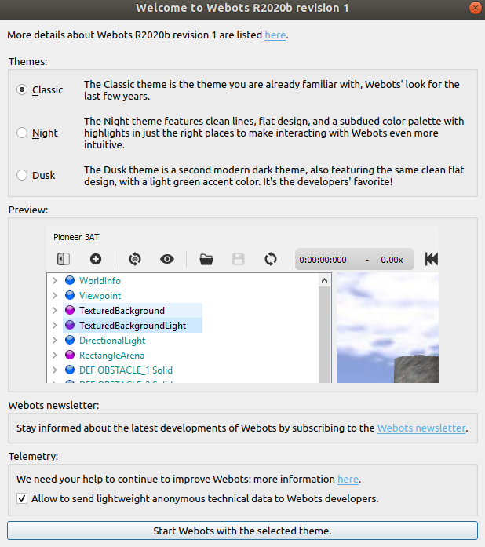
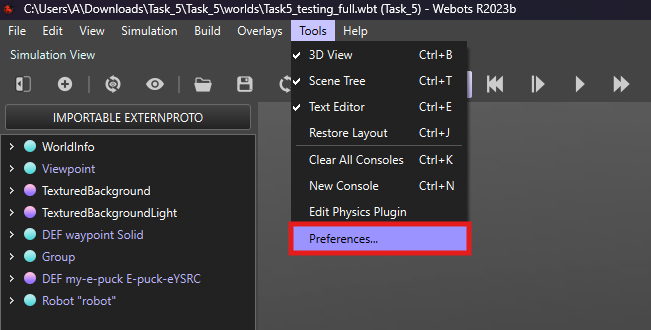
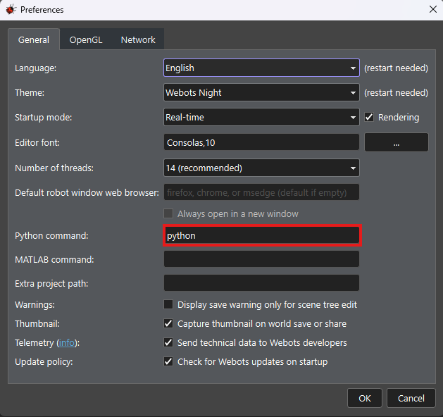

# 
Instructions for Ubuntu

## 1. Webots Installation:

- Open up the terminal.
- Type the command `sudo snap install webots` as shown in the image below.

  

 

- Now it will ask for password on your system. Enter the password and execute the command and file will automatically get downloaded
 as shown in the image below.
 
 

  

 

- Check in your installed softwares, you will find Webots. Double click on `Webots` you will see interface as shown in the image below. Click on `Start webots with the selected theme`
to get started.

  

 

 
 
## 2. Python Installation

Most of the Linux distributions have Python 2.7 and 3.x already installed. To check the versions of Python installed on your system, you can type in a terminal: `python3 --version`.

## 3. Setting up environment for Python in Webots

1. For setting up environment for Python in Webots, go to `Tools` menu and click on `Preferences`.

 

2.The command to use python is usually preset as shown in the below image:

 

