<h1 align="center">Instructions for Windows</h1>

---

## 1. Webots Installation

> [!IMPORTANT] 
> Webots runs on Windows 10 and Windows 8.1 (64-bit versions only).

In order to check whether your system is 64-bit or not, kindly follow these two steps.

1. Open the `file explorer` in your PC/Laptop. Right click on `This PC` and select `Properties` as highlighted (with red box) in the figure below.

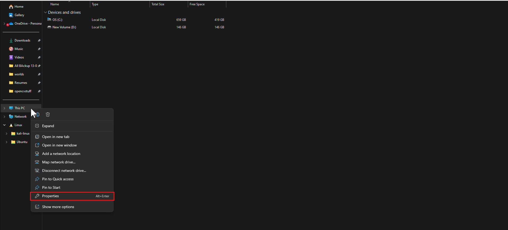

2. Then in System, the System type is specified as shown below:

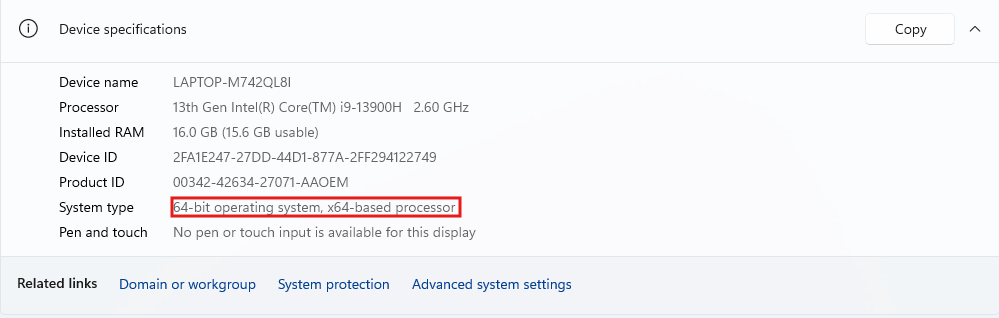

- To install Webots <u><a href="https://www.cyberbotics.com/#download" target="_blank">click here</a></u>. This will lead you to the official website of Webots as shown in the image below:

  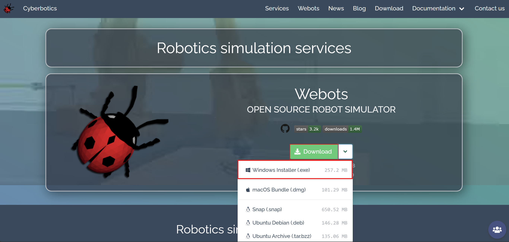

- Click on `Download`. Select `Windows Installer (.exe)` and then an executable file will automatically get downloaded on your system.

- Double-click the downloaded file `webots-R2025a_setup.exe` to commence the installation and follow the below installation instructions:

1. Click on `Install for all users (recommended)`.

  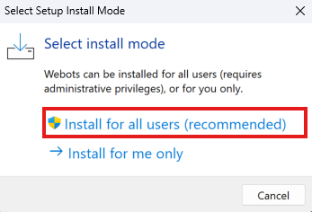

2. Enter the path where you need the software to be installed (or continue with the default path) and click on `Next`.

  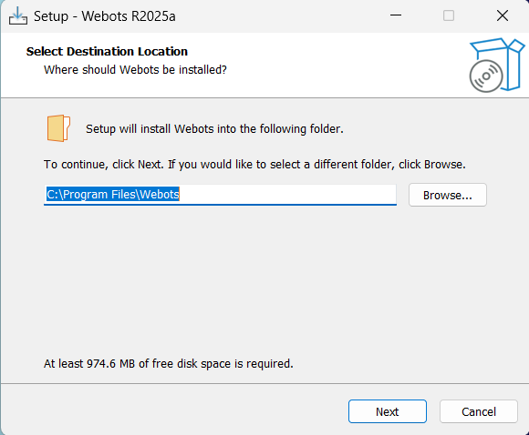

3. Enter the folder name where you want to create a program's shortcut and click on `Next`.

  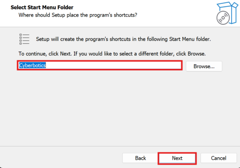

4. Then you will see a dialog box as shown in the image below. Click on `Install`.

  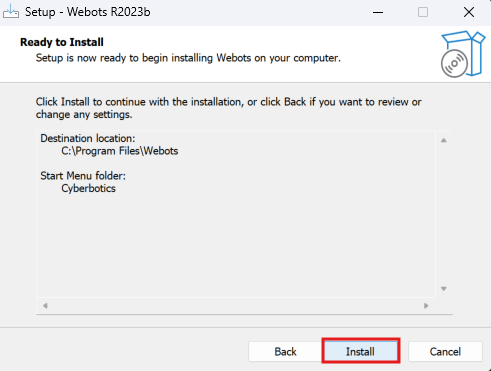

  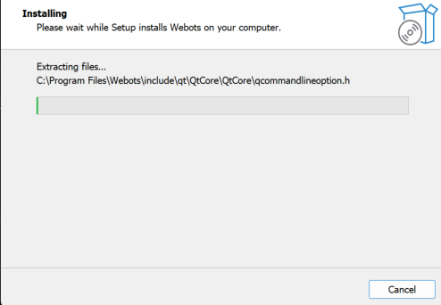

5. Click on `Finish`.

  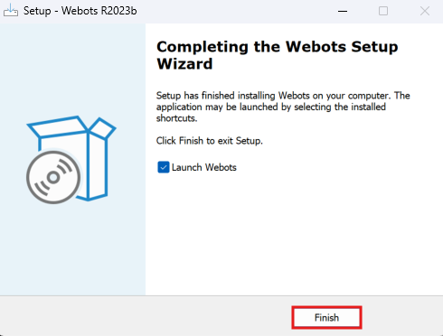

> [!NOTE]
> Install Python for your operating system as explained below. After that follow instructions for setting up environment for Python in Webots.

---

## 2. Python Installation

1. <u><a href="https://www.python.org/ftp/python/3.14.0/python-3.14.0-amd64.exe" download>Click here</a></u> to download Python 3.14.0.
2. On double clicking the `.exe` file (or right click → **Run as administrator**), this window will appear.

  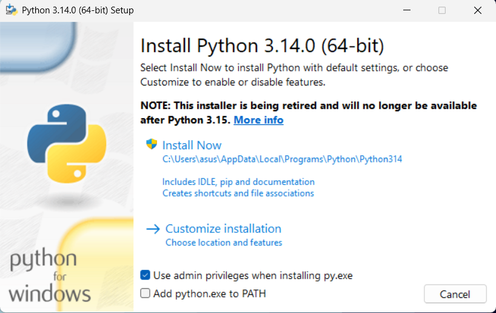

3. Click on <b>“Add python.exe to PATH”</b> in order to add Python’s installed path to environment variables.

  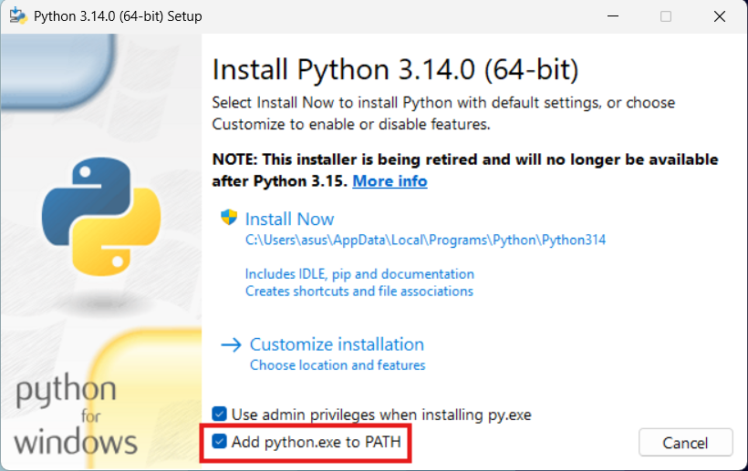

4. The installation screen will ask you if you want regular or custom installation. Do not customize and hence do NOT select “Custom Install”.  
   Click on <b>“Install Now”.</b> This will start the installation of Python on your system. You might be asked for administrator permissions to install the same, say “Yes” in that case.

  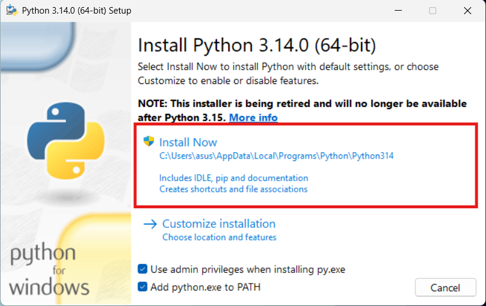

This might take some time to complete.

  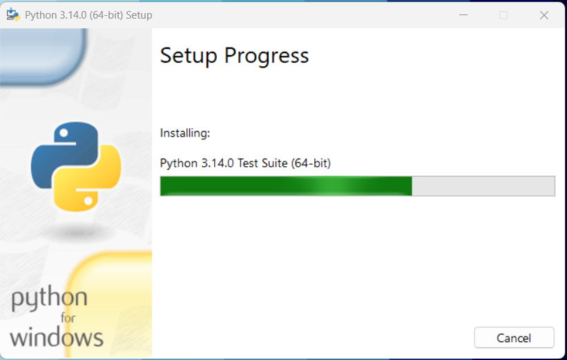

5. Click **Yes** if the pop up asks for making changes to the device as shown in the below image:

  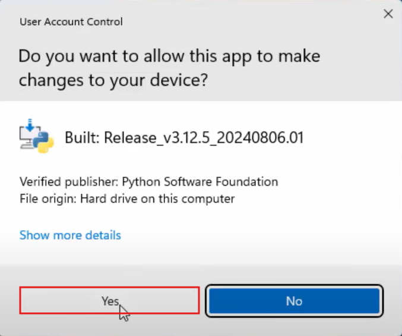

6. Click on <b>`Close`.</b>

  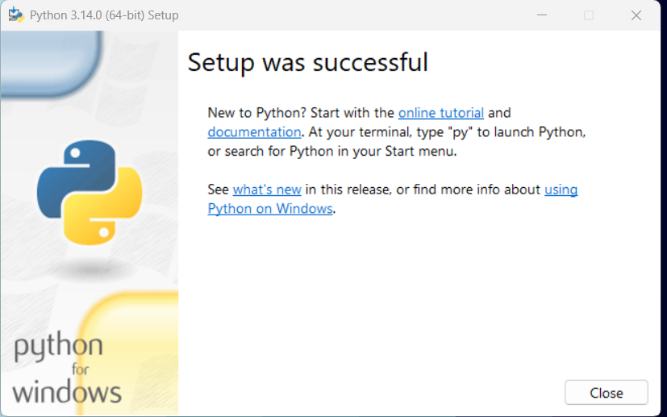

7. Python 3.12.5 is thus successfully installed. To verify software installation, type **“cmd”** in the search box on Windows as shown below to open Command Prompt.

  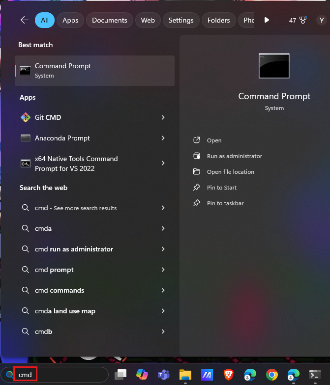

8. In Command Prompt, type `python --version` and press Enter. You’ll see `Python 3.14.0` appears in the next line.

  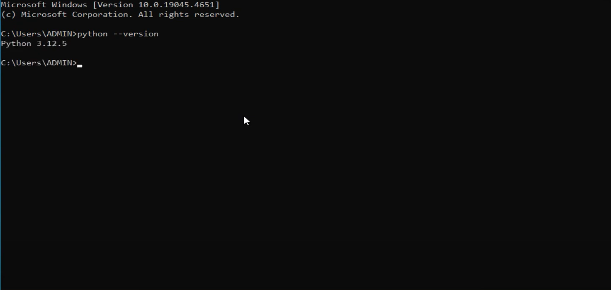

---

## 3. Setting up environment for Python in Webots

1. For setting up environment for Python in Webots, go to the `Tools` menu and click on `Preferences`.

  

2. The command to use Python is usually preset as shown in the image below:

  

