# 
Instructions for macOS:

> [!NOTE] 
> This document contains instructions for the following:  
> 1. Webots Installation  
> 2. Python Installation  
> 3. Setting up environment for Python in Webots 

## 1. Webots Installation

- Copy this URL `https://www.cyberbotics.com/#download` and paste it in your browser (preferably Firefox).  This will lead you to the official website of the Webots as shown in the image below.

  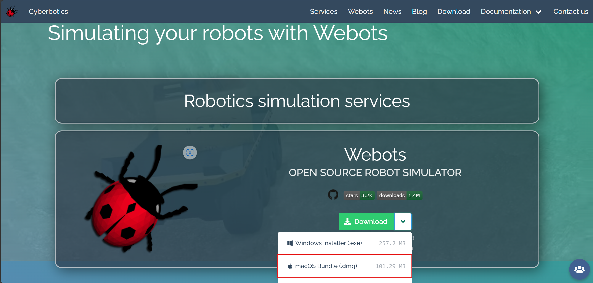

 

- Click on `Download`. Select `macOS Bundle (.dmg)` and the file will automatically get downloaded on your system.

  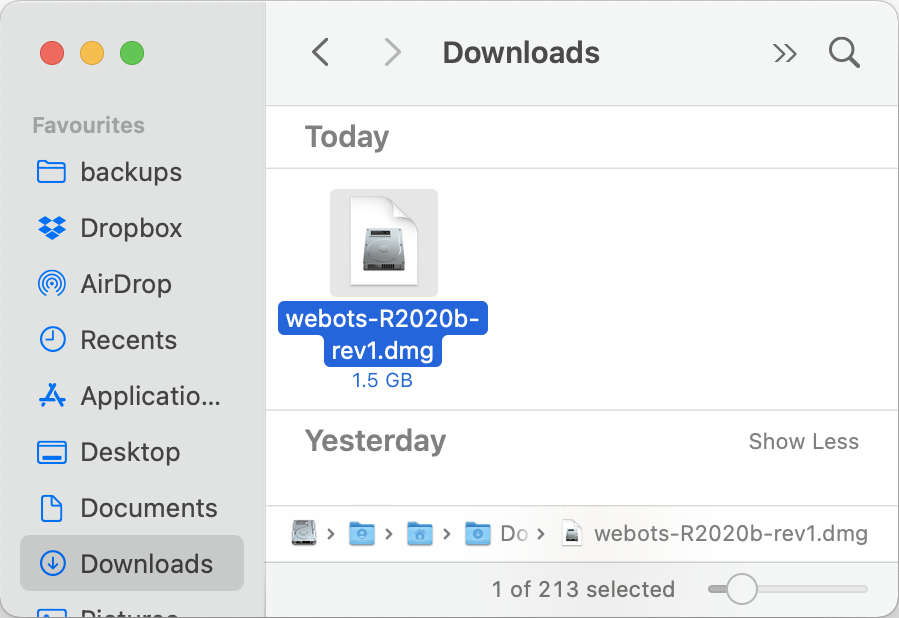

 

- Drag Webots to Applications folder as shown below:

  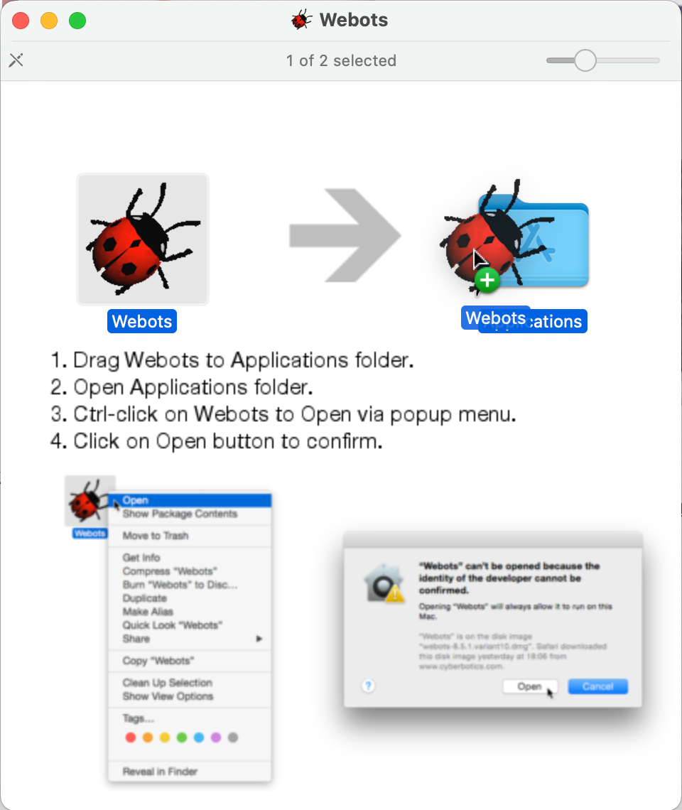

 

- macOS Gatekeeper may refuse to run Webots because it is from an unidentified developer (see below figure). You will need administrator privileges to be able to install Webots.

  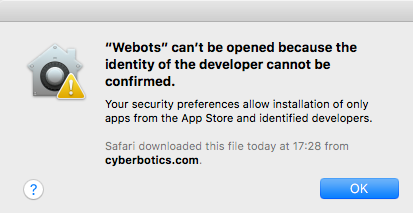

 

- You should Ctrl + click (or right-click) on the Webots icon, and select the Open menu item. Then, macOS should propose to open the application anyway.

  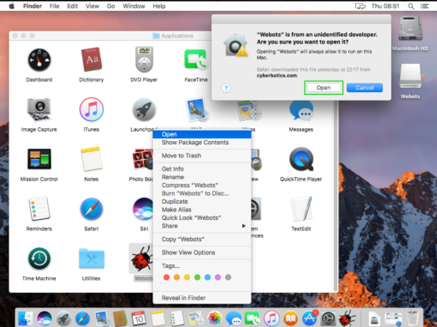

 

## 2. Python Installation

1. To download Python 3.14.0 , Clcik the link [Python Download](https://www.python.org/downloads/).
2. Click on Download Python 3.14.0 and then an executable file will automatically get downloaded on your system.

  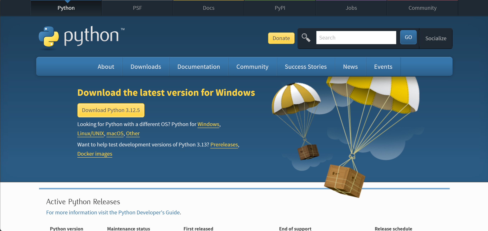

 

3. After the file gets downloaded you will see the dialog box as shown in the image below and click on Install.

  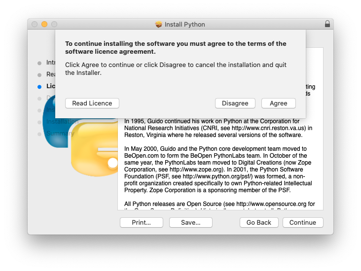

4. Click on Agree to continue with the installation and after that click on Continue till you reach to the interface as shown in the image below. 

 

  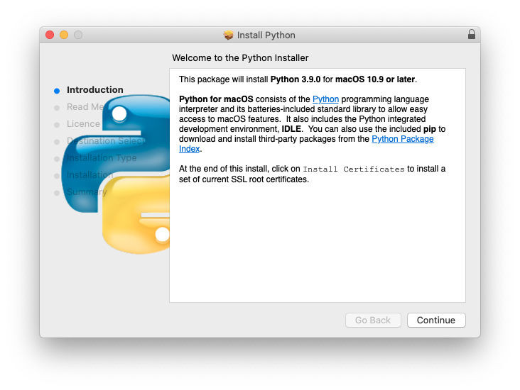

 

5. Finally click on the `Continue` to Install python.

  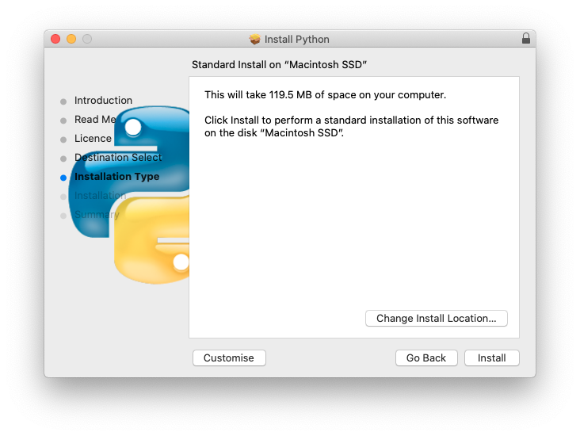

## 3. Setting up environment for Python in Webots

1. For setting up the environment for Python in Webots, go to Webots menu and click on `Preferences`.

  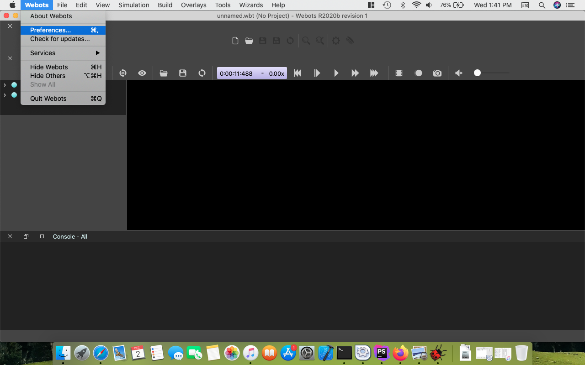

 

2. Copy the path where you have installed the Python extension (along with that type \python.exe ) and paste it in the dialog box as shown in the image below:

  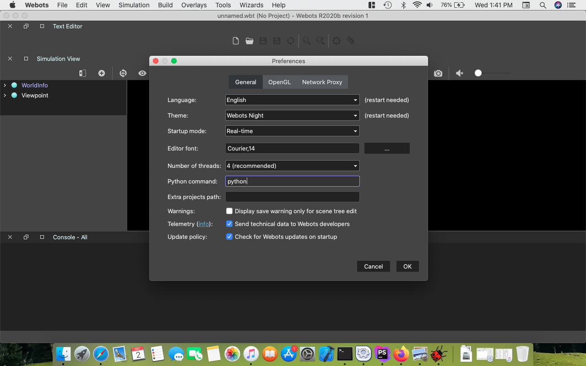

 

3. After adding the path, click on OpenGL to make the changes shown in the figure below. Once done click on OK and we are done with the required setup.

  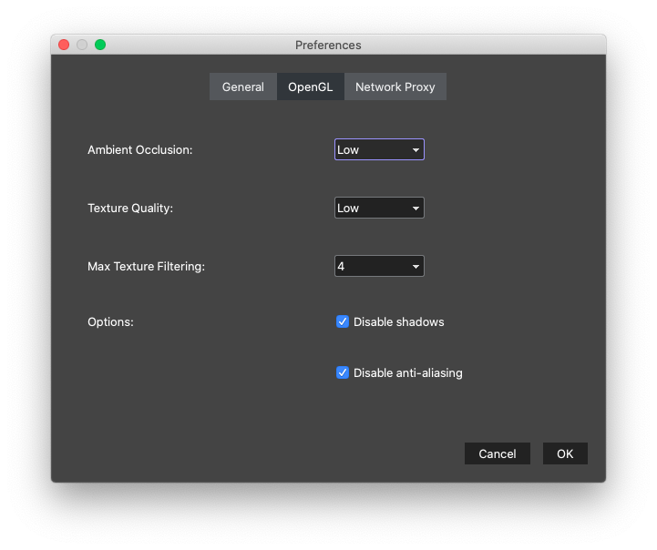

 

