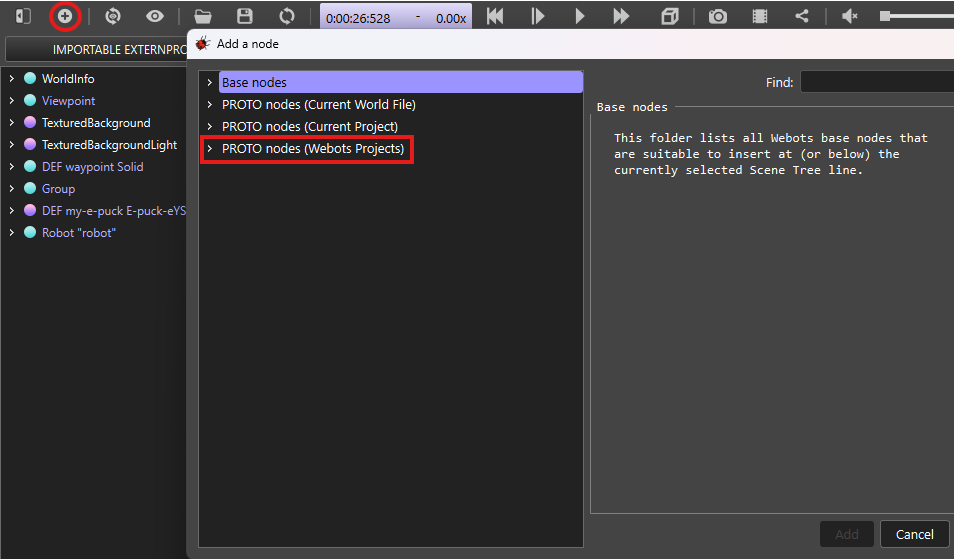
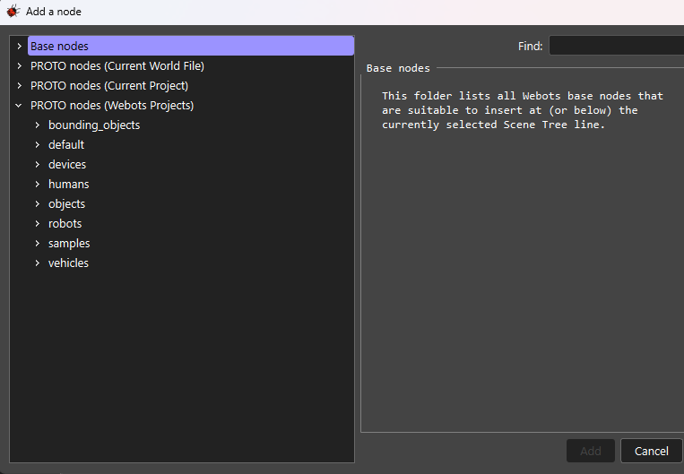
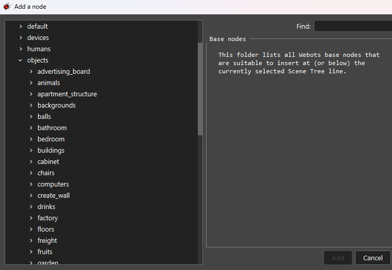
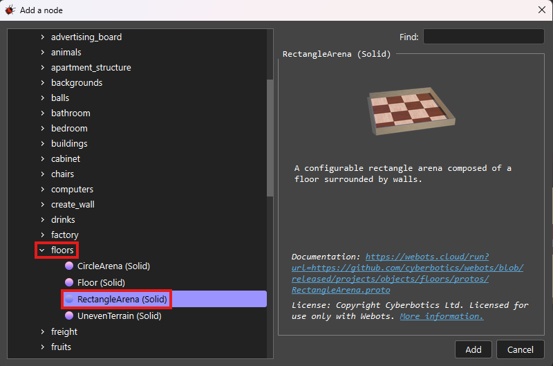
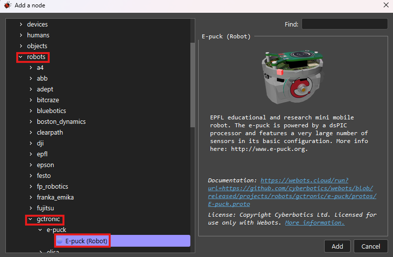

<h1 style="text-align: center;">Adding objects to Webots</h1>

## How to add objects in Webots?

Above the scene tree, Click on the **"+"** button. This will lead you to the interface as shown in the image below:

 

Expand PROTO nodes (Webots Projects) and you will be able to see different nodes.

If you expand objects node, you can see different objects available in PROTO nodes (Webots Projects).

<h3>For Example:</h3>

1. If you wish to add rectangular arena, then go to **floors**, select **RectangularArena** and click on **Add**.

2. If you wish to add e-Puck robot in your world file, then expand **robots** node and go to **gctronic** and select **E-puck (Robot)**. Click on **Add**.

Similarly, we can add other objects present in the PROTO nodes and explore **Sample Worlds** available in the **File -> Open Sample World** menubar.

