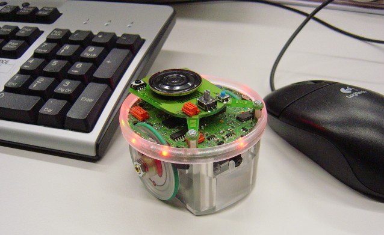
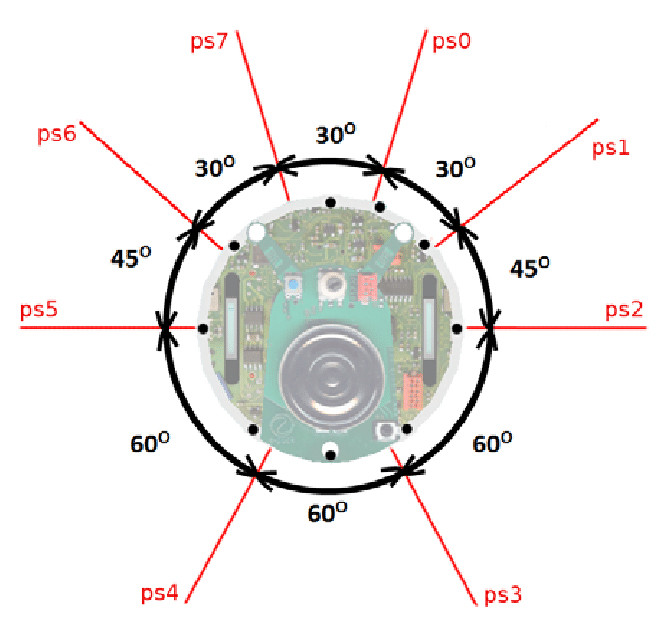
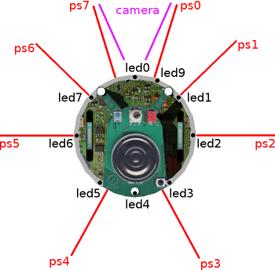
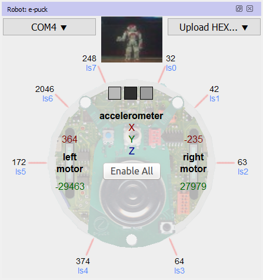

<h1 style="text-align: center;">Introduction to e-puck</h1>

Throughout this eYSRC 2025 competition, we will be using `e-puck` miniature mobile robot.

 

 Image Source: <a href="https://www.cyberbotics.com/doc/guide/epuck?version=cyberbotics:R2019a#overview-of-the-robot" download>Link</a>

e-puck was designed to fulfill the following requirements:

1. **Elegant design:** The simple mechanical structure and electronics design.
2. **Flexibility:** e-puck covers a wide range of educational activities, offering many possibilities with its sensors, processing power and extensions.
3. **Simulation software:** e-puck is integrated with Webots simulation software for easy programming, simulation and remote control of the (physical) robot.

The e-puck robot also features a large number of sensors and actuators as depicted on the below pictures with devices and described in the table.

| **Features**                                   | **Description**      | 
| ---------------------------------------------- | -------------------- | 
| Size, Weight	                                 | 7.4 cm in diameter, 4.5 cm high, 150 g |
| Battery                                        | 5Wh LiION rechargeable and removable battery providing about 3 hours autonomy |
| Max. forward speed                             |	0.25 m/s |
| Max. rotation speed                            |	6.28 rad/s |
| IR sensors                                     |	8 infra-red sensors measuring ambient light and proximity of obstacles in a 4 cm range |
| Camera	                                     |  color camera with a maximum resolution of 640x480 |
| Accelerometer                                  |	3D accelerometer along the X, Y and Z axes |
| Gyroscope                                      |	3D gyroscope along the X, Y and Z axes |
| LEDs	                                         |  8 red LEDs on the ring and one green LED on the body |
| Bluetooth	                                     | Bluetooth for robot-computer and robot-robot wireless communication |

 
 

 &nbsp;&nbsp; 
 

 Position of LEDs and Proximity sensors

 Image Source: <a href="https://www.cyberbotics.com/doc/guide/epuck?version=cyberbotics:R2019a#overview-of-the-robot" download>Link1</a>, <a href="https://www.researchgate.net/figure/Overhead-view-of-an-E-Puck-robot-with-the-angles-between-proximity-sensors-labeled-from_fig4_289404595" download>Link2</a> 

> [!NOTE]
> In the above images ps0, ps1, etc are the positions of distance sensors on e-puck model.

 

 

 Position of Light sensors, motors and accelerometer 

 Image Source: <a href="https://www.cyberbotics.com/doc/guide/epuck?version=cyberbotics:R2019a#overview-of-the-robot" download>Link</a>

