<h1 style="text-align: center;">Creating a New Project Directory</h1>

<hr>

In this module, we will learn how to create a **Project Directory** in Webots.

---

## 1. Steps to Create a New Project Directory

1. In the menu bar, click **File**.  
2. From the dropdown, select **New → New Project Directory**.

<p align="center">
	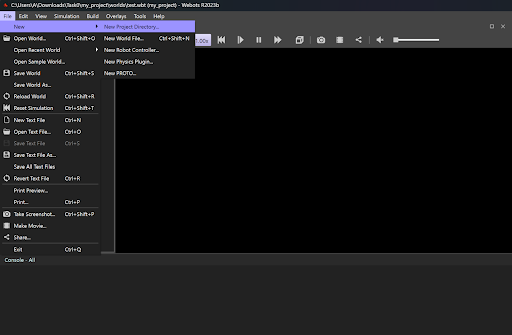
</p>

3. Click **Next**. You can rename `my_project` to any name of your choice.

<p align="center">
	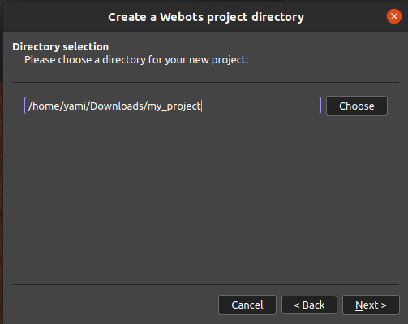
</p>

4. Rename the file to `new_project` and check the box **Add a rectangular arena**.

<p align="center">
	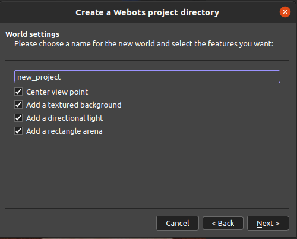
</p>

5. Click **Finish**.

<p align="center">
	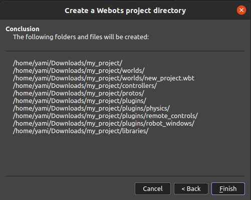
</p>

---


## 2. Adding the E-puck Robot to the Workspace

You will notice that there’s **no robot** in the scene by default.  
To add the **E-puck** robot, follow the steps below:

<p align="center">
	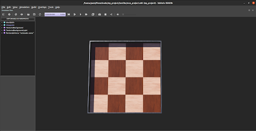
</p>

1. Click the **“+”** icon as shown below.

<p align="center">
	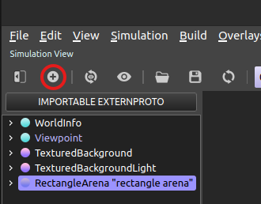
</p>

2. Click on **PROTO nodes (Webots Projects)**.

<p align="center">
	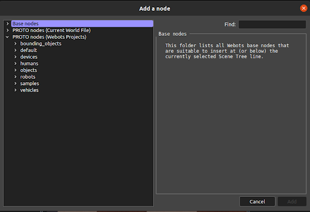
</p>

3. Expand the **robots** folder.

<p align="center">
	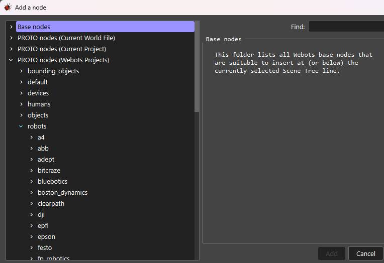
</p>

4. Open the **gctronic** folder, select the **E-puck** robot, and click **Add**.

<p align="center">
	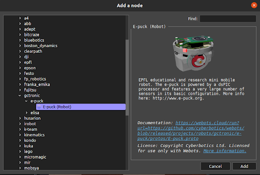
</p>

---
## 3. Adjusting the Arena and Robot Position

1. In the **Scene Tree**, click on the **RectangularArena** node and change the **floorTileSize** values to:
   ```
   x = 1
   y = 1
   ```

<p align="center"> 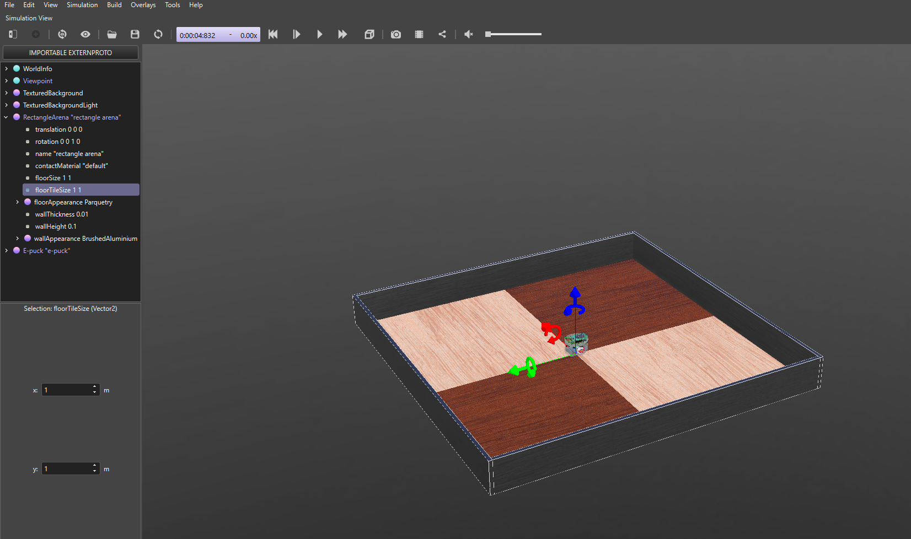 </p>

2. Click on Change View and switch to Top View.

<p align="center"> 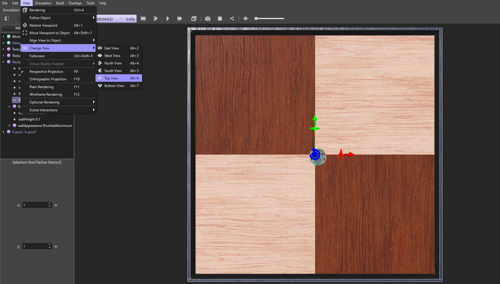 </p>

3. Click on the E-puck node and change the translation and rotation values as follows:

```
translation: (-0.25, -0.25, 0)
rotation: 1.57 rad
```

<p align="center"> 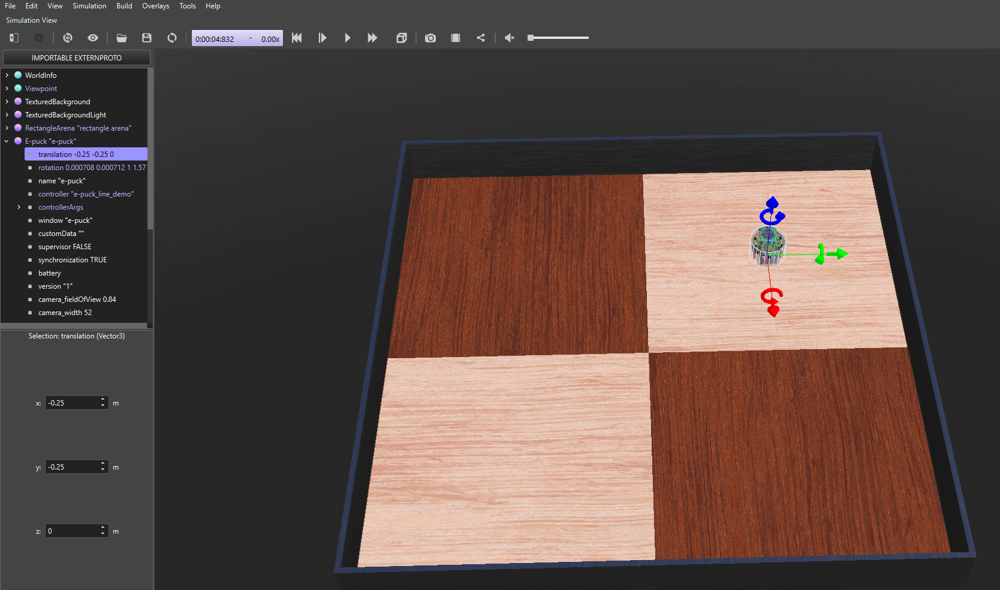 </p>