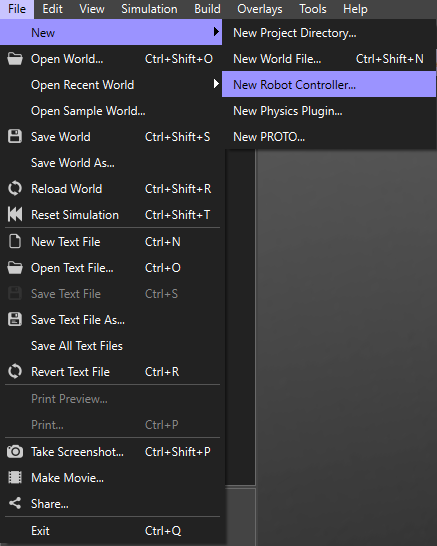
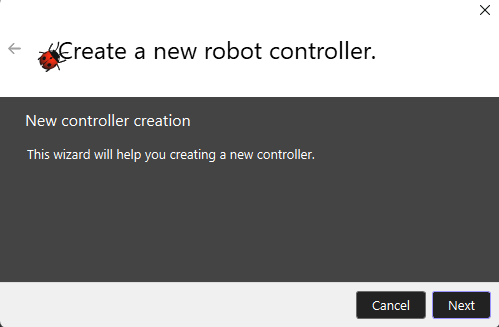
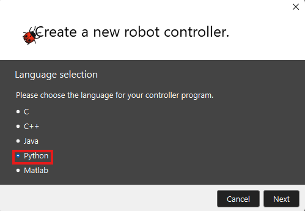
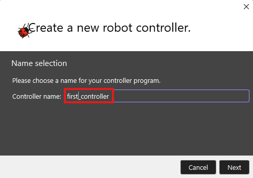
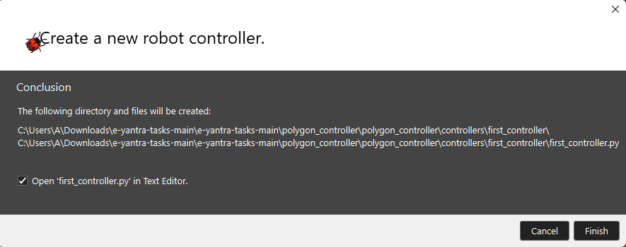
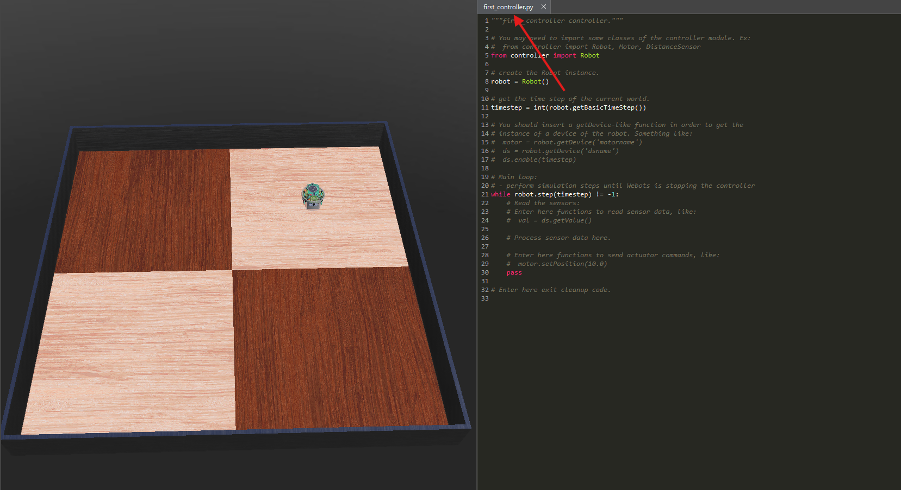

<h1 style="text-align: center;">The Steps to Create a New Controller</h1>

1. In the menu bar click File,Drop down “New” ands select “New Robot Controller”.

 

2. Click on Next.

 

3. Then select the language as `Python` and click on `Next`.

 

4. Give a name for the controller as `first_controller` and again click on `Next`.

 

5. Verify the path and click on the checkbox as shown in the image below and click on to `Finish`.

 

6. Then, on the right side of the Webots window , in the text editor you can see the controller `first_controller.py` with template code provided.

 

