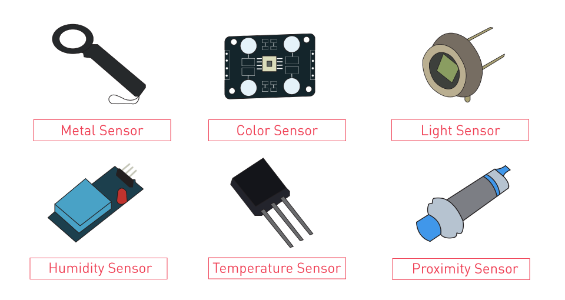
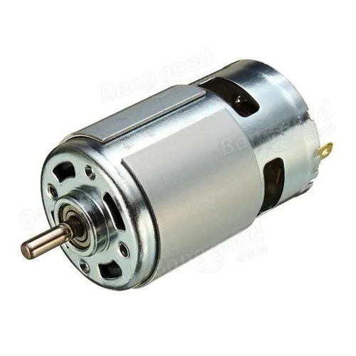
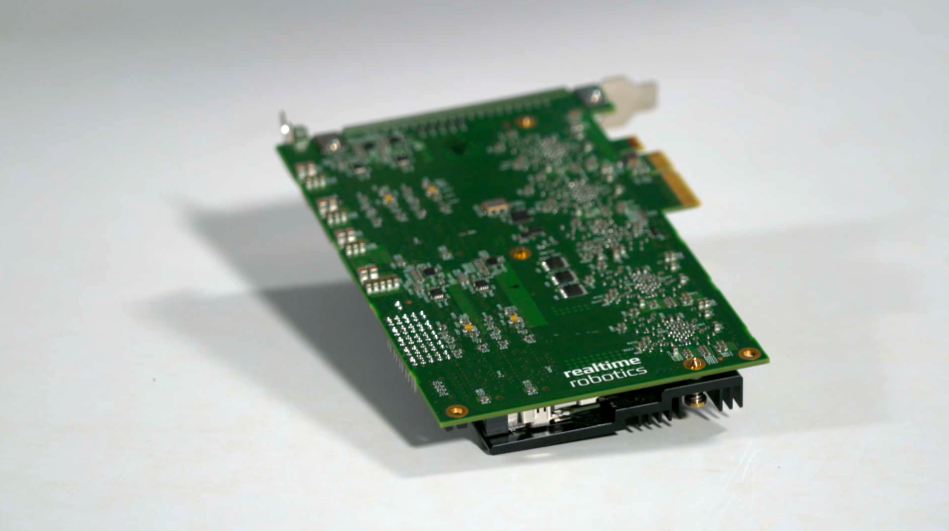
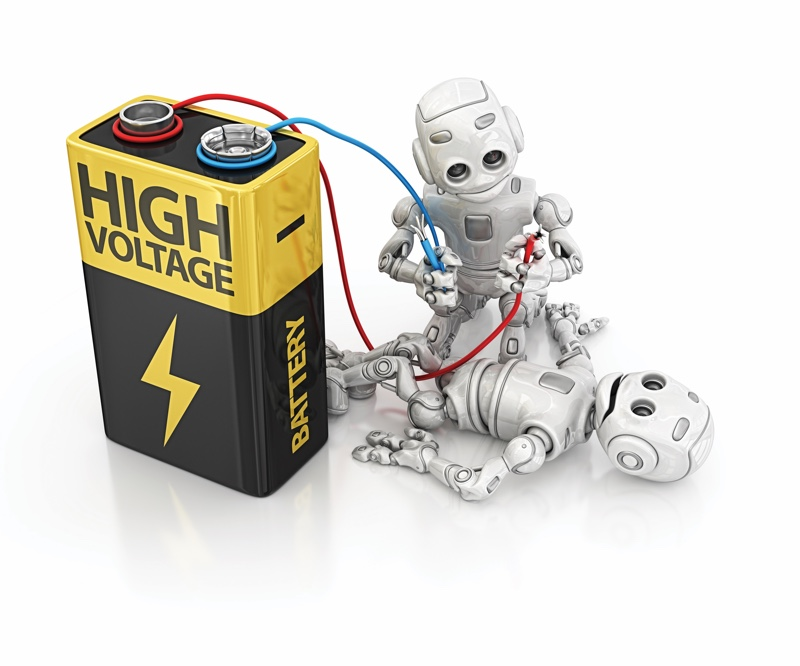

<h1 style="text-align: center;">A Brief Overview of Robotics</h1>

Welcome to the e-Yantra School Robotics Competition! We hope you have fun!
Now since it is a robotics competition, we found it worthwhile to explain some background of the robotics field, as many of you might be only superficially acquainted with it.

There's almost an infinite amount of stuff to learn in any field of knowledge and practice. Hence, even we don't know all of it. But we find it useful to share what we do know, in hopes of piquing your curiosity and enabling and encouraging you learn in a hands-on manner, which we believe is the key to get better in any domain of action. May all of us never stop learning!

### What do you know about robots!?

Do mention what you do know and are curious about in this post on the QnA forum (share stuff you find cool and useful as well)! We will discuss your answers in a live stream soon!/next week

### What is Robotics?

Robotics is a mix of many fields like engineering, computer science, and math. Robots are machines that can do tasks on their own, or with the help of a computer. From simple machines to complex ones like drones, robots are everywhere! The word “robot” was first used by a Czech writer, Karel Čapek, in his 1920 play, where it meant “worker.”

### Useful Skills in Robotics:

To be great at robotics, you need a mix of skills, from understanding math to learning how to program and work with robotic systems. Don’t worry, though! You’ll learn these skills over time, and through fun, hands-on projects.

### What Makes Up a Robot?

Here are the four main parts of a robot:

1. **Sensors**: 
   Sensors help robots understand their surroundings. Some sensors send signals like light or sound, while others just measure things like temperature or distance.

    

2. **Actuators**: 
   These are the parts that make the robot move! Motors are the most common actuators, but robots can also use air (pneumatic) or liquids (hydraulic) to move.

    

3. **Computing**: 
   Robots have a “brain” too! This can be a simple chip or a powerful computer. Robots use their computers to make decisions based on what their sensors pick up.

    

4. **Power**: 
   Robots need energy to move and think. Most robots run on electricity, and mobile robots often use batteries to stay powered.

    

    

### Robot Software:
Robots need both hardware (like sensors and motors) and software (the code that tells the robot what to do). Learning to write code helps you control what your robot does.

---

Even though learning all this might seem like a lot, the best way to do it is through fun projects! Building something, whether on a computer or in real life, helps you learn and improve.

Good luck, and have fun! We’ll dive into more cool robot stuff in the next section.

 
All the best!