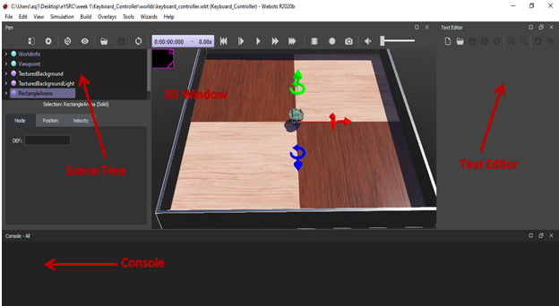

<h1 style="text-align: center;">The Webots Interface</h1>

<!-- 1. The essential files to get you started with Task 0 are provided by us in the Downloads Page - > Task 0 ZIP file.
2. Unzip Task0.zip file.
3. Go to `Keyboard_Controller -> worlds` and double clicking on `pen.wbt` file will lead you to 
the Webots simulator which will look like the image shown below : -->

**Webots GUI is composed of four principle windows:**
- The **3D window** that displays and allows you to interact with the 3D simulation
- The **Scene tree** which is a hierarchical representation of the current world
- The **Text editor** that allows you to edit source code
- The **Console** that displays both compilation and controller outputs.

A computer program that controls a robot specified in a world file (i.e. .wbt file) is known as a **Controller**. All the instructions to be given to the bot are written in the controller and the bot will do the tasks accordingly.

 

