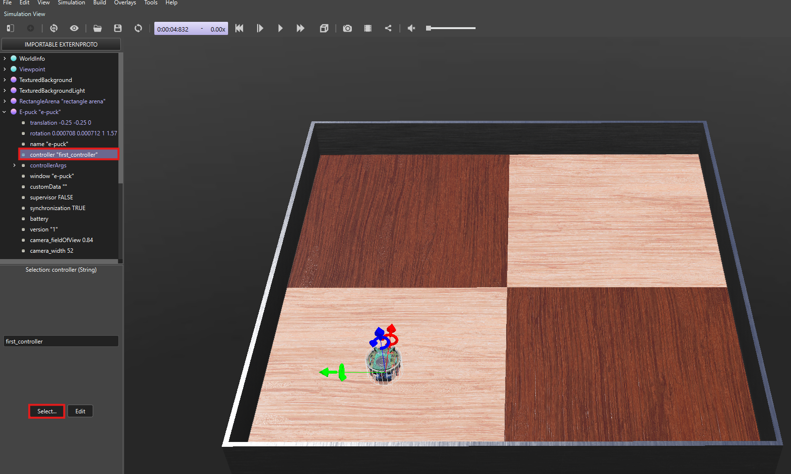

<h1 style="text-align: center;">Writing the Python Script</h1>

<hr>


>This part of the module assumes you have some prior experience in coding. If you do not have experience this may seem intimidating. That is why the whole code is prewritten for you. Try your best to understand what each line does. But Do Not worry if it's not understood, because this will be covered in greater depth in the coming week.

First let's clearly define the objective before we start editing the controller:

- The e-puck should move for 3 seconds in the forward direction.
- The e-puck should halt after moving for 3 seconds


Now with this objective in mind let's start writing the program.

<hr>

When the controller was created you will notice a template code already exists and it looks something like this:

```python
"""my_controller controller."""

# You may need to import some classes of the controller module. Ex:
#  from controller import Robot, Motor, DistanceSensor
from controller import Robot

# create the Robot instance.
robot = Robot()

# get the time step of the current world.
timestep = int(robot.getBasicTimeStep())

# You should insert a getDevice-like function in order to get the
# instance of a device of the robot. Something like:
#  motor = robot.getDevice('motorname')
#  ds = robot.getDevice('dsname')
#  ds.enable(timestep)

# Main loop:
# - perform simulation steps until Webots is stopping the controller
while robot.step(timestep) != -1:
    # Read the sensors:
    # Enter here functions to read sensor data, like:
    #  val = ds.getValue()

    # Process sensor data here.

    # Enter here functions to send actuator commands, like:
    #  motor.setPosition(10.0)
    pass

# Enter here exit cleanup code.

```

You will notice a lot of comments (lines starting with #) that describe what the template code is doing. Following are things that we will need to add in order to complete the set objective.

 1. **Important Imports**\
 We need to import Robot class of the controller module. This will help us use the predefined functions available in Webots to control the robot.

    ```python
    from controller import Robot
    ```

2. **Defining Essential Variables** (Contants)\
Defining the duration of each physics step [(timestep)](https://cyberbotics.com/doc/guide/controller-programming#the-step-and-wb_robot_step-functions) in milliseconds. *This line is already written in the template.*

    ```python
    # time in [ms] of a simulation step
    timestep = int(robot.getBasicTimeStep())
    MAX_SPEED = 6.28
    ```

> [!IMPORTANT]
> The maximum allowable speed of the robot which is 6.28 rad/sec as per webots documentation of GCTronic' e-puck. 


3. **Initializing the leftMotor and rightMotor**\
Get a handler to the motors and set target position to infinity (speed control) and set the initial velocity as 0.
Also initialize two variables to hold the motor speed values.

    ```python
    # initialize motors
    leftMotor = robot.getDevice('left wheel motor')
    rightMotor = robot.getDevice('right wheel motor')
    leftMotor.setPosition(float('inf'))
    rightMotor.setPosition(float('inf'))
    leftSpeed = 0.0
    rightSpeed = 0.0
    leftMotor.setVelocity(leftSpeed)
    rightMotor.setVelocity(rightSpeed)
    ```

- **robot.getDevice():** This function helps the robot to identify its parts by using their names as the argument.

- **setPosition():** This function is used to set the target position of the motor `float('inf')` is used for continuous rotation mode.

- **setVelocity():** This function is used to set the speed of the motor, takes the speed value as the argument.


4. **The Main Loop**<br>

    - Our main goal is to set the velocity of the wheels using the setVelocity function for both the wheels.
    - After that the same speed should continue for 3 seconds.
    - Finally after these 3 seconds have elapsed the robot should come to halt. We use the `break` here since we want to execute the loop only once 

    ```python
    while robot.step(timestep) != -1:
        leftMotor.setVelocity(MAX_SPEED)
        rightMotor.setVelocity(MAX_SPEED)
        robot.step(3000)
        leftMotor.setVelocity(0)
        rightMotor.setVelocity(0)
        break
    ```


### Finally Let's Run the Controller!

Now we need to make sure e-puck is using the correct controller.
To do this we need to have a look at the Scene Tree.
In the Scene tree, under E-puck, the "controller" value should be assigned the correct controller name. Refer the below image:

<p align="center">
  
</p> 


You can "Select..." the correct controller by clicking on the `Select` button and selecting the controller you have just designed.
And with that if all is done well, the play button should start the controller and you should be able to control the robot.


### Further Study

To explore more on Robot, Motor controls you can refer to the following Webots reference links :

1. [https://cyberbotics.com/doc/reference/robot](https://cyberbotics.com/doc/reference/robot)
