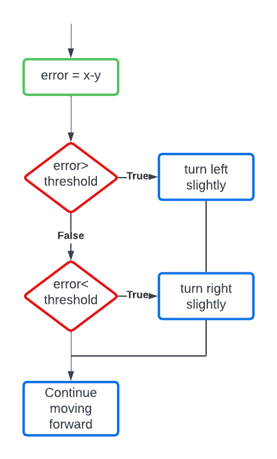
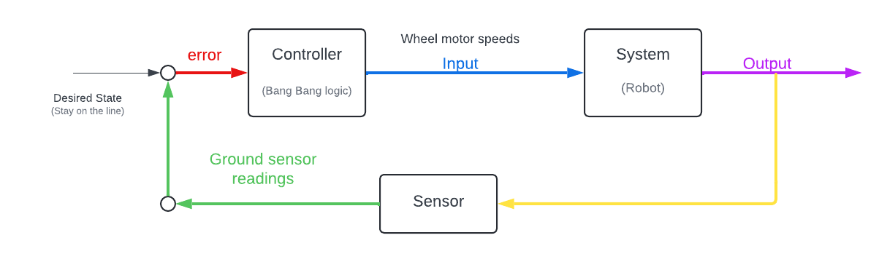

<h2><center>Bang Bang Controller for Line Following</center></h2>
<hr>

The Bang Bang approach to line following follows a similar logic to the controller used for wall following, the controller should contain two states which switch abruptly based on the feedback from the sensors used to detect the line.

Which sensor do you think can be used to detect the line? 

### How does it work?
In line following we want the robot to move over a black line which is present on a white surface. e-puck can sense whether it is above the line or not using the ground sensors. So the two conditions for our bang bang controller would be:

1. If the robot moves to the right of the line it has to turn slightly towards the left to remain on the line. 
2. If the robot moves to the left of the line it has to turn slightly towards right to remain on the line.

This makes the robot switch direction continuously to try and stay on line similar to the thermostat example from the *Bang Bang Controller* chapter.

This can be represented in the form of a flowchart to better understand the conditions that we will be using in the bang bang controller 

<p align="center">

</p> 

The above flowchart can be converted to the following closed controller block diagram 

<p align="center">

</p> 

In this example for line following:

-  **desired state** 
    - Center of the line 
-  **sensor reading**
    - ground sensor values
-  **error**
    - `error = left_sensor - right_sensor`
    - positive error means that the bot is deviating towards the left
    - negative error means that the bot is deviating towards the right 
    
-  **input**
    -The left and right wheel velocities based on the error value
    -The controller will take the error values and change the input to be sent to the robot based on the conditions defined.

### Implementation in Webots

Before implementing the logic we need to do the setup. We need to do all the required initializations and create a control loop to read the ground sensor values.

**Initializations:**
- Including all the necessary header files
```python
from controller import Robot
```
- Some important/useful global variable
```python
# time in [ms] of a simulation step
TIMESTEP = 32
MAX_SPEED = 6.28
```
- Initializing robot, motors, and gs sensor
```python
# create the Robot instance.
robot = Robot()

# ground sensors
gs = []
gsNames = ['gs0', 'gs1', 'gs2'] # Left Middle Right
for i in range(3):
    gs.append(robot.getDevice(gsNames[i]))
    gs[i].enable(timestep)

# motors    
leftMotor = robot.getDevice('left wheel motor')
rightMotor = robot.getDevice('right wheel motor')
leftMotor.setPosition(float('inf'))
rightMotor.setPosition(float('inf'))
leftMotor.setVelocity(0.0)
rightMotor.setVelocity(0.0)
```
- Finally creating the main control loop!
```python
# feedback loop: step simulation until receiving an exit event
while robot.step(TIMESTEP) != -1:
    gsValues = []
    for i in range(3):
        gsValues.append(gs[i].getValue())


    error = #?

    if #??:
    	leftSpeed = #?
    	rightSpeed = #?
    elif #??:
    	leftSpeed = #?
    	rightSpeed = #?
    else:
    	leftSpeed = #?
    	rightSpeed = #?

    leftSpeed =  #?
    rightSpeed = #?

    leftMotor.setVelocity(leftSpeed)
    rightMotor.setVelocity(rightSpeed)
```

The blanks are left for you to fill...

**Happy Coding!**

Coming Up Next: Implementation of **Proportional Controller** for line following. 