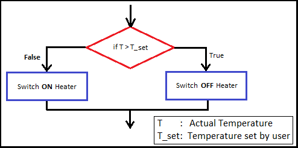
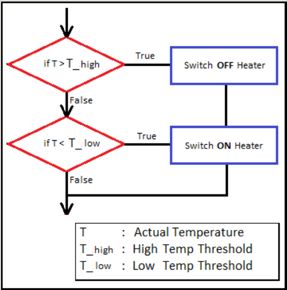
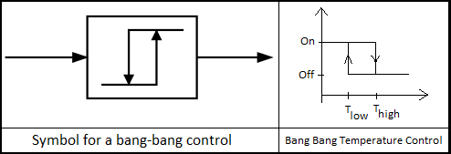
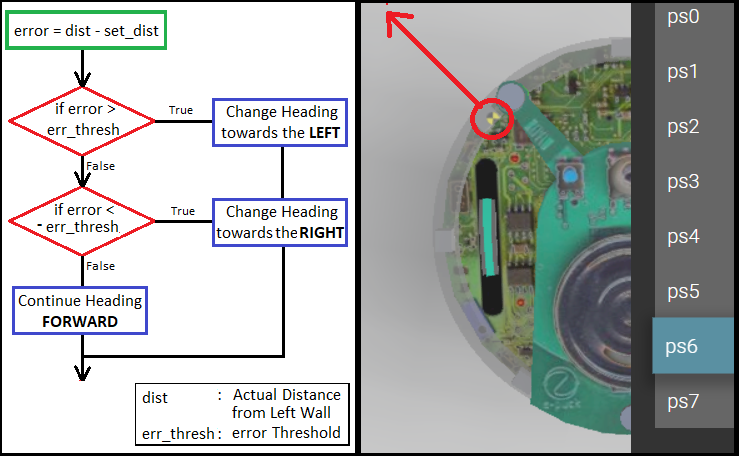
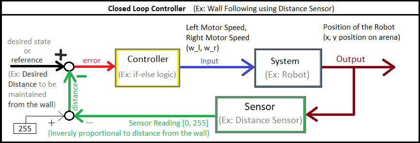

<h2><center> Bang Bang Controller</center></h2>
<hr>

The first controller that we shall write is something similar to what is popularly known as **"Bang Bang Controller"**. Well technically we might deviate a bit from what is strictly called Bang-Bang Controller but the idea is similar. 

### Definition
A bang–bang controller (2 step or on–off controller), is a **feedback controller** that switches abruptly between two **states**.  *- Wikipedia*

We have all surely come across this controller in our daily life. If all the bold words made sense you will be able to guess some systems in your daily life that implement such a controller. Would you like to guess where this kind of controller is used in real life? 

This is the controller that is used in water heater, thermostat etc.


<p align="center">
<iframe width="640" height="360" src="https://www.youtube.com/embed/je4MB5hs9uc?si=U76FXLnfyecqrrpk" title="YouTube video player" frameborder="0" allow="accelerometer; autoplay; clipboard-write; encrypted-media; gyroscope; picture-in-picture; web-share" referrerpolicy="strict-origin-when-cross-origin" allowfullscreen></iframe>
</p>


**Question:** If you were to design a controller for a thermostat for a heater, how would you do it?

A possible algorithm you would come up with would be as shown in the flow chart below. 
- IF temperature goes above set_temperature SWITCH OFF heater
- IF temperature goes below set_temperature SWITCH ON heater.
<p align="center">

</p> 

**Question:** Is there any flaw with this design?

What happens if the temperature is exactly equal to the set_temperature?
In practice the heater would rapidly switch on and off and therefore this controller would damage the heater!

**Question:** So whats the solution?

We keep an allowance... We define T_high slightly higher than set_temperature and T_low slightly lower than set_temperature. And we modify the controller to the following flow chart:
- IF temperature goes above T_high SWITCH OFF heater
- IF temperature goes below T_low SWITCH ON heater.

<p align="center">

</p> 

This logic of a Bang Bang controller is shown in its **symbol**! 
The image on the left shows the symbol of Bang Bang Control, while the image on the right shows why it is so. The graph on the right shows the Temperature on x-axis and the control input sent to the heater is shown on the y-axis.

Also do you see the "Bang Bang" happening in the graph!? xD :P

<p align="center">

</p> 

### Wall Following Bang Bang Controller
We shall try to use a similar controller to make the robot follow the wall. As you may have observed already, from the **code perspective** this is nothing but an **IF-ELSE Logic**.

**Question:** This is a good time to _think_ what the different **states** of the robot/system would be and when would these states be triggered. In other words, what would be your different **"if conditions"** and what would be its respective **"reactions"**?

Following is a flowchart of the algorithm that "we" propose. The algorithm that you propose might be different from the below flow and might also work perfectly. But the following flowchart is simple yet effective algorithm using just IF-ELSE logic. 

Very intuitively speaking it is better to use the sensor that looks a little ahead of the robot rather than the side of the robot so that it can react to whats ahead. Therfore in this algorithm we are following the left wall using the ***ps6* sensor**

<p align="center">

</p> 

And if you compare this flowchart with the closed loop control block diagram that we discussed in introduction, the full picture will become complete. The left hand side of the bloack diagram is shown in the flowchart above.

<p align="center">

</p> 

In the specific example of Wall Following,
- **desired state/reference**
	- `set_dist = The distance to be maintained from the wall`
- **sensor reading** (NOT shown in Flowchart)
	- `dist_inv = [0;255] inversely proportional to distance from Wall`
	- `dist = 255 - dist_inv`
- **error** (Green Box in Flowchart)
	- `error = dist - set_dist`
	- *positive error* would mean the bot is too *far from* the wall
	- *negative error* would mean the bot is too *close to* the wall
- **input** (Blue Boxes in Flowchart decide the motor speeds)
	- the left and right wheel velocity has to be decided based on the error.
	- The *Controller* will take the *error* value and generate the *input* to be sent to the robot based on the error.

### Implementation in Webots

Once the above discussed concepts are understood clearly the only thing left to do is to implement it in python code.

With the Flowchart at hand the logic of the controller is already known.

But before we implement the logic we need to do the setup. We need to do all the required *Initializations* and we need to create a control loop that will continuously *read sensor data from ps6 sensor*.

**Initializations:**
- Including all the necessary header files
```python
from controller import Robot
```
- Some important/useful global variable
```python
# time in [ms] of a simulation step
TIMESTEP = 32
MAX_SPEED = 6.28
```
- Initializing robot, motors, and ps6 sensor
```python
# create the Robot instance.
robot = Robot()

# initialize devices
leftMotor = robot.getDevice("left wheel motor")
rightMotor = robot.getDevice('right wheel motor')
leftMotor.setPosition(float('inf'))
rightMotor.setPosition(float('inf'))
leftMotor.setVelocity(0.0)
rightMotor.setVelocity(0.0)

ps6 = robot.getDevice('ps6')
ps6.enable(TIMESTEP)
```
- Finally creating the main control loop!
```python
# feedback loop: step simulation until receiving an exit event
while robot.step(TIMESTEP) != -1:
    psValue6 = ps6.getValue()

    dist_inv = #?
    dist = #?

    set_dist = #?
    err = #?

    if #??:
    	leftSpeed = #?
    	rightSpeed = #?
    elif #??:
    	leftSpeed = #?
    	rightSpeed = #?
    else:
    	leftSpeed = #?
    	rightSpeed = #?

    leftMotor.setVelocity(leftSpeed)
    rightMotor.setVelocity(rightSpeed)
```

The blanks are left for you to fill...

**Happy Coding!**

### What's Next?

Although Bang Bang controllers are still used in Thermostats it is not a good controller for the wall_following robot that we are designing. The reasoning for this is a deep one, but very simple put... The Bang Bang (more formally the **rapid switching** between states/ velocities) is not good for our robot. But also as you fill notice it is NOT a very "graceful" control! The next controller that we shall be desiging will help the robot to complete the challenge much more smoothly that the bang-bang controller.

Coming Up Next: **Proportional Controller**