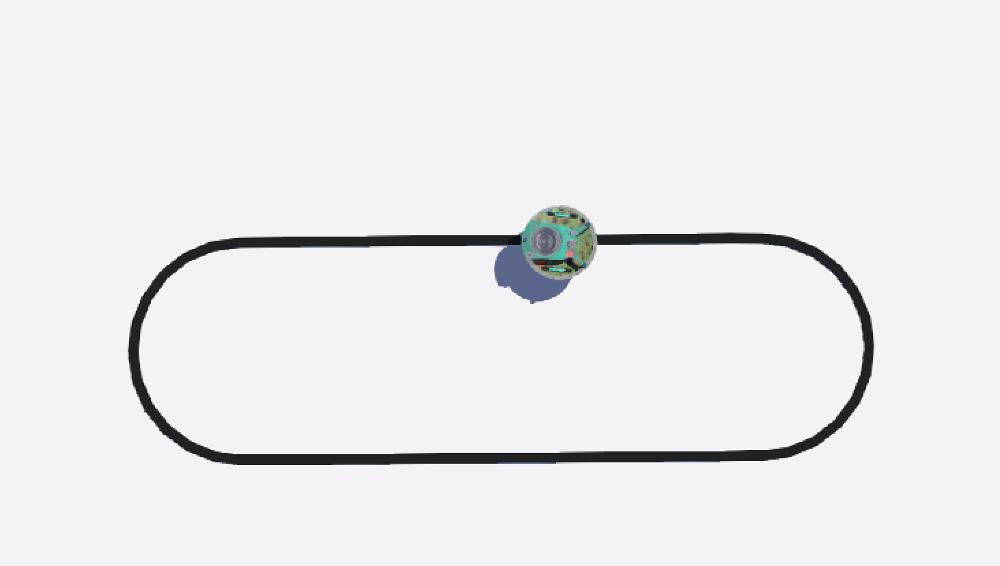

<h2><center>Designing Contollers - Line Following</center></h2>
<hr>

In this chapter, we shall design a controller to follow a line using the ground sensors present in the  e-puck.
The two chapters will focus on using the bang bang controller to achieve the desired behavior.

#### The Challenge
To design a controller to "Follow a line". The project Directory with all the essentials has been provided to you in the "Line_Follower" row under "Learn Resources" in the "Downloads" page of the mdbook.

Once unzipped you will find the following content in the project directory.
- `Line_Follower.wbt` is the world file that you need to work in for this challenge.
- `line_follower.py` is the python file that you need to write your code in, to complete the challenge.

> **NOTE:** Do NOT edit the proto files (in the challenges or in the tasks). In your own time after completing the challenges and tasks if your are curious please do explore the proto files. proto files are what describe the robot, i.e it's dimension, sensors, actuators and so on.

```
	Line_Follower
	├── controllers
	│   └── line_follower
	│       └── line_follower.py
	├── worlds
	│   ├── Line_Follower.wbt
	│   └── STL
	│       ├── line2.STL
    │       └── arena.STL    
	└── protos # DO NOT Change These Files (for now)!
	    ├── E-puck-eYSRC.proto
	    ├── E-puckDistanceSensor.proto
        └── E-puckGroundSensors.proto
```

#### How to Edit the Controller?
Once you open the world, in the scene tree, under *E-puck-eYSRC* make sure to **select** the **line_follower** controller. Then click on **edit** to make sure you are editing the correct controller file in the *text editor*.

The image below shows the image of the arena provided to you in the **Downloads**. 
Also note that the cursor and the scene tree show where you can go to ***edit the controller***.

<p align="center">

</p>

#### What's Next?
Now that we have the setup ready and have clearly set the objective to achieve, we shall finally get to actually design the line following controller!

In the next chapter we shall see how to design a bang bang controller for Line following!


