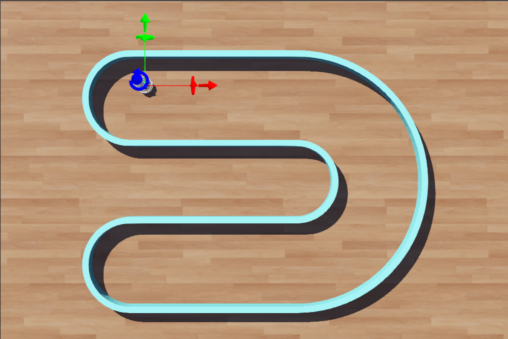

# <center>Designing Controllers - Wall Following </center>

<hr>

In this chapter and the next one, we shall design controller to follow a wall using the distance sensor.
The two chapters will focus on two different ways to achieve this desired behaviour.

#### The Challenge
Design a Controller to **"Follow the Wall"**.
Project Directory with the essentials has been provided to you in the "Wall_Follower" row under "Learn Resources" in the ["Downloads"](../../../Downloads.mdown) page of this mdbook. 

Once unzipped you will find the following content in the project directory.
- `Wall_Follower.wbt` is the world file that you need to work in for this challenge.
- `wall_follow.py` is the python file that you need to write your code in, to complete the challenge.

> **NOTE:** Do NOT edit the proto files (in the challenges or in the tasks). In your own time after completing the challenges and tasks if your are curious please do explore the proto files. proto files are what describe the robot, i.e it's dimension, sensors, actuators and so on.

```
	Wall_Follower
	├── controllers
	│   └── wall_follower
	│       └── wall_follower.py
	├── worlds
	│   ├── Wall_Follower.wbt
	│   └── STL
	│		├── Floor.stl
	│       └── Walls.STL
	└── protos # DO NOT Change These Files!
	    ├── E-puck-eYSRC.proto
	    └── E-puckDistanceSensor.proto
```
#### How to Edit the Controller?
Once you open the world, in the scene tree, under *E-puck-eYSRC* make sure to **select** the **wall_follower** controller. Then click on **edit** to make sure you are editing the correct controller file in the *text editor*.

The image below shows the image of the arena provided to you in the **Downloads**. 
Also note that the cursor and the scene tree show where you can go to ***edit the controller***.

<p align="center">

</p>

#### What's Next?
Now that we have the setup ready and have clearly set the objective to achieve, we shall finally get to actually design the wall following controller!

In the upcoming chapters we shall find two different approaches to write your controller!

***BONUS Challenge:*** We shall be following the wall along the left in our explaination. A good exercise would be to mirror it and *follow the wall on the **right side** of the robot*.