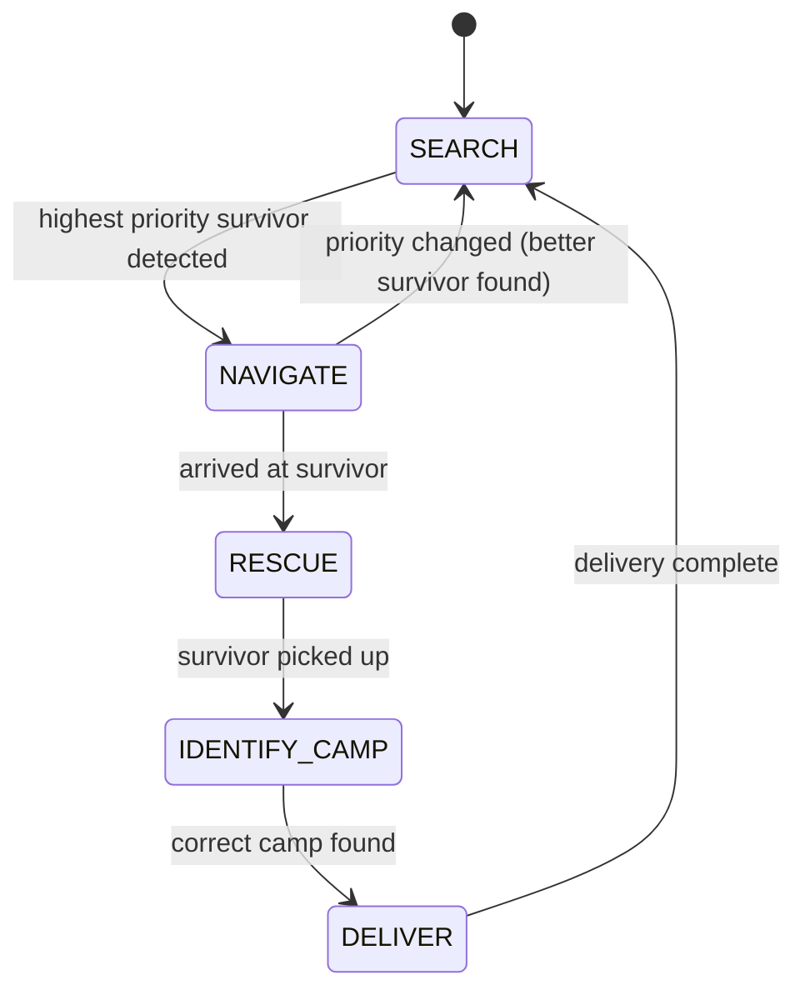

# Finite State Machines (FSM)

---

## What is a Finite State Machine?

A **Finite State Machine (FSM)** is a computational model used to design systems that can be in exactly one of a finite number of **states** at any given time.

The machine transitions from one state to another in response to **inputs** or **events**.

FSMs are widely used in robotics because they provide a clean, structured way to model robot behaviour.

---

## Why Use FSMs in Robotics?

Without an FSM, robot controllers often become a tangled mess of `if-else` statements that are hard to debug.

With an FSM, you clearly define:

- What **states** the robot can be in
- What **conditions** trigger a state change
- What **actions** the robot performs in each state

This makes your code easier to read, test, and extend.

---

## FSM Terminology

| Term | Meaning |
|------|---------|
| **State** | A defined mode of behaviour (e.g., SEARCH, NAVIGATE, DELIVER) |
| **Transition** | A change from one state to another, triggered by a condition |
| **Input/Event** | A sensor reading or event that triggers a transition |
| **Action** | What the robot does while in a state |

---

## Example: Simple 3-State Robot FSM

Imagine a robot that must:
1. Search for a target
2. Navigate to it
3. Deliver it and then go back to searching

```
┌─────────────────────────────────────────────┐
│                                             │
▼                                             │
SEARCH ──(target detected)──► NAVIGATE        │
                                │             │
                          (reached target)    │
                                │             │
                                ▼             │
                            DELIVER ──────────┘
                         (delivery done)
```

---

## Implementing an FSM in Python

### Method 1: Using a Variable and if-elif

```python
from controller import Robot

robot = Robot()
timestep = int(robot.getBasicTimeStep())

# --- FSM State Variable ---
state = "SEARCH"

while robot.step(timestep) != -1:

    if state == "SEARCH":
        # Rotate and look for target
        rotate_slowly()
        if target_detected():
            state = "NAVIGATE"

    elif state == "NAVIGATE":
        # Move towards the target
        move_towards_target()
        if reached_target():
            state = "DELIVER"

    elif state == "DELIVER":
        # Perform delivery action
        deliver()
        state = "SEARCH"
```

### Method 2: Using a Dictionary of Functions

```python
def search_state():
    rotate_slowly()
    if target_detected():
        return "NAVIGATE"
    return "SEARCH"

def navigate_state():
    move_towards_target()
    if reached_target():
        return "DELIVER"
    return "NAVIGATE"

def deliver_state():
    deliver()
    return "SEARCH"

# State-to-function mapping
state_functions = {
    "SEARCH":   search_state,
    "NAVIGATE": navigate_state,
    "DELIVER":  deliver_state,
}

state = "SEARCH"

while robot.step(timestep) != -1:
    state = state_functions[state]()
```

---

## FSM Diagram for Task 3

Task 3 requires a more complex FSM where survivor priorities can change dynamically.



---

## Tips for Designing FSMs

- Keep each state focused on **one clear behaviour**.
- Avoid complex logic inside state transitions - use helper functions.
- Print the current state during testing to debug transitions.
- Handle edge cases like "what if no target is found" explicitly.

---

## Common Mistakes

- Forgetting to update the state variable (robot gets stuck)
- Checking transition conditions in the wrong state
- Having overlapping conditions that cause unpredictable transitions
- Not resetting variables when re-entering a state

---

> **NOTE!** <span style="color:red">For Task 3, your FSM must monitor survivor priorities continuously - not just when first entering the SEARCH state. A survivor that changes from Yellow to Red must be immediately re-prioritised.</span>
