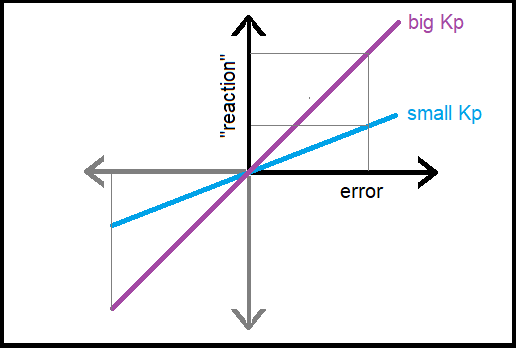
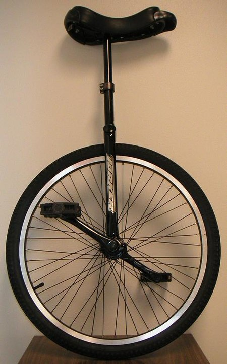
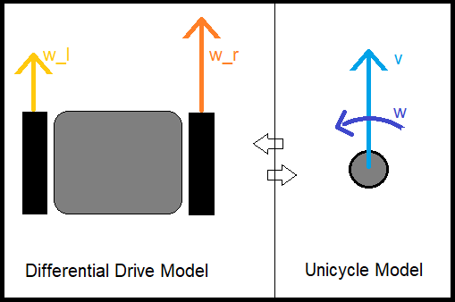
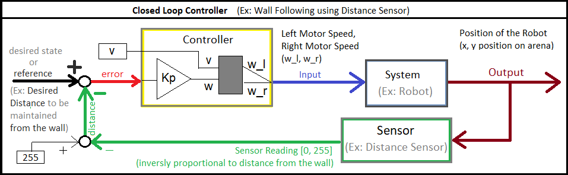
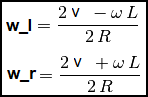

<center><h2> Proportional Controller</h2></center>

<hr>

**Question:** If you were the robot, 
- Would you wait till the error become big and then react abruptly? OR
- Would you rather make a small correction if there is a small error, and a big correction if there is big error?

Surely the obvious answer would be option 2. Using a more technical word, you would react **Proportional** to the error. Therefore your logic would be:

```
Reaction <proportional_to>  Error
Reaction <equal_to>	    Constant x Error
```
The constant decides how vigorously the controller would react to error. We shall name this constant **Kp** (Proportional Constant). The graph below shows the effect of Kp on the reaction for the same value of error.

<p align="center">

</p> 

**Question:** We know how to find error, it is the `Actual distance - Set distance`. But what is this reaction variable? Left motor speed? right motor speed? Average speed?

This is where we will introduce a new term!

## Unicycle Model
You  know about the **Differential Drive Model**, where we control the robot using Left Wheel and Right Wheel Velocities. But when we think about how a robot moves, we don’t usually think about controlling the left and right wheels individually. Instead, we tend to describe its motion more naturally—by how fast it’s moving forward and how much it’s turning.

This is exactly how a unicycle model works! You control it by adjusting:
- **Forward velocity (v):** How fast it moves ahead.
- **Turning velocity (ω):** How quickly it rotates or changes direction.

This way of thinking makes controlling a robot simpler, just like riding a unicycle!

<p align="center">

</p> 

Yes, it’s easy to switch between the differential drive model (which uses left and right wheel velocities, \\( w_l \\) and \\( w_r \\) and the unicycle model (which uses forward velocity \\( v \\) and turning velocity \\( \omega \\) .

<p align="center">

</p> 

We shall now design a Proportional Controller for a Unicycle model ( \\( v \\), \\( \omega \\)) and then we can easily change it to the familiar (\\( w_l \\), \\( w_r \\)) values, to command the epuck wheel velocities.

## Designing Proportional Controller

Now that we're controlling the robot using ( \\( v \\), \\( \omega \\)) instead of the wheel velocities (\\( w_l \\), \\( w_r \\)), let's revisit the question:

**Revisit Question:** What is the **"reaction"** in `reaction = Kp * Error`? What value should change proportional to the error? 

In this case, the value that should change is the turning **velocity (\\( \omega \\))**.

- **Error:** The difference between the robot’s current position/distance from the wall and its desired position.
`error = dist - set_dist` .

- **Reaction (\\( \omega \\)):** The turning rate of the robot, which should adjust based on how big the error is. The larger the error, the more we want the robot to turn, and the smaller the error, the smaller the turn.
```python
w = Kp * Error
```

**Question:** What is the value of \\( v \\)?

\\( v \\) is what makes the robot move forward, it is the average forward velocity. And since we want the robot to keep moving forward at a steady constant velocity:

```python
v = # constant average velocity for eg, .75*MAX_SPEED`
```
Connecting all the dots together, the closed loop controller looks something like the block diagram shown below.

The Triangle with Kp, simply means it multiplies the **error** by **Kp** and therfore outputs the **w** value.

<p align="center">

</p> 

The last part left to figure out, is the the grey box that converts the ( \\( v \\), \\( \omega \\)) to (\\( w_l \\), \\( w_r \\)).

## Unicycle to Differential Drive

Fully justifying the equation below might take some time and thinking. We can surely discuss that in detail (in the future) but from application point of view, to understand the equation all you need to do is focus on the four variables, (\\( v \\), \\( \omega \\), \\( w_l \\), \\( w_r \\)). 

<p align="center">

</p> 

If you focus just on the four variable (\\( v \\), \\( \omega \\), \\( w_l \\), \\( w_r \\)) and ignore the constants, the equation will look as follows: <br>

$$
w_l = v - \omega
$$

$$
w_r = v + \omega
$$

These equations help us understand how the robot reacts when the **turning velocity (\\( \omega \\))** changes.

Observe that,

- When the robot is too far from the wall (wants to move closer):
    - **Error (err)** is positive because the robot is farther than it should be.
    - \\( \omega \\) is positive, so:
    - \\(w_r = v + \omega \quad \text{(Right wheel moves faster than forward speed)} \\)
    - \\(w_l = v - \omega \quad \text{(Left wheel moves slower)} \\)
    - **Result**: The robot turns **left** to move closer to the wall.

---

- When the robot is too close to the wall (wants to move away):
    - **Error (err)** is negative because the robot is closer than it should be.
    - \\( \omega \\) is negative, so:
    - \\( w_r = v + \omega \quad \text{(Right wheel moves slower)} \\)
    - \\(w_l = v - \omega \quad \text{(Left wheel moves faster)} \\)
    - **Result**: The robot turns **right** to move away from the wall.

---

- When the robot is exactly at the right distance:
    - **Error (err)** is zero (no need to correct).
    - \\( \omega = 0 \\), so:
    - \\(w_r = w_l = v \quad \text{(Both wheels move at the same speed)} \\)
    - **Result**: The robot goes **straight**.


## Implementation in Webots

Now we have all the knowledge required to design our Proportional Controller. So go ahead and replace your old Bang Bang Controller with your brand new Proportional Controller.

Same as last time you will need all the initial setup:

---

**Initializations:**
- Including all the necessary header files
```python
from controller import Robot
```
- Some important/useful global variable
```python
# time in [ms] of a simulation step
TIMESTEP = 32
MAX_SPEED = 6.28
```
- Initializing robot, motors, and ps6 sensor
```python
# create the Robot instance.
robot = Robot()

# initialize devices
leftMotor = robot.getDevice("left wheel motor")
rightMotor = robot.getDevice('right wheel motor')
leftMotor.setPosition(float('inf'))
rightMotor.setPosition(float('inf'))
leftMotor.setVelocity(0.0)
rightMotor.setVelocity(0.0)

ps6 = robot.getDevice('ps6')
ps6.enable(TIMESTEP)
```

---

- But now the main control loop will include a Proportional Controller!
```python
# feedback loop: step simulation until receiving an exit event
while robot.step(TIMESTEP) != -1:
    psValue6 = ps6.getValue()

    dist_inv = #?
    dist = #?

    set_dist = #?
    err = #?

    # P-Controller applied on Unicycle Model
    v = #?
    w = #?

    # Converting to Differential Drive
    w_l = #?
    w_r = #?

    leftMotor.setVelocity(w_l)
    rightMotor.setVelocity(w_r)
```

The blanks are left for you to fill.

**Happy Coding!**

