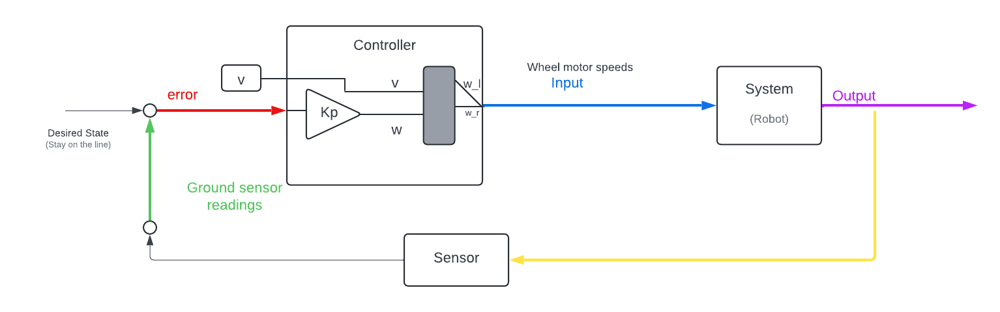

<h2><center>Proportional Controller for Line Following</center></h2>
<hr>

### Why use a proportional controller for Line following?

For following a line it is not always optimal to wait for a large deviation from the line before steering to the correct direction and realign the bot, similar to the case with wall following the bot has to detect and react proportional to the error that shows the deviation from the line which seems more reasonable than waiting for the error to shoot up and then react.

The closed loop control for the proportional controller can be given roughly as:

<p align="center">

</p> 

The desired state and sensor reading will remain the same as used for the bang bang controller 

### Logic for the proportional controller 

First let us try and understand what the error value represents in the line following problem. Unlike the case for wall following where we are using only a single sensor, we use the ground sensor which is a combination of 3 sensors. Hence we can say that if the center sensor is on the line the robot follows the line, if the left sensor is on the line it means that the bot is moving in the right direction and the reverse is true when the right sensor senses the line.

From the above deduction we can say that when two of the 3 sensors specifically the left and right sensor sense closely related values the bot is following the line and if all 3 sensors detect close values then the bot has deviated from the line.

`error = right_sensor-left_sensor`

Ans we know the tuning speed w(omega) is given by<br>

`w = Kp * error`

The differential drive equations for the velocity will remain the same i.e.

`w_r = v + w`<br>

`w_l = v - w`

Now let's implement this logic in webots

### Implementation in Webots


**Initializations:**
- Including all the necessary header files
```python
from controller import Robot
```
- Some important/useful global variable
```python
# time in [ms] of a simulation step
TIMESTEP = 32
MAX_SPEED = 6.28
```
- Initializing robot, motors, and gs sensor
```python
# create the Robot instance.
robot = Robot()

# ground sensors
gs = []
gsNames = ['gs0', 'gs1', 'gs2'] # Left Middle Right
for i in range(3):
    gs.append(robot.getDevice(gsNames[i]))
    gs[i].enable(timestep)

# motors    
leftMotor = robot.getDevice('left wheel motor')
rightMotor = robot.getDevice('right wheel motor')
leftMotor.setPosition(float('inf'))
rightMotor.setPosition(float('inf'))
leftMotor.setVelocity(0.0)
rightMotor.setVelocity(0.0)
```
- Finally creating the main control loop!
```python
# feedback loop: step simulation until receiving an exit event
while robot.step(TIMESTEP) != -1:
    gsValues = []
    for i in range(3):
        gsValues.append(gs[i].getValue())

    error = #?

    Kp = #?

    v=#?

    w = #?

    w_l = #?
    w_r = #?

    leftMotor.setVelocity(w_l)
    rightMotor.setVelocity(w_r)
```

The blanks are left for you to fill.

**Happy Coding!**


