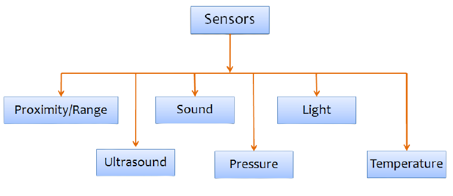
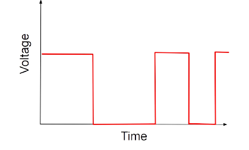
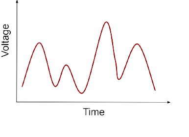
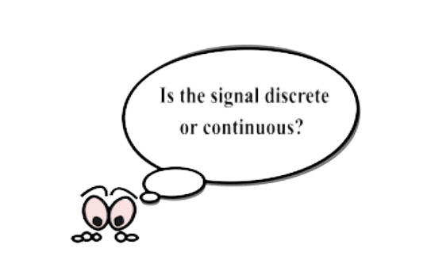
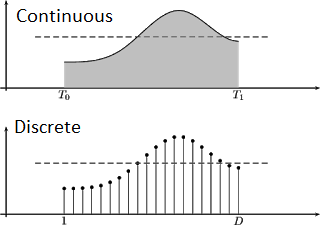
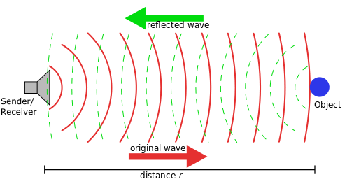
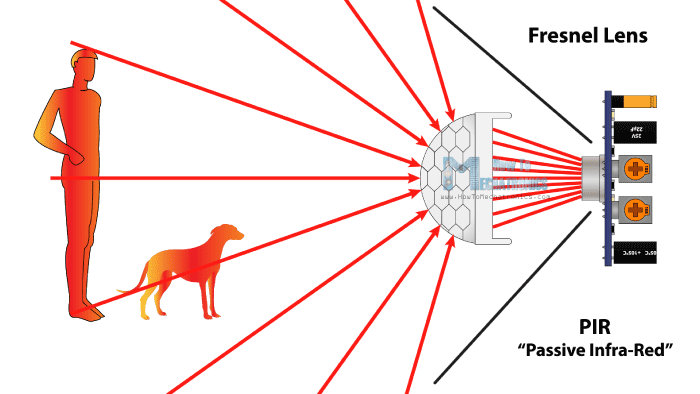

<h2>
 Introduction to Sensors 
</h2>

<h3>What are sensors?</h3>

Devices which allow the robot to sense the environment around it. Considering robots as analogous to we human beings, sensors are devices that make robots feel the world as humans do with help of their five senses. Sensors have become an integral part of Embedded System and Robotics.

Few types of sensors are shown in the image below.

Sensors are usually classified on certain characteristics such as - 
1. Digital OR Analog sensors
2. Active OR Passive sensors

**Characteristics of Sensors:**

1. **Digital sensors :**  
The output signal produced or reflected by the sensor is binary (either on or off state).  

Ex. Digital Temperature sensor, Digital Pressure sensor, etc.

2. **Analog sensors :**  
The sensors that produce continuous analog output signals to the system is known as Analog sensor. It senses the external parameters such as wind speed, solar radiation, light intensity etc. and gives precise value of the measured parameter. 

Ex. Accerelometer, Proximity sensor, Light sensor, etc. 

Sensing happens on receiving and transmitting signals from sensors. There are 2 types of signals:
<ol>
<li>Continuous Signal</li>
<li>Discrete Signal</li>
</ol>

<ol>
<li><b>Continuous Signal: </b></li>
<ul>
<li>A continuous signal is like a smooth line that doesn’t break. It's a steady curve that flows over time, like how the temperature changes slowly throughout the day.</li>

<li>A continuous signal is called an analog signal.</li>

<li> It is a continuous function of time defined on the real line (or axis) R. It has continuous amplitude and time. That is, the continuous-time signals will have certain value at any instant of time.</li>

</ul>
<li> <b>Discrete Signal: </b></li>
<ul>
<li>In a discrete-time signal, the number of elements in the set, as well as the possible values of each element, is finite, countable. </li>
<li>A discrete signal is called digital signal.</li>
<li> The discrete-time signal can be represented and defined at certain instants of time in its sequence. </li>
<li>The discrete-time signals are represented with binary bits and stored on the digital medium.</li>
</ul>

</ol>

**Let's learn what is Active and Passive sensor.**
1. **Active sensors:**

<ul>
<li>The active sensors are designed for measuring signals transmitted by the sensor that were reflected, refracted or scattered in the environment. </li>
<li>The advantages of active sensors include the ability to obtain measurements anytime, regardless of the time of day or season.</li>
<li>It require an external power supply to operate. </li>
<li>Sensors like ultrasonic sensors, distance sensors, etc. come under the Active category.</li>
</ul>

Let’s take an example of ultrasonic sensors, it measures the distance of a target object by emitting ultrasonic sound waves, and converts the reflected sound into an electrical signal.

2. **Passive sensors:**

<ul>
<li>The sensors are designed to receive and to measure natural emissions from the environment.</li>
<li>It does not need any additional power source.</li>
<li>It can only be used to detect energy when the naturally occurring energy is available.</li>
</ul>
For example, Passive Infrared sensors (PIR) are usually used for home automation. When a warm body like a human passes by, the sensor detects the IR radiations and turns on the light.

**Sensors in the e-puck robot :**

1. **Proximity sensors / Distance Sensors:**
2. **Position sensors**
3. **Light Sensor**
4. **Ground Sensor** 
5. **Camera**

> **Note :** We will cover the detailed information of each sensor in next module. Only the Proximity sensors and Ground sensor will be covered in further tasks.