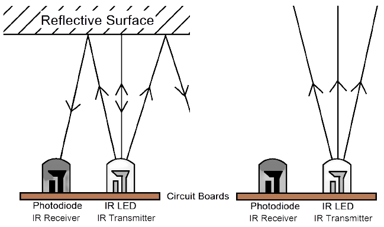
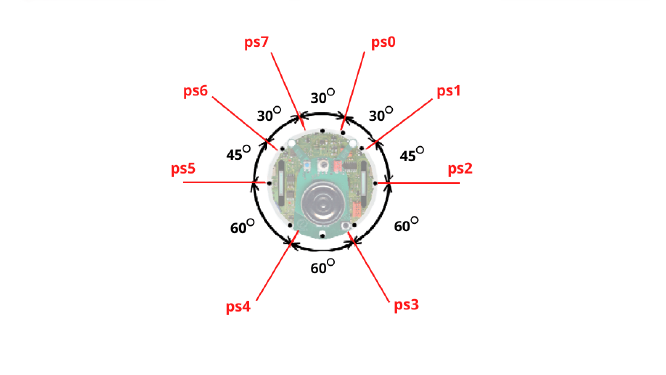
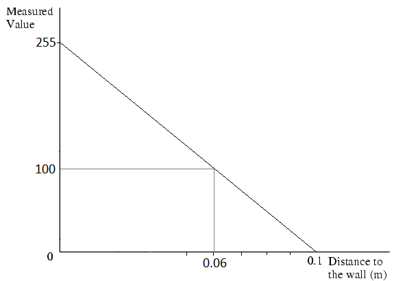
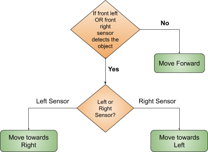
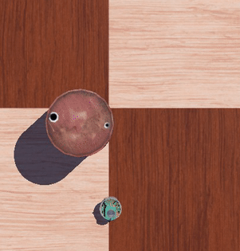
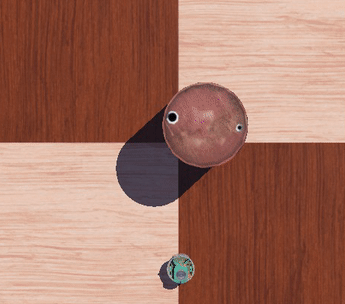
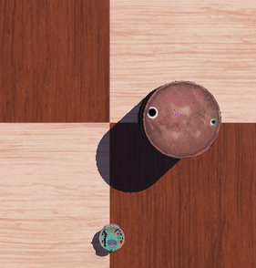
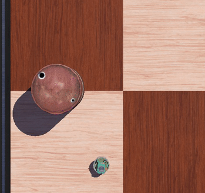

# <center> Proximity Sensor </center>

<hr>

This sensor is able to detect the presence of nearby objects without any physical contact.

<p align="center">

</p>

The e-puck has 8 infra-red sensors measuring ambient light and proximity of objects. <br>
**Range:** 4 cm

The sensor not only detects the presence of an object, but also gives the distance value at which the object is located from the robot. ps0 is Proximity sensor 0, ps1 is proximity sensor 1, and so on as shown in the image below:

<p align="center">

</p>


**How does it work?** <br>
The output of proximity sensors is inversely proportional, this means that when the distance increases the sensor value gradually decreases. Refer to the below image.
<p align="center">

</p>

The above image is with respect to the original e-puck present in the Webots. But this e-puck's proximity sensor has 4 cm range with noise and this gives random values. So for that we have changed the range of proximity sensor to 10 cm with no noise in original e-puck's proto file. Hence the output value of proximity sensors ranges from 0 to 255.

> *__Note :__ Do not modify the proto files located in proto folder provided to you.*

The e-puck is equipped with 8 proximity sensors for collision avoidance around environment. These sensors have values varying from 0 to 255, where 0 means the object is at greater than 10cm distance from the sensor. *So, if the value is 100 then what will be the scenario?*

Imagine the e-puck robot is in a stranded environment. There are various rocks, trees, doghouse, swing, etc. We need to make sure the e-puck doesn’t collide with any objects. It should always maintain a distance from the objects and explore the complete environment. 

**So, how will the e-puck detect these objects?** <br>
Let’s think of the sensor/s which can help the e-puck robot to navigate the unknown environment. The algorithm to make the way for our e-puck robot will be:


<p align="center">

</p>


As we know, the e-puck has a total - eight proximity sensors. Out of which we have, 
- two sensors in the front (ps0) & (ps7)
- two sensors in the left i.e front left sensor (ps6) & left sensor (ps5).
- two sensors in the right i.e front right sensor (ps1) & right sensor (ps2).

**How will we determine the presence of an object?** <br>
As mentioned above, for an ease of use, we have changed the proximity sensor values in the range of 0 to 255. The value at which the sensor starts taking the decision in the presence of an object is called the **Threshold value**.

Let’s start writing the code for the e-puck robot in 3 steps.

> *__Note :__ To perform these activities, you can download the .wbt file from [Downloads](../../../Downloads.mdown) section.*

**Step 1:** <br>
Program the robot to check if the objects are towards the front of the robot, if yes, then 
1. Check if the object is at the front right then take left turn.
2. Check if the object is at the front left then take right turn. <br>
else the robot can simply move forward.


1. We need to import Robot class of the Controller module.
```python
from controller import Robot
```
2. Let’s define e-puck’s  maximum speed which is 6.28 rad/sec according to the Webots documentation. Also, you can define an average speed for the run. In the following example, we have taken the average speed as 0.75 times maximum speed.
```python
MAX_SPEED = 6.28
w =  0.75*MAX_SPEED
```
3. Below the line that creates the Robot instance robot = Robot(), initialize the left motor and right motor and set target position to infinity (speed control) and set the initial velocity at 0.
```python
leftMotor = robot.getDevice('left wheel motor')
rightMotor = robot.getDevice('right wheel motor')
leftMotor.setPosition(float('inf'))
rightMotor.setPosition(float('inf'))
leftMotor.setVelocity(0.0)
rightMotor.setVelocity(0.0)
```
4. Just after the initialization of motors, get and enable the distance sensors as follows:
First get all the eight sensors named from ps0 to ps7 in a list
```python
psNames = [
    'ps0', 'ps1', 'ps2', 'ps3',
    'ps4', 'ps5', 'ps6', 'ps7'
]
```
5. To enable distance sensor, use getDistanceSensor() function with robot instance and pass each sensor name as parameter. Use for loop to get all the 8 sensors instead of writing each line for each sensor. 
```python 
ps = []
for i in range(8):
    ps.append(robot.getDevice(psNames[i]))
    ps[i].enable(timestep)
 ```      
		

6. Let’s define a function for moving a robot in forward direction:
```python
def go_straight(w): 
leftMotor.setVelocity(w)
rightMotor.setVelocity(w)
```

Similarly, define a function to move the robot in right and left direction :
```python
def soft_right(w,t):
    leftMotor.setVelocity(w)
    rightMotor.setVelocity(0)
    robot.step(t)
```
```python
def soft_left(w,t):
    leftMotor.setVelocity(0)
    rightMotor.setVelocity(w)
    robot.step(t)
```

7. To continuously check the sensor values till the controller is running use while loop. In while loop, we will check the values of sensors ps0 and ps1 and the robot will avoid the object (if present) and move around it to recover its path.
```python
while robot.step(timestep) ! = -1:
    psValues = []
    
    for i in range(8):
        psValues.append(ps[i].getValue())
        
    print("psValues[0] :", psValues[0], "psValues[7]:", psValues[7])
    if psValues[0] >= 60.0:
        soft_left(w,1530)
    elif psValues[7]>= 60.0:
    	soft_right(w,1530)
    else:
        go_straight(w)
```

`output:` If objects are on the front left :

<p align="center">
  
</p>

`output:` If objects are on the front right :

<p align="center">
  
</p>


**Step 2:** <br>
Program the robot to check if the objects are on the right side of the robot, then the e-puck has to take a left turn to avoid the object. 

1. In order to check if the objects are on the right side of the robot or not, we will check the values of sensors ps1 and ps2. So our while loop will be :

```python
while robot.step(timestep) ! = -1:
    psValues = []
    
    for i in range(8):
        psValues.append(ps[i].getValue())
        
    print("psValues[1] :", psValues[1], "psValues[2]:", psValues[2])
    if psValues[1] >= 60.0 or psValues[2]>= 60.0:
        soft_left(w,1530)
    else:
        go_straight(w)
```

`output:` If objects are on the right :

<p align="center">
  
</p>


**Step 3:** <br>
Program the robot to check if the objects are on the left side of the robot, then the e-puck has to take a right turn to avoid the object. 

1. In order to check if the objects are on the left side of the robot, we will check the values of sensors ps5 and ps6. So our while loop will be :

```python
while robot.step(timestep) ! = -1:
    psValues = []
    
    for i in range(8):
        psValues.append(ps[i].getValue())
        
    print("psValues[5] :", psValues[5], "psValues[6]:", psValues[6])
    if psValues[5] >= 60.0 or psValues[6]>= 60.0:
        soft_left(w,1530)
    else:
        go_straight(w)
```

`output:` If objects are on the left :

<p align="center">
  
</p>


