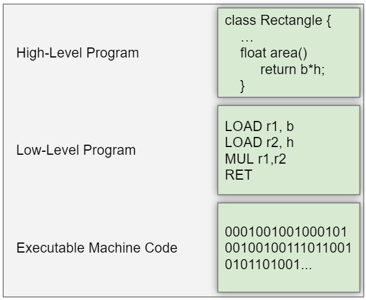

<h1 style="text-align: center;">Computer Programming (Part 2)</h1>

## Types of Programming Languages 
**Machine Language**
    - Machine code is a low-level programming language, consisting of machine language instructions, used to control a computer's central processing unit (CPU).
    - 0s and 1s only.
    - Each machine architecture has its own machine language. 
    - Machine code is the only way to directly communicate with the machine.

**Assembly Languages**
    - Assembly language is any low-level programming language in which there is a very strong correspondence between the instructions in the language and the architecture's machine code instructions. 
    - Because assembly depends on the machine code instructions, every assembly language is designed for exactly one specific computer architecture. 
    - Assembly language may also be called symbolic machine code.
    - Assembly code is converted into executable machine code by a utility program referred to as an assembler. 

**High Level Languages**
    - A high-level programming language is a programming language with strong abstraction from the details of the computer. 
    - In contrast to low-level programming languages, it may use natural language elements be easier to use making the process of developing a program simpler and more understandable than when using a lower-level language.
    - This programming language is not directly readable by the computer. Rather, it is intended to make programs more readable to humans.
    - High level languages use a compiler and/or an interpreter to convert code to a machine readable low level language.

<center> </center><br>

<table>
    <thead>
        <tr>
            <th style="text-align: center;">Interpreter</th>
            <th style="text-align: center;">Compiler</th>
        </tr>
    </thead>
    <tbody>
        <tr>
            <td> Conversion takes place <b>LINE BY LINE</b> and <b>DURING</b> the execution of the program. </td>
            <td> Conversion takes place <b>ALL AT ONCE</b> and <b>BEFORE</b> the execution of the program. </td>
        </tr>
        <tr>
            <td> An interpreter takes very less time to analyze the source code. </td>
            <td> A compiler takes more time to analyze the source code.</td>
        </tr>
        <tr>
            <td> The interpreter keeps translating the program continuously till the first error is confronted. If any error is spotted, it stops working and hence debugging becomes easy. </td>
            <td> The compiler generates the error message only after it scans the complete program and hence debugging is relatively difficult while working with a compiler.</td>
        </tr>
        <tr>
            <td> Interpreters are used by programming languages like Ruby and Python. </td>
            <td> Compliers are used by programming languages like C and C++. </td>
        </tr>
    </tbody>
</table>

<!-- **In case of Interpreter:** -->

<!-- ```python
firstname = "Justin"
print(firstname)
print(lastname)
``` -->

<!-- <MonacoPyEditor :code="myCode" />

<script setup>
const myCode = 
`
firstname = "Justin"
print(firstname)
print(lastname)
`
</script> -->


<!-- <div>
  <iframe 
    src="https://trinket.io/embed/python3/e1d3a902e6" 
    width="100%" 
    height="356" 
    frameborder="0" 
    marginwidth="0" 
    marginheight="0" 
    allowfullscreen>
  </iframe>
</div>

Output: Line 1 and 2 will execute and print "Justin" but Line no. 3 will give an error as Lastname doesn't exist.

<b>In case of Compiler:</b>

<div>
  <iframe 
    frameborder="0" 
    width="100%" 
    height="500px" 
    src="https://replit.com/@ishakamone/DopeyUntidyDefragment?lite=true#main.c">
  </iframe>
</div>

Output: It will not execute any statement and give an error as shown in the image below:

 -->


