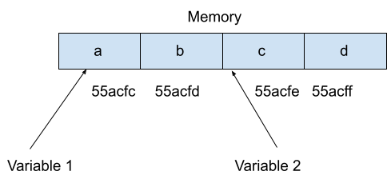

<h1 style="text-align: center;">Variables</h1>

<hr>

Variables are used to store information, so you can think of variables like boxes they can store items in. The word variable in programming describes a place to store information such as numbers, text, lists of numbers and text, and so on. And in order to remember what was put in the box, we have to assign a descriptive name, like: *number_of_apples*, we use an equal sign(=) and then tell Python what information the variable (box) should store.

## Assigning Values to Variables
After a variable is given a name, you give it a value. Assigning this value is like filling the box.

#### Syntax:

```python
<variable-name> = <value>
```
Where the equal sign `=` is used to assign value (right side) to a variable name(left side). 

**Example:** If you had 3 apples, you would set number_of_apples equal to 3, like so:

```python
number_of_apples = 3 
```


>[!NOTE]
>This doesn't mean that another variable can't have the same value. Variables are powerful because they can be reused and changed easily during program execution.

<iframe src="https://trinket.io/embed/python3/83fd0eb160" width="100%" height="356" frameborder="0" marginwidth="0" marginheight="0" allowfullscreen></iframe>

> [!TIP] 
> Setting this value of “3” to the variable is called assigning. Assignment statements read to left only.


#### For Example:
`a=3` is correct, but `3=a` does not make sense to python, which creates a syntax error. 

*Like:*

<iframe src="https://trinket.io/embed/python3/b3e5621d6d" width="100%" height="356" frameborder="0" marginwidth="0" marginheight="0" allowfullscreen></iframe>

## Multiple Assignment in Python

The basic assignment statement works for single variable and expression.  We can also assign the same value to multiple variables simultaneously.

#### Syntax :

```python
var1=var2=var3.....varn=value
```
#### For Example:
<br>

<iframe src="https://trinket.io/embed/python3/12c10ca171" width="100%" height="356" frameborder="0" marginwidth="0" marginheight="0" allowfullscreen></iframe>

## Multi Value Assignment in Python

We can also assign multiple values to multiple variables.

#### Syntax:

```python
var1, var2, var3 = value1, value2, value3
```
#### For Example:

<iframe src="https://trinket.io/embed/python3/98822f56ef" width="100%" height="356" frameborder="0" marginwidth="0" marginheight="0" allowfullscreen></iframe>

## Input Function

When the Python program needs to get input from the user, we should use input function.

#### Syntax :

```python
variable = input("message")
```

Where, <br>
`variable`: where we want to store the input<br>
`input()`: Used to get the user input <br>
`message`= will be printed on the console while getting the input


#### For Example:

```python
name=input("Enter your name")
print(name)
```

<iframe src="https://trinket.io/embed/python3/90244e8d97" width="100%" height="356" frameborder="0" marginwidth="0" marginheight="0" allowfullscreen></iframe>

When it comes to variable names, the sky is the limit! Well, almost. There are some rules you need to follow and some conventions you ought.


## Common Rules for Naming Variables in Python :

1. Variable names are **case-sensitive**. For e.g. `apple`, `APPLE`, and `Apple` are different variables.
2. A variable name can only contain **alphanumeric characters and underscore**, such as (`a-z`, `A-Z`, `0-9`, and `_` ). For e.g. `apple _apple`,`Apple` are valid variable names. 
3. A variable name **cannot** start with a number. For example: `1apple` is invalid
4. A variable name can not contain spaces. For example: `Roll No` is invalid. `roll_no` or `rollNo` is valid.
5. There are some **reserved words (keywords)** which you cannot use as a variable name because Python uses them for other things. For e.g. `if`, `else`, `break`, `import`, etc.
6. Choose meaningful names instead of short name for easier understanding. `roll_no` is better than `rn`.


## Need of Variables

While programming, we need to access the memory to read and write data. 

#### For Example:

```python
a=4  # assigning or writing value 4 to variable a
```
Here, memory is allocated with the name `a`, and there the value 4 is stored. 

This way, for each variable, new memory will be allocated with the name of the variable, and if we change the value of the variable, then memory will be updated with the new value.

But the memory addresses are hexadecimal values. So, it is very hard to keep track of hexadecimal values while programming.

To manipulate memory address easily, we can attach a name to the memory address. So, it will be very easy to make use of the memory address using a variable name rather than hexadecimal values.

<p align="center">
 
</p>

In the above diagram, memory address 55acfc has been mapped with the variable name letter. Using variable1, we can easily manipulate the memory address `55acfc`. Similarly, using variable2, we can easily manipulate the memory address `55acfe`.

A variable is only a name given to a memory location, all the operations done on the variable effects that memory location.

There are different types of data like integers, decimals, or characters which you can store in variables and based on the data type of a variable, the interpreter allocates memory and decides what can be stored in the reserved memory. In the next chapter we will see what are the different `Data Types` to store in a variables, but before that lets see the two types of variables that can be declared using python


## Local Variables

The variables that are defined and declared inside a function, these variables cannot be called outside the function, if you try to call these variables outside the function they are said to be out of scope and an error is displayed 

<iframe src="https://trinket.io/embed/python3/76a8eab0122a" width="100%" height="356" frameborder="0" marginwidth="0" marginheight="0" allowfullscreen></iframe>

Now let's try printing the variable 'a' out of the function 

<iframe src="https://trinket.io/embed/python3/684b3e3e972e" width="100%" height="356" frameborder="0" marginwidth="0" marginheight="0" allowfullscreen></iframe>

We can see that the variable 'a' when called outside the function separately gives an error stating that it is not defined, this is because a is not in the scope. 

## Global Variables

The variables that are defined and declared outside a function and can be used even when called inside a function. There are 2 ways of declaring a global variable:

1) Declaring the variable outside the function 

<iframe src="https://trinket.io/embed/python3/f17fc25945d2" width="100%" height="356" frameborder="0" marginwidth="0" marginheight="0" allowfullscreen></iframe>

2) Using the global keyword

<iframe src="https://trinket.io/embed/python3/64407be60bcb" width="100%" height="356" frameborder="0" marginwidth="0" marginheight="0" allowfullscreen></iframe>


