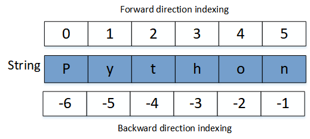

<h1 style="text-align: center;">String</h1>

<hr>

Variables can hold data besides just numbers; they can hold words as well and they are known as Strings. Strings are sequences of character data. Strings start and end with single or double quotes.

>[!NOTE]
> *`'Apple'` is the same as `"Apple"`*

You can display a string with `print()` function.

<iframe src="https://trinket.io/embed/python3/fe00165e22" width="100%" height="356" frameborder="0" marginwidth="0" marginheight="0" allowfullscreen></iframe>

 The string type in Python is called `str`. A string can be assigned to a variable, as shown below.

<iframe src="https://trinket.io/embed/python3/49f0be53a7" width="100%" height="356" frameborder="0" marginwidth="0" marginheight="0" allowfullscreen></iframe>

## String Operators

- `+` **: Concatenation** - To concatenate, combine or add two or multiple strings using `+` operator.

   <iframe src="https://trinket.io/embed/python3/d938576cfa" width="100%" height="356" frameborder="0" marginwidth="0" marginheight="0" allowfullscreen></iframe>

- `*` **: Repetition** - Repeat multiple string

    <iframe src="https://trinket.io/embed/python3/fd651d82bb" width="100%" height="356" frameborder="0" marginwidth="0" marginheight="0" allowfullscreen></iframe>

- Membership check operator - check if character or substring is present in the string
    - `in`: Return `True` if character/substring exist
    - `not in`: Return `False` if character/substring exist

<iframe src="https://trinket.io/embed/python3/d135b228c6" width="100%" height="356" frameborder="0" marginwidth="0" marginheight="0" allowfullscreen></iframe>

## Accessing Strings Using Slicing and Indexing

- Use square brackets for slicing along with the index or indices to obtain your substring.
- Indexing starts from `0`.
- **Syntax:**
  ```python
  variable_name[a:b:c]
  ```
  - Here, `a` is the starting index, and it ends at `b-1` (note that indexing starts from 0).

  - `c` is the step size; the default is `1`.

- **Negative indexing:** The last element has an index of `-1`, and it goes through `-2`, `-3`, etc., as you move towards the left. 

<p align="center"></p>
<p align="center"><a href="https://www.alphacodingskills.com/python/img/python-string.png">Image Source</a></p>

<iframe src="https://trinket.io/embed/python3/f2da71d5a9" width="100%" height="356" frameborder="0" marginwidth="0" marginheight="0" allowfullscreen></iframe>

## String Methods

- `capitalize()` - return string with first letter in upper case

  <iframe src="https://trinket.io/embed/python3/b7aaa1c93c" width="100%" height="356" frameborder="0" marginwidth="0" marginheight="0" allowfullscreen></iframe>

- `upper()`      - return string with all letter in upper case

  <iframe src="https://trinket.io/embed/python3/a270cb4697" width="100%" height="356" frameborder="0" marginwidth="0" marginheight="0" allowfullscreen></iframe>

- `lower()`      - return string with all letter in lower case

  <iframe src="https://trinket.io/embed/python3/d0931bd005" width="100%" height="356" frameborder="0" marginwidth="0" marginheight="0" allowfullscreen></iframe>

- `count(str)`   - count occurrence of 'str' in string

  <iframe src="https://trinket.io/embed/python3/0a05c3a52a" width="100%" height="356" frameborder="0" marginwidth="0" marginheight="0" allowfullscreen></iframe>

- `find(str)`    - find 'str' in string. If found: return start index of first occurrance str, else return -1

  <iframe src="https://trinket.io/embed/python3/9b66acc631" width="100%" height="356" frameborder="0" marginwidth="0" marginheight="0" allowfullscreen></iframe>

- `index(str)`   - same as find, but raises exception when str is not found

  <iframe src="https://trinket.io/embed/python3/8ba2453f27" width="100%" height="356" frameborder="0" marginwidth="0" marginheight="0" allowfullscreen></iframe>

- `join(seq)`    - join string represented as sequence into a string with a separator string between each string

  <iframe src="https://trinket.io/embed/python3/751c1eda18" width="100%" height="356" frameborder="0" marginwidth="0" marginheight="0" allowfullscreen></iframe>

- `len(str)`     - returns length of string

  <iframe src="https://trinket.io/embed/python3/fa4a732834" width="100%" height="356" frameborder="0" marginwidth="0" marginheight="0" allowfullscreen></iframe>

- `replace()`    - returns a copy of the string in which the occurrences of old have been replaced with new,                          optionally restricting the number of replacements to max.

  <iframe src="https://trinket.io/embed/python3/e70da4bafb" width="100%" height="356" frameborder="0" marginwidth="0" marginheight="0" allowfullscreen></iframe>

- `split(str)`   - return a list which has string of words separated by str

  <iframe src="https://trinket.io/embed/python3/ccde43e57f" width="100%" height="356" frameborder="0" marginwidth="0" marginheight="0" allowfullscreen></iframe>

- `strip(str)`   - remove occurrence of str from the beginning and the end of the string 

<iframe src="https://trinket.io/embed/python3/139bf3b51c" width="100%" height="356" frameborder="0" marginwidth="0" marginheight="0" allowfullscreen></iframe>