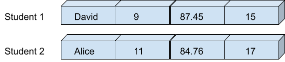
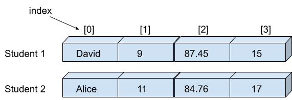

<h1 style="text-align: center;">Lists</h1>

<hr>

Before learning about operators, we explored the `int`, `float`, and `string` data types, which are used to store single values.

#### For example

```python
a = 4
b = 3.14
c = "Python"
```

## List

But what if we want to store multiple values in a single variable? <br>
Let’s say we want to store a student’s information such as **name**, **grade**, **percentage**, and **age**, which are of different data types. 

<br>

<p align="center">  </p>

<br>

Lists are containers that hold a group of items together in a specific order.<br>
They can contain elements of different data types, and they maintain the order of insertion.

Lists allow programmers to **add**, **remove**, or **modify** elements easily, making them highly flexible. Because of this ability to organize and manipulate data, they are considered a data structure.

Lists are one of the four built-in data structures in Python. The others are:

- **Tuple**
- **Set**
- **Dictionary**

<br>

> [!NOTE]
> Each element in a sequence is assigned a number called an **index**, which starts from 0 for the first element, 1 for the second, and so on. This indexing allows us to access or modify specific items in the list.

<p align="center">  </p>

## Declaring List

#### Syntax

```python
variable = [item1, item2, ....itemN]
```

**Items should be separated by comma `,` and enclosed within square brackets `[]`.**

#### For example

```python
student_1 = ['David', 9, 87.45, 15]
```

   <iframe src="https://trinket.io/embed/python3/f1e8669f32" width="100%" height="356" frameborder="0" marginwidth="0" marginheight="0" allowfullscreen></iframe>


As the variable `student_1` is storing multiple values of different types such as `string`, `int`, and `float`, you might wonder — **what is the data type of `student_1`?**
<br>

Yes! It is a **list**. <br>

According to the definition, lists are containers that hold a group of items together, even if those items are of different data types.

## Accessing Elements of a List

As we discussed above, each element within a list is assigned a number called an **index**. This index helps us access a specific element within the list.


#### For example

I want to know the name of **student_1**. Since we know that in the list `student_1`, the name is stored at the **first position**, and indexing in a list starts from 0, we can access it using index `0`.

<iframe src="https://trinket.io/embed/python3/d6048a47d1" width="100%" height="356" frameborder="0" marginwidth="0" marginheight="0" allowfullscreen></iframe>

In the same way, we can access the other items from the list.

<iframe src="https://trinket.io/embed/python3/6cd9e18b5c" width="100%" height="356" frameborder="0" marginwidth="0" marginheight="0" allowfullscreen></iframe>

One thing to notice here is index has a positive value if it counts from the beginning (left to right)  and similarly the index has a negative value if it counts backward (right to left).

| Item               | David | 9    | 87.45 | 15   |
| ------------------ | ----- | ---- | ----- | ---- |
| Index (from left)  | 0     | 1    | 2     | 3    |
| Index (from right) | -4    | -3   | -2    | -1   |

If you give an index value that is **out of range**, the interpreter will generate an error message.

<iframe src="https://trinket.io/embed/python3/8bb0fa6dea" width="100%" height="356" frameborder="0" marginwidth="0" marginheight="0" allowfullscreen></iframe>

As we know, the `student_1` list contains only 4 items. That’s why index 7 does not exist in the `student_1` list.

## Slicing list

If we want to access multiple items from a list at a time, we can use slicing.

#### For example

```python
A = ['adam', 'bella', 'ceila', 'daisy', 'elsa', 'fiona', 'gabriella', 'hazel']
```

This is the list `A`, which contains the names of all students in Section A, arranged roll number-wise.
We can use **slicing** to extract a specific group of elements from the list and create a sublist.

Slicing **does not modify** the original list. Instead, it returns a **new list** containing only the required elements.

#### Syntax

```python
list[start_index : end_index]
```

The **starting index** is **included**, and the **ending index** is **excluded** in the slice.

That’s why, if we want the names of students from roll number 1 to 5, we should use the index range `0:5`.
This means it will include elements from index 0 to 4 (i.e., the first 5 students).

<iframe src="https://trinket.io/embed/python3/7555be6d5c" width="100%" height="356" frameborder="0" marginwidth="0" marginheight="0" allowfullscreen></iframe>

## Updating lists

Items in a list are **mutable**, which means that after creating a list, you can **change any item** or **add new item(s)** to it.

You can change an item in the list using **indexing** along with a simple **assignment** statement.

#### For example

```python
A = ['adam', 'bella', 'ceila', 'daisy', 'elsa', 'fiona', 'gabriella', 'hazel']
```

Later, we realized that the name of the student with roll no. 2 is **'bery'**, not **'bella'**. Since lists are mutable, we can update the list like this:

<iframe src="https://trinket.io/embed/python3/6c1211bf46" width="100%" height="356" frameborder="0" marginwidth="0" marginheight="0" allowfullscreen></iframe>

If you try to add a new item to a list using indexing (i.e., assigning a value to an index that doesn’t exist yet)

<iframe src="https://trinket.io/embed/python3/45bf633e0b" width="100%" height="356" 	frameborder="0" marginwidth="0" marginheight="0" allowfullscreen></iframe>

If you notice, there are a total of 8 items initially when we declared the list `A`.So, if you try to add a new item using indexing, it will give you a **"list index out of range"** error. However, you can add new items to the list using the `append()` function.

Using the `append()` function, we can add new items at the end of the list.

#### Syntax

```python
list.append(item)
```

#### For example

<br>

<iframe src="https://trinket.io/embed/python3/9d2fa869ca" width="100%" height="356" frameborder="0" marginwidth="0" marginheight="0" allowfullscreen></iframe>

To append **multiple items to a list**, use the `extend()` method.

First, create a new list containing the multiple items you want to add to the current list.

#### Syntax

```python
current_list.extend(new_list)
```

#### For example

<br>

<iframe src="https://trinket.io/embed/python3/4041eb2bae" width="100%" height="356" frameborder="0" marginwidth="0" marginheight="0" allowfullscreen></iframe>

## Remove Items in a List

To remove or delete items from a list—or the entire list—you can use the `remove()`, `pop()` methods, or the `del` keyword.

<iframe src="https://trinket.io/embed/python3/8cbcfe2e2f" width="100%" height="356" frameborder="0" marginwidth="0" marginheight="0" allowfullscreen></iframe>

## Basic List Operations & Methods

1. `len()` : Returns the number of items in the list.
2. `min()` : Returns the item with the lowest value in the list.
3. `max()` : Returns the item with the highest value in the list.

<iframe src="https://trinket.io/embed/python3/9bb6d3dd31" width="100%" height="356" frameborder="0" marginwidth="0" marginheight="0" allowfullscreen></iframe>