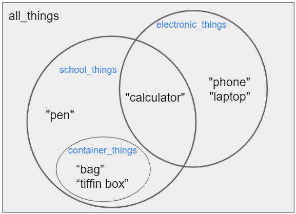

<h1 style="text-align: center;">Sets</h1>

## Set

So far, we have looked at two Python data types used to store collections of data — **Lists** and **Tuples**.  
Now, let's explore **Sets**.

A Set also stores a collection of data, but it differs in a few key ways:

- Sets are **unordered** and **unindexed**.
- Sets **cannot contain duplicate elements**.
- Sets are **unchangeable** once created — meaning individual items cannot be modified — though you can still add or remove entire items.

> [!NOTE]
>**Unordered** means that items in a set do not have a fixed position.  
>The order in which elements appear may change each time the set is accessed, and elements cannot be referred to by index or key.    

**Sets** can be initialized using curly braces.

<iframe src="https://trinket.io/embed/python3/bcb3e477e236" width="100%" height="356" frameborder="0" marginwidth="0" marginheight="0" allowfullscreen></iframe>

In the output of `print(things)`, notice that the values in the set are not in the order they were added.  
This is because sets are unordered. Also notice that `"phone"` appears **only once** in the set, because duplicates are not allowed.

Sets can also be initialized by passing a list to the `set()` constructor.

<iframe src="https://trinket.io/embed/python3/adcbaaf9ba72" width="100%" height="356" frameborder="0" marginwidth="0" marginheight="0" allowfullscreen></iframe> 
 

Now, let's have some fun with sets!

Remember **Venn Diagrams** from math class?  

A Venn diagram is a widely used diagram style that shows the logical relationship between sets.  
On the right is the Venn diagram of the sets we'll be creating.

`all_things` is the universal set, and it contains everything:  
`{"pen", "calculator", "phone", "laptop", "bag", "tiffin box"}`

There are three sets in this universal set called `school_things`, `electronic_things`, and `container_things`.

## Set Operations

Let's explore some basic operations on sets.

- The **union** of *A* and *B*, denoted by ``A ∪ B``, is the set of all elements that are members of `A or B`, or both.

- The **intersection** of *A* and *B*, denoted by `A ∩ B`, is the set of all elements that are members of both `A and B`.

- If *A* ∩ *B* = ∅, then *A* and *B* are said to be **disjoint**.

Two sets can also be **subtracted**.  

The **relative complement** of *B* in *A* (also called the *set-theoretic difference* of *A* and *B*), denoted by *A* \ *B* (or *A* − *B*), is the set of all elements that are members of *A* but not members of *B*.

In certain settings, all sets under discussion are considered to be subsets of a given [universal set](https://en.wikipedia.org/wiki/Universe_(mathematics)) *U*.  
In such cases, *U* \ *A* is called the **absolute complement** (or simply the **complement**) of *A*, and is denoted by *A′* or *Ac*.

The following five images demonstrate the set operations mentioned above for the sets we defined earlier.

Now, let's implement these five examples in Python.

<iframe src="https://trinket.io/embed/python3/17625664e4ae" width="100%" height="356" frameborder="0" marginwidth="0" marginheight="0" allowfullscreen></iframe>

---

There is a lot more to learn about sets and how to work with them, but the above content should give you a general idea of what sets are and how they are used.  
So, we’ll stop here for this chapter. Next, we shall explore **Dictionaries** in Python.
