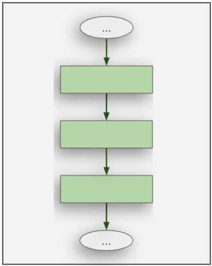
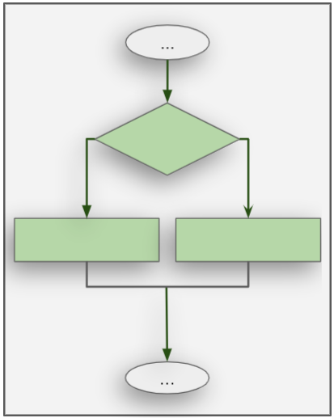
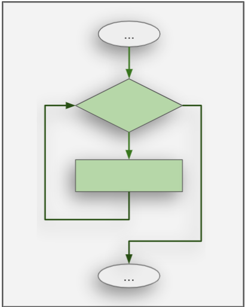

<h1 style="text-align: center;">Control Flow</h1>

**Question:** Imagine you're the computer, and your job is to follow the instructions a programmer gives you. How would you decide which instruction to follow first, second, and so on?

**Your answer would probably be:** Start from the top and work your way down, line by line.

This way of thinking is correct, and it’s called the **control flow** of a program. The control flow is simply the order in which a program's instructions are run. So far, all the programs you've seen probably just follow this top-to-bottom flow. But now, we’ll explore some new, interesting ways to control the flow of your code.

## But why learn about Control Flows?

Understanding control flow helps you write more powerful programs and makes it easier to fix problems in your code. You'll start thinking like a computer, which is really helpful when you're trying to figure out why something isn't working.

## Categories

Here are some types of control flow that you’ll come across:

- **Sequential** - The default. You just run one line after the other from top to bottom.
- **Selection** - Make decisions and choose which path to follow (like "if this happens, do this").
- **Repetition** - Repeat a piece of code over and over (using loops).

There’s also:

- **Subroutines** (we'll learn about these later as functions) - Jump to a set of instructions, run them, and come back.
- Stopping the program when you're done.

## So in Summary...

To see what control flow looks like, we’ll use flowcharts. These help you visualize how a program decides which path to take or how many times to repeat something.

| Sequential                                             | Selection                                             | Repetition                                       |
| ------------------------------------------------------ | ----------------------------------------------------- | ------------------------------------------------ |
|  |  |  |
| Default mode                                           | Conditional statements like if-else                   | Looping using for and while                      |

---

All the programs we have looked at and written till now are all Sequential. In the next few chapters we shall look at the Selection and Repetition control flow structures, more specifically, how to implement them in python. The above table will make even more sense once you have gone through these chapters.

---

