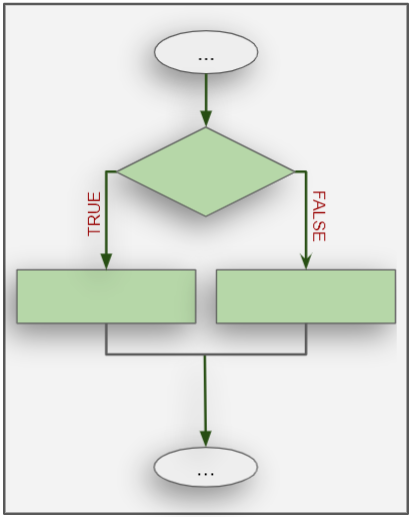
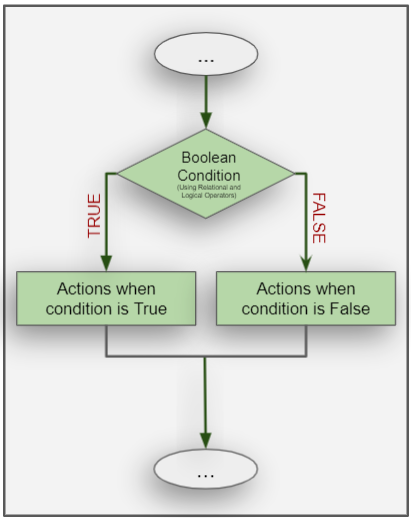

<h1 style="text-align: center;">Making Decisions in Programming</h1>

 
 
In programming, just like in life, we often face situations where we need to make decisions. For example, what if you were given two options: to go outside or stay indoors? How do you decide? You'd probably look at the weather, right?

In programming, we make decisions based on certain conditions, just like how you'd decide based on the weather. We call these conditionals.
[Image source](https://lifelessons.co/personal-development/how-to-make-difficult-decisions/)

## What Are Conditionals?
 

Conditionals are statements that allow a program to make decisions based on whether something is **true** or **false**.

For example:
- If it's raining, stay indoors.
- If it's sunny, go outside.

In programming, this is done using `if-else` statements.

In computer science, **conditionals** (that is, **conditional statements**) are programming language commands for handling decisions. 

## How Do We Decide in Code?

To make decisions in code, we use Boolean conditions. These conditions give us either a `True` or `False` result.

For example:
- Is 5 greater than 3? **True**
- Is 10 equal to 5? **False**

### Relational and Logical Operators 

**To quickly recap:**

Relational/Comparison operators compare 2 values and produce a boolean value (True or False) depending on if the condition is true of false. 

**For example:** `a>=b`, `c==d`, `x!=y`.

Logical Operators can combine comparisons. These are, `and`, ``or``, ``not``

---

Now that we understand the concepts of taking decisions using conditionals and it's flowchart representation, let's move on implement this in python using the famous if-else statemen!

---

