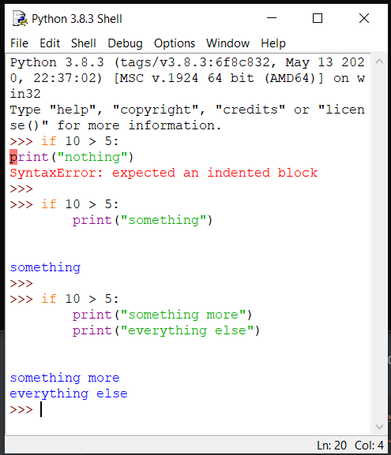

# If-Elif-Else and Indentation in Python

<hr>

**Question:**

What do water heaters, electric kettles, the Dino Game in Google Chrome, and factory robots have in common?

**Answer:** 
They all use **if-else logic** to make decisions! Below, you can see how if-else logic applies to each case:


|  |  |  |
| :----------------------------------------------------------: | :----------------------------------------------------------: | :----------------------------------------------------------: |
|  |  |  |
| **Electric Kettle:** Switches off **if** water reaches boiling temperature. Starts heating **if** water is cold. | **Factory Robot:** Stops moving **if** an object is too close. | **Dino Game:** Jumps **if** the up key is pressed, and ducks **if** the down key is pressed. |
---

## It's Coding Time!

After learning about control flow and flowcharts, it’s time to see how we can use these concepts in Python! Let’s work on the electric kettle example—even if we don’t have a real kettle!

### Understanding the `if` Statement

First, let’s look at how we write an `if` statement in Python. Here’s a simple example:

```python
if 10 > 5:
    print("10 is greater than 5")

```

**Let’s Break It Down:**
- **The `if` Keyword:** This is how we start our decision-making. It tells Python that we’re going to check something.
- **The Condition:** After if, we have a condition `(10 > 5)`. This is a question that can be answered with true or false. In this case, it’s true because 10 is indeed greater than 5!
- **The Colon (:):** This is for ending the `if` condition statement and move to next part of code.
- **Indented Code:** The line print("10 is greater than 5") is indented (it has spaces before it). This tells Python that this line is part of what happens if the condition is true.

Before we move on let's understand why indentation is important.

---
## Indentation in Python

Understanding indentation in Python is super important! If we don’t get it right, we might run into an **indentation error**. 

### Why Does Indentation Matter?

Think of indentation like the **paragraphs in a story**. Just like paragraphs help readers understand where one idea ends and another begins, indentation helps Python understand which lines of code belong together.

### Let's See Some Examples:



1. **No Indentation:**
   In the first example, there’s no indentation. When we try to run it, Python gets confused and gives us a **SyntaxError**. This is like trying to read a story where all the sentences are jumbled together without any spaces!

2. **With Indentation:**
   The second example has the correct indentation, so it runs smoothly. This is like a well-organized story where each paragraph flows nicely.

3. **Understanding Blocks of Code:**
   The third example is important because it shows us why indentation is really needed. In Python, indentation tells the interpreter that certain lines of code belong to the same **block**. A block is just a group of code that works together for a specific purpose. 

   For instance, if we have two print statements that are indented the same way, it means they are part of the same block of code, and Python knows to execute them together.

### Fun Fact!

In many other programming languages like C, C++, and Java, they use braces `{ }` to group code. But in Python, we use indentation instead, making it easier to read!

So remember, keeping your code neatly indented helps Python—and you—understand it better!

<hr>

## What Are Nested `If` Statements?

A nested if statement is an `if` statement placed inside another `if` statement. This helps us create more complex decision-making processes. 

#### Visualizing the Control Flow

Take a look at the image below, which shows different blocks of code for our nested if statement:

<iframe src="https://trinket.io/embed/python3/084341d3677c" width="100%" height="356" frameborder="0" marginwidth="0" marginheight="0" allowfullscreen></iframe>

### Understanding the Output

To figure out what the code does, we need to think like a computer and read it line by line (from top to bottom)


<hr>

### Understanding `if`, `elif`, and `else` Statements

Let’s explore how to write `if`, `elif`, and `else` statements in Python with a simple example:

<iframe src="https://trinket.io/embed/python3/f46ccc175820" width="100%" height="356" frameborder="0" marginwidth="0" marginheight="0" allowfullscreen></iframe>

**Let’s Break It Down:**

1. **The `if` Keyword:**
    - This starts our decision-making process. It tells Python that we want to check a condition.

2. **The Condition (First Check):**
    - After `if`, we have a condition `(temperature > 30)`. This checks if the temperature is greater than 30. If this is true, it executes the next indented line.

3. **The `elif` Keyword:**
    - This stands for "else if." It’s used to check another condition if the first one was false. Here, we check if the temperature is greater than 20.
    - If this condition is true, Python runs the indented code below it.

4. **The `else` Keyword:**
    - This is the fallback option. If none of the previous conditions were true, Python runs the code inside the else block. It handles all other cases.

5. **The Indented Code:**
    - Each indented line of code (like `print("It's a hot day!")`) tells Python what to do if the condition is true. Indentation is crucial here because it shows which block of code belongs to which condition.

Try changing the values of **temperature** in the code and executing them!!

### Square Checker using simple if-else

Let's write a simple if-else code to check whether the entered dimensions for length and breadth would form a rectangle or a square 

<iframe src="https://trinket.io/embed/python3/efcf60d56fb3" width="100%" height="356" frameborder="0" marginwidth="0" marginheight="0" allowfullscreen></iframe>


