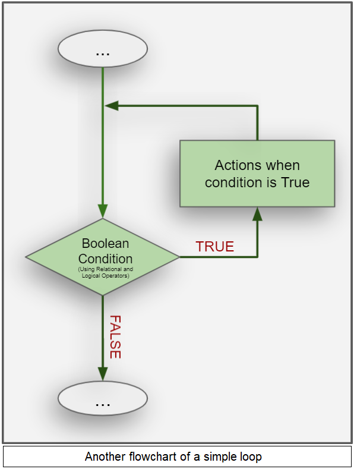
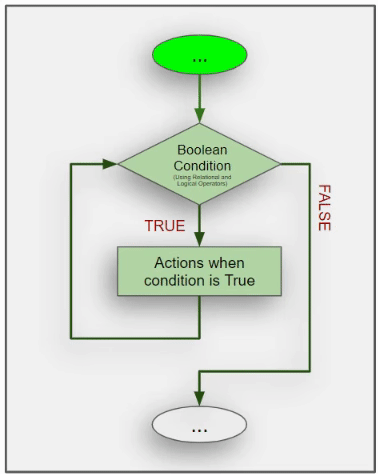

<h1 style="text-align: center;">Looping</h1>

One of the best things about a computer is it's ability to perform **repetitive tasks**. Question is, how can we program a computer to do this? Answer: Almost all the programming languages provide a concept called loop, which helps in executing one or more statements a desired number of times.

**Definition**: In computer science, a loop is a programming structure that repeats a sequence of instructions until a specific condition is met. 

This definition is visualized in the first image on the right. You can easily see the **"LOOP"** that the control flow makes when the Boolean condition is **True**.

Here's a side question: 
Is the flowchart shown on the *left* the same as or different from the flowchart shown on the *right*?

 

## How to Loop in Python?

Loops are supported by all modern programming languages, though their implementations and *syntax* may differ. Two of the most common types of loops are the **while loop** and the **for loop**.

---

In the next two chapter we shall explore the above mentioned two ways to execute loops in python. 

---

