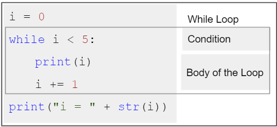
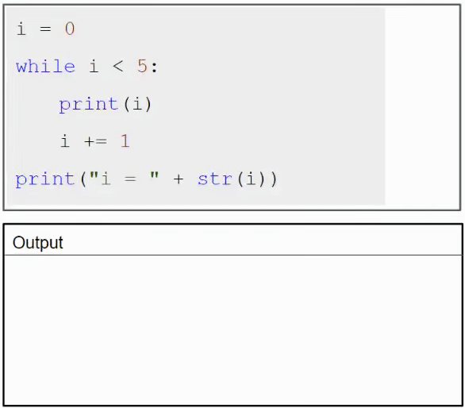

<h1 style="text-align: center;">While Loop</h1>

So as we saw in the flow chart, with the while loop we can execute a set of statements **as long as a condition is true.**

 A basic while loop 

The animation on the right shows how a while loop works 
(The dotted lines are there just for a fun way to "see" the loops): 

1) We initialise **i** with 0 before starting the while loop.

2. check the condition, i.e. if **i** is less than 5
   - if true:
     - execute body:
       - print(i)
       - increment i by 1
     - start step 2 again
   - if false
     - end loop (do step 3)
3. execute statements after the while loop, i.e. print("i = " + str(i))

**Question:** What would happen if you *remove* the i += 1 statement from the body of the while loop?

Try to figure it out with reasoning by yourself, if you're not sure you can discuss this in the discussion forum.

> [!NOTE] 
> The while loop requires relevant variables to be ready, in this example we need to define a variable, **i**, which we set to 0. You will see in the next page that this is not the case in **for** loop.

---

### Practice Time!

1. **Average of 10 Calculator** 
Write a Program to find the average of 10 numbers entered by a user.

2. **Average of n Calculator** 
Modify the above Program to find the average of n numbers entered by the user. (n is also entered by the user)

