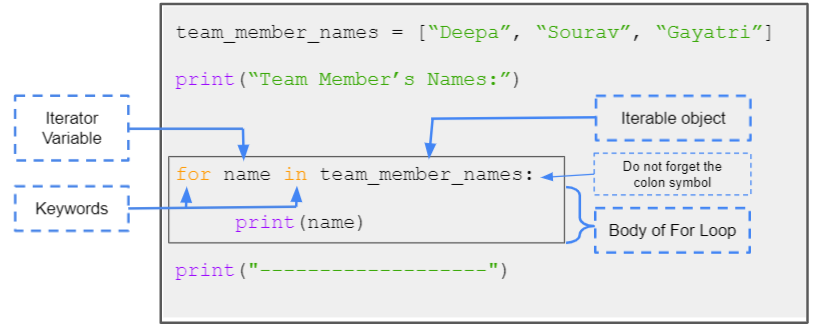
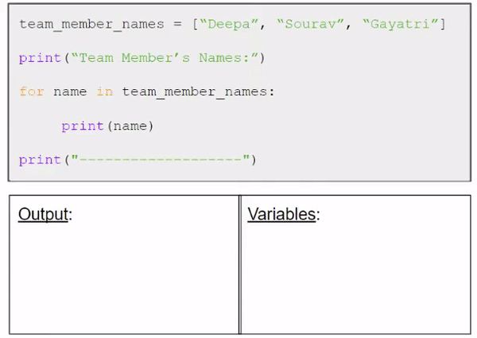

<h1 style="text-align: center;">For Loop</h1>

A for loop is used for iterating over a sequence.

That is either a **list**, a **tuple**, a **dictionary**,  or a **string** - **Iterable Objects**.

What is Iteration? Iteration is the **repetition** of a process in order to generate an outcome.

With the for loop we can execute a set of statements, once for each item in a list, tuple, set etc.

## Example 1: Looping through a list

Following image shows how a for loop is written in python:

The animation on the right shows how for loop works.  Note:

1) team_member_names is an iterable object contraining a list of strings to iterate through.

2. the **for** loop *iterates* through the list assigning the strings to the name variable and executes the statements inside the body of the loop.
3. The body of the loop is all the statement that are indented.

**Question:** What would happen if we added a line, **print(name)** at the end (after print("------------"))

## Example 2: Looping through a dictionary

Here is another example, but instead of iterating through a **list** we iterate through a **dictionary**.
The Iterator variable is iterating through the keys of the dictionary. From section 4 we know that to access the **value** corresponding to a key we use the square brackets [ ] a.k.a the indexing operator.

> [!NOTE]
> **Multi-line statements**  
> Python statements are usually written in a single line. The newline character marks the end of the statement. If the statement is very long, we can explicitly divide into multiple lines with the line continuation character (\\). Python supports multi-line continuation inside parentheses ( ), brackets [ ], and braces { }. 

The print statement in the below example is written in multiple lines. The new line is not considered as a new statement because the new line is within the paranthesis () of the print statement.

<iframe src="https://trinket.io/embed/python3/0ea025396e05" width="100%" height="356" frameborder="0" marginwidth="0" marginheight="0" allowfullscreen></iframe>

> [!NOTE]
>There are other ways to loop through a dictionary, like looping through the values instead of keys, etc. 

## Example 3: Looping through a string
Using the for loop you can iterate through the character present in a string as show in the example below
<iframe src="https://trinket.io/embed/python3/95838d68a486" width="100%" height="356" frameborder="0" marginwidth="0" marginheight="0" allowfullscreen></iframe>

## Three Examples: Looping through range(n)

One use of the for loop that we very often use is to execute something n number of times, or to loop though a series of numbers. The range() function comes in handy here.

Following is the simplest form of looping through range()

> [!NOTE]
> `range()` is one of the many inbuilt functions in python, later in this module we will learn how to make our own functions.

<iframe src="https://trinket.io/embed/python3/5b0780349f8b" width="100%" height="356" frameborder="0" marginwidth="0" marginheight="0" allowfullscreen></iframe>

> [!NOTE]
> x goes from 0 to n-1, therefore it runs the loops n times

But it is not necessary that range must start from zero. In the following exaple it starts from 5 and goes till 10 - 1 = 9.

<iframe src="https://trinket.io/embed/python3/4d6e07b2dde6" width="100%" height="356" frameborder="0" marginwidth="0" marginheight="0" allowfullscreen></iframe>

But it is also not necessary that range must always increment by 1. In the following example it increments by 2.

<iframe src="https://trinket.io/embed/python3/83ce5dabc107" width="100%" height="356" frameborder="0" marginwidth="0" marginheight="0" allowfullscreen></iframe>

---

That is all for "for loops" for now! :P Next we shall have look at 2 new statements (break and continue) that are very useful in practice.

---

